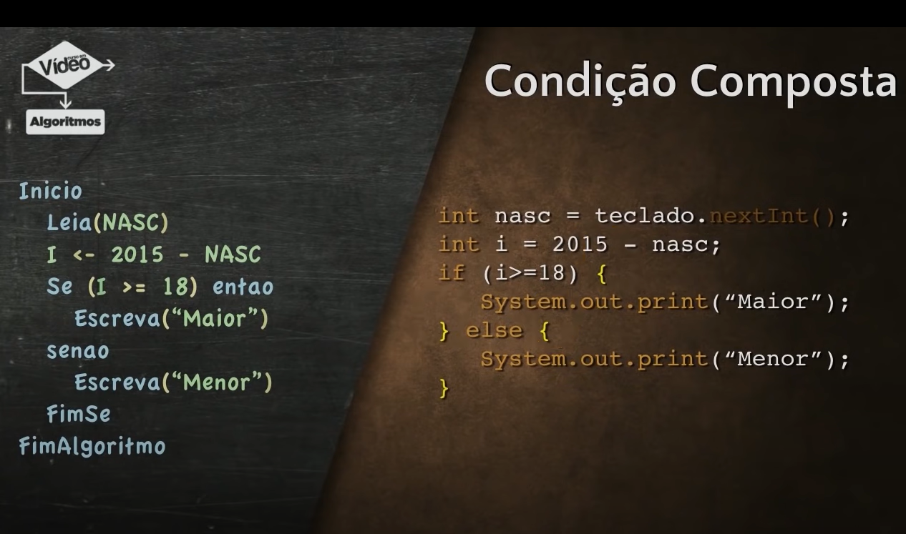

<h1 align="center">JAVA BÁSICO</h1>

<h3 align="center"> Canal do YouTube: <a href="https://www.youtube.com/watch?v=sTX0UEplF54&list=PLHz_AreHm4dkI2ZdjTwZA4mPMxWTfNSpR&index=1">Gustavo Guanabara
</a> </h3>

- O Java começa com o código fonte, que é escrito por um programador em um arquivo com extensão .java.
- O código Java é compilado usando o compilador Java (javac). Isso cria um arquivo chamado bytecode.
- O bytecode é uma forma intermediária de código que é independente da plataforma. Ele é armazenado em um arquivo .class.
- JVM (Java Virtual Machine) é responsável por executar o bytecode em qualquer sistema operacional que tenha uma JVM instalada.
- A JVM interpreta o bytecode e executa o programa Java, produzindo resultados na tela ou realizando tarefas específicas.
- Coleta de Lixo (Garbage Collection): A JVM também gerencia a memória, incluindo a coleta de objetos não utilizados para liberar recursos.
- Bibliotecas: O Java também inclui bibliotecas (conjuntos de código pré-escrito) para ajudar os desenvolvedores a realizar tarefas comuns, como entrada/saída de dados, manipulação de strings, etc.
- Wora -> é um acrônimo para "Write Once Run Anywhere" = Escreva um vez e execute em qualquer lugar.

>  </br>

> JDK (Java Development Kit) -> Programadores Java

- Já tem JRE.
- javaLang -> por padrão a linguagem java já vem com o pacote **javaLang** esse pacote vem com as instruções básicas de funcionamento, as essenciais (realizar operações aritméticas, fazer testes condicionais, escrever na tela).
- javaTools
- Debugger -> que vai permitir que você verifique como é que seu programa está sendo executado em tempo real, inclusive, verificando e testando conteúdos de variáveis ou acesso ao banco de dados.
- API -> é um grupo de bibliotecas.

> JRE (Java Runtime Enviroment) -> pessoas que usam java

- JVM.
- APIs bibliotecas.
- Loader/Verificador -> o loader é a parte interna da JVM que vai carregar o bytecode ma memória da JVM, o verificador vai verificar se esse código pode ser executado sem problemas algum.
- Interpretador/Gerenciador -> o interpretador é aquele que vai pegar o código em bytecode e transformar diretamente pro código nativo da máquina em questão, o gerenciador de memória vai tratar como os códigos e as variáveis vão ser gerenciados na memória da JVM.
- Compilador JIT -> Just In Time: Em tempo real, surgiu para dar um ganho de performance muito grande.

>  </br>

- Código compilado -> ocupa mais memória, mas leva menos tempo.
- Código interpretado -> ocupa menos memória, mas leva mais tempo.

> Processo de Compilação

- Compila -> é transformar de alto nível (código fonte) para máquina; pega esse código e passa para um compilador -> ele vai analisar o código, verificar erros.
- Código relocável -> código intermediário entre o compilador e o montador; traduzir todas as instruções de alto nível e transformar em baixo nível.
- Montador -> pega essas instruções e diz o que vai ficar na memória e transforma as instruções relocáveis em linguagem de máquina.
- Código objeto -> em limguagem de máquina 001010010.

>  </br>

- SE -> para janelas; programas simples.
- EE -> para banco de dados; programas mais complexos.
- ME -> criar uma edição portátil do seu aplicativo.

## Introdução ao SWING

- permite que crie interfaces gráficas.

>  </br>

>  </br>

## Introdução ao JAVAFX

- É uma plataforma adicional de software, foi criado com objetivo de substituir o swing.
- Cria uma aplicação e serve para tudo (celulares, navegadores, videogames).

https://gluonhq.com/products/javafx/

> 

> 

## Coloca o caminho que extraiu o arquivo

> 

**module-info.java**

```java
module olamundojavafx {
requires javafx.controls;
requires javafx.fxml;
requires javafx.graphics;
exports olamundojavafx;
}
```

**OlaMundoJavaFx.java**

```java
package olamundojavafx; // Declaração do pacote, onde o arquivo está localizado

import javafx.application.Application; // Importa a classe Application, que é a base para a aplicação JavaFX
import javafx.scene.Scene; // Importa a classe Scene, usada para criar a "tela" da aplicação
import javafx.scene.control.Button; // Importa a classe Button, que cria botões interativos
import javafx.scene.layout.StackPane; // Importa a classe StackPane, que é um tipo de layout
import javafx.stage.Stage; // Importa a classe Stage, que representa a janela da aplicação

public class OlaMundoJavaFx extends Application { // Declaração da classe 'OlaMundoJavaFx', que herda de 'Application'

@Override // Anotação que indica que o método a seguir sobrescreve (substitui) um método da classe pai
public void start(Stage primaryStage) { // Método start: ponto de entrada da aplicação JavaFX. Método = ação que a classe pode realizar.

    // Declaração e criação de um botão com o texto "Clique em mim!"
    Button btn = new Button("Clique em mim!");

    // Evento: define a ação que ocorrerá quando o botão for clicado
    // A ação do evento é imprimir "Olá Mundo!" no console
    btn.setOnAction(e -> System.out.println("Olá Mundo!"));

    // Declaração de um layout do tipo StackPane (os elementos são empilhados um sobre o outro)
    StackPane root = new StackPane();

    // Adiciona o botão ao layout 'root', que é um StackPane
    root.getChildren().add(btn);

    // Declaração e criação de uma cena (Scene) que irá conter o layout e os componentes
    Scene scene = new Scene(root, 300, 250); // 300x250 são as dimensões da cena

    // Configuração do palco (janela): define o título da janela
    primaryStage.setTitle("Olá Mundo JavaFX");

    // Define a cena (que contém o layout e o botão) para ser exibida na janela
    primaryStage.setScene(scene);

    // Exibe a janela para o usuário (abre a janela)
    primaryStage.show();
}

public static void main(String[] args) { // Método main: ponto de entrada da aplicação Java
    // Lança a aplicação JavaFX, chamando o método start() que cria a interface
    launch(args); // Método launch é fornecido pela classe Application e inicia a execução da aplicação JavaFX
}
}

```

## Salvar .jar

- Botão direito no projeto - export - Java - JAR file

> 

> 

## Selecionar a classe principal, nesse exercício é apenas uma

>  </br>

- **NEW** -> sempre que utilizar new, dentro de uma declaração, automaticamente esta criando um objeto, então tem que ter uma classe referenciando ele.

> Orientação a Objetos

>  </br>

- Programação Orientada a Objetos (POO) é um paradigma de programação que se baseia na ideia de que tudo no código é um objeto. Um objeto é uma entidade que tem um estado e um comportamento. No Java, por exemplo, um objeto é uma instância de uma classe. Uma classe é como um modelo para um objeto, onde você pode definir seus atributos e métodos. Os atributos são as características do objeto e os métodos são as ações que o objeto pode executar.

```java
// Definindo a classe Pessoa - essa classe representa um modelo para criar objetos do tipo Pessoa
class Pessoa {
// Atributos da classe (ou características do objeto)
// 'nome' e 'idade' representam os dados que cada pessoa terá
String nome; // Armazena o nome da pessoa
int idade;   // Armazena a idade da pessoa

// Construtor da classe Pessoa
// O construtor é um método especial que é chamado quando criamos um novo objeto
// Aqui, ele recebe o nome e a idade e usa o 'this' para se referir aos atributos da classe
Pessoa(String nome, int idade) {
    this.nome = nome; // 'this.nome' se refere ao atributo da classe, e 'nome' ao parâmetro do construtor
    this.idade = idade; // 'this.idade' se refere ao atributo, enquanto 'idade' é o parâmetro
}

// Método apresentar - representa uma ação ou comportamento do objeto
// Esse método não recebe parâmetros e exibe uma mensagem no console com o nome e a idade da pessoa
void apresentar() {
    System.out.println("Olá, meu nome é " + nome + " e eu tenho " + idade + " anos.");
    // O comando acima imprime o nome e a idade da pessoa no console
}
}

// Classe principal que contém o método main, onde o programa inicia sua execução
public class Main {
public static void main(String[] args) {
    // Criando um objeto da classe Pessoa e passando os valores "João" e 25 para o construtor
    // Isso inicializa os atributos 'nome' e 'idade' do objeto pessoa1
    Pessoa pessoa1 = new Pessoa("João", 25);

    // Chamando o método apresentar do objeto pessoa1
    // Isso vai exibir a mensagem "Olá, meu nome é João e eu tenho 25 anos."
    pessoa1.apresentar();
}
}

```

> Método main -> No Java, o método main é o ponto de partida de qualquer programa. Quando você executa uma aplicação, é o main que começa a execução. Você pode ter muitas classes em um projeto, mas o Java vai procurar por esse método específico para saber por onde começar.

> Características principais do main:

- É estático: Isso significa que você não precisa criar um objeto da classe para chamar o método main.
- Ele é executado diretamente pela máquina virtual Java (JVM).
- É público: O método precisa ser público para que a JVM consiga acessá-lo e iniciar o programa.
- Sem valor de retorno: O método main não retorna nada, por isso ele é declarado como void (quer dizer vazio).
- Recebe um argumento: O main recebe um parâmetro chamado args, que é um array de String. Esse array pode ser usado para passar informações para o programa quando ele for iniciado pela linha de comando.
- **main** é onde o programa começa, e o args pode ser usado para passar informações extras ao programa.

```java
public class MeuPrograma {
public static void main(String[] args) {
    System.out.println("Primeiro argumento: " + args[0]);
    System.out.println("Segundo argumento: " + args[1]);
}
}

SAÍDA:
Primeiro argumento: arg1
Segundo argumento: arg2
```

> Getters e Setters

- Os getters e setters no Java são métodos usados para acessar e modificar os valores dos atributos de uma classe. Eles ajudam a proteger e controlar o acesso aos dados de um objeto, permitindo seguir o princípio de encapsulamento.
- Imagine que você tem uma classe Pessoa com um atributo idade. Em vez de permitir que qualquer código altere a idade diretamente (o que pode causar problemas, por exemplo, se alguém tentar definir uma idade negativa), você usa um getter e um setter. Assim, você controla o acesso e pode garantir que a idade sempre tenha um valor válido.

```java
public class Pessoa {
private int idade; // Atributo privado

// Getter para acessar a idade
public int getIdade() {
    return idade;
}

// Setter para modificar a idade
public void setIdade(int idade) {
    if (idade >= 0) { // Verifica se a idade é válida
        this.idade = idade;
    }
}
}
```

- Getter (getIdade): É um método que retorna o valor do atributo idade. Ele permite que outras classes leiam a idade, mas sem poder modificar diretamente.
- Setter (setIdade): É um método que define o valor do atributo idade. Ele verifica se o valor é válido antes de atualizar o atributo, evitando problemas.

> Tipos em Java: Primitivos e Não Primitivos

> Typecast e Wrapper Class

>  </br>

```java
public class ExemploSimples {
public static void main(String[] args) {
    // Typecast (conversão de tipo primitivo)
    int num = 10;
    double numDouble = num;  // Conversão implícita de int para double
    System.out.println("Número como double: " + numDouble);

    // Wrapper Class (Integer)
    Integer numWrapper = 20;  // Autoboxing: int é convertido automaticamente para Integer
    System.out.println("Número em Wrapper Class: " + numWrapper);

    // Unboxing: conversão de Integer para int
    int numPrimitivo = numWrapper;  // Unboxing: Integer é convertido automaticamente para int
    System.out.println("Número após Unboxing: " + numPrimitivo);
}
}

```

## Explicação:

- Typecast: A variável num é convertida automaticamente de int para double.
- Wrapper Class: O valor 20 é atribuído à variável numWrapper do tipo Integer (usando autoboxing), e depois o valor é convertido de volta para um tipo primitivo int com o unboxing.

> Tipos Primitivos ->

>  </br>

- São simples e básicos, usados para armazenar valores simples, como números inteiros e caracteres.
- int: Representa números inteiros. Por exemplo, int idade = 25; armazena a idade 25.
- char: Armazena caracteres, como letras ou símbolos. Por exemplo, char letra = 'A'; guarda a letra 'A'.
- boolean: Armazena valores verdadeiros ou falsos. Por exemplo, boolean estaChovendo = true; indica se está chovendo ou não.

> Tipos Não Primitivos

- Podem conter informações mais complexas e até mesmo outros tipos primitivos.
- String: Representa texto. Por exemplo, String nome = "Alice"; guarda o nome "Alice".
- Array: Armazena uma coleção de valores do mesmo tipo. Por exemplo, int[] numeros = {1, 2, 3, 4, 5}; guarda uma lista de números inteiros.
- Classe: Você pode criar suas próprias classes para representar objetos personalizados, como class Pessoa { String nome; int idade; }. Isso permite que você crie objetos como Pessoa alice = new Pessoa(); com propriedades nome e idade.
- ArrayList: É uma coleção dinâmica que pode crescer ou encolher. Por exemplo, ArrayList nomes = new ArrayList<>(); pode armazenar uma lista flexível de nomes.
- Objetos: Além das classes personalizadas, Java possui muitas classes pré-definidas que podem ser usadas para criar objetos, como Date para datas e Scanner para entrada de usuário.

> Operadores Unários => Incremento e Decremento

- O ++ quando vem depois do numero significa utiliza o numero 5 + 5 e depois de fazer essa soma, soma mais um no numero.

```java
int numero = 5;
int valor = 5 + numero++;
System.out.println(valor); SAÍDA 1 = 10
System.out.println(numero); SAÍDA 2 = 6
```

- ++numero significa que ele pega 5 e soma com numero ja pré incrementado de unidade.

```java
int numero = 5;
int valor = 5 + ++numero;
System.out.println(valor); SAÍDA 1 = 11
System.out.println(numero); SAÍDA 2 = 6
```

- Tenho o 10, vou tirar 1 e depois vou ter 9.

```java
int numero = 10;
int valor = 4 + numero--;
System.out.println(valor); SAÍDA 1 = 14
System.out.println(numero); SAÍDA 2 = 9
```

>  </br>

> Classe Math

>  </br> 

>  </br>

- Math.random -> gera um número entre 0.0 a 1.0.

```java
double ale = Math.random();
System.out.println(ale);
```

- Se quiser gerar um número entre 5 e 10 => 5 + Math.random() \* (10 - 5). Outro exemplo entre 0 e 9, substitui 5 por 0 e 9 por 10.

```java
double ale = Math.random();
int n = (int) (5 + ale * (10-5));
System.out.println(n);
```

> Operadores Ternário

- Ele tem 3 componentes, o que vem antes da ?, o que vem depois da ? e o que vem depois dos ':'.
- O primeiro operador é uma expressão, ai coloca a ? e depois coloca qual valor vai ser atribuido caso essa expressão seja verdadeira x ':' e por ultimo coloca o valor que vai ser atribuido caso a expressão seja considerada falsa y.
- Tem que atribuir um valor para uma mesma variável.

```java
    int n1, n2, r;
    n1 = 10;
    n2 = 8;
    r = (n1>n2)?n1:n2;
    (n1 é maior que n2 ? se sim mostra n1 se nao mostra n2)
    System.out.println(r); SAÍDA 10
```

- exemplo com fórmulas:

```java
    int n1, n2, r;
    n1 = 10;
    n2 = 8;
    r = (n1>n2)?n1+n2:n1-n2;
    System.out.println(r); SAÍDA 18
```

> Operadores Relacionais

> </br>

> Comparando strings

- Maneiras diferentes de declarar o mesmo objeto.

```java
    String nome1 = "Gustavo";
    String nome2 = "Gustavo";
    String nome3 = new String("Gustavo");
    String res;
    res = (nome1==nome2)?"igual":"diferente";
    System.out.println(res); /*SAÍDA igual; nome1 e nome2 são 2 objetos que tem o mesmo conteúdo, tem a mesma estrutura*/
```

```java
public static void main(String[] args) {
    String nome1 = "Gustavo";
    String nome2 = "Gustavo";
    String nome3 = new String("Gustavo");
    /*Não tem variavel porque quando usa string com letra maiscula, string é uma classe então ela automaticamente vai criar um
        objeto, a diferença de instanciar ou não utilizando a cláusula new vai fazer toda diferença.*/
    String res;
    res = (nome1==nome3)?"igual":"diferente";
    System.out.println(res); /*SAÍDA diferente; o ultimo objeto foi instanciado utilizando a clausula new, não tem tecnicamente
    a mesma estrutura dos 2 de cima;
    */}
```

```java
    String nome1 = "Gustavo";
    String nome2 = "Gustavo";
    String nome3 = new String("Gustavo");
    String res;
    res = (nome1.equals(nome3))?"igual":"diferente"; /*nome1 como é um objeto ele pode ter métodos, equals é um metodo que verifica
        se o conteudo de um objeto é igual ao conteudo do outro*/
    System.out.println(res); /*SAÍDA igual;
    */
```

- Para objetos em vez utilizar ==, utiliza equals, serve para qualquer classes envólucras.

> Operadores Lógicos

>  </br>

> 

```java
        int x, y, z;
        x = 4;
        y = 7;
        z = 12;
        boolean r;
        r = (x<y && y<z)?true:false;
        System.out.println(r); \\SAÍDA true
```

> Sistema de votação

>  </br>

>  </br>

> 

```java
    Scanner teclado = new Scanner(System.in);
    System.out.print("Primeira nota: ");
    float n1 = teclado.nextFloat();
    System.out.print("Segunda nota: ");
    float n2 = teclado.nextFloat();
    float m = (n1+n2)/2;
    System.out.println("Sua média foi " + m );
    if (m>9) {
    System.out.println("Parabéns");}
```

>  </br>

>  </br>

```java
    Scanner t = new Scanner(System.in);
    System.out.println("Em que ano você nasceu ? ");
    int nasc = t.nextInt();
    int i = 2015 - nasc;
    System.out.println("Sua idade é " + i + " anos");
    if (i>=18) {
        System.out.println("Maior de idade");
    } else {
        System.out.println("Menor de idade");
    }
```

>  </br> 

>  </br> 

>  </br> 

> A bolinha vai virar o comando break

> 

- default -> tipo padrão caso nenhum desses de cima seja escolhido pelo switch o tipo é "ET"; como é a ultima não precisa do break.

>  </br>

>  </br>

>  </br>

```java
int cc = 1;
while (cc<=4) {
System.out.println("Cambalhota " + cc);
cc++;
}
```

>  </br>

- O 'continue' interrompe o fluxo natural e volta para 'while';

```java
    int cc = 1;
    while (cc<5) {
        cc++;

        if (cc == 1 || cc == 3 || cc == 5) {
            continue;
        }
        System.out.println("Cambalhota " + cc);
    }
    SAÍDA : Cambalhota 2
            Cambalhota 4
```

> break -> vai jogar pra fora do laço, interrompendo a execução mesmo não tendo saído pela clásula não;

>  </br>

```java
    int cc = 1;
    while (cc<5) {
        cc++;
        if (cc == 1 || cc == 2 ) {
            continue;
        }
        if (cc == 4) {
            break;
        }
        System.out.println("Cambalhota " + cc);
    }
    SAÍDA : Cambalhota 3
```

> Teste lógico no final e no início:

>  </br>

- CC<4 - > utilizando o enquanto while;
- CC>=4 - > estrutura repita, é a mesma coisa só que primeiro executa os comando e depois testa, while de cabeça pra baixo;

>  </br>

> </br>

> O 'do' é útil quando você precisa que o código seja executado pelo menos uma vez. </br>

>  </br>

```java
        int cc = 0;
        do {
            System.out.println(cc);
            cc++;
        } while (cc<4);
```

```java
    int n, s = 0;
    String resp;
    Scanner teclado = new Scanner(System.in);
    do {
        System.out.print("Digite um número: ");
        n = teclado.nextInt();
        s += n; // S = S + n;
        System.out.print("Quer continuar? [S/N] ");
        resp = teclado.next();
    } while (resp.equals("S"));
    System.out.println("A soma de todos os valores é " + s);
SAÍDA:  Digite um número: 2
        Quer continuar? [S/N] S
        Digite um número: 3
        Quer continuar? [S/N] S
        Digite um número: 5
        Quer continuar? [S/N] N
        A soma de todos os valores é 10
```

> Repetição com variável -> as estruturas de repetição com variáveis de controle já fazem o looping, incremento ou decremento automático; </br>

- Tem uma delimitação de quantas vezes ele vai fazer e qual será o passo de incremento, isso tudo voltando. </br>

> Estrutura PARA; o 'for' é um enquanto simplificado; </br>

>  </br>

>  </br>

```java
    for (int cc = 0; cc<4; cc++) {
        System.out.println("Cambalhota");
    }
```

- Começar em 15, enquanto ele for maior igual a 5, ele tira 2:

```java
    for (int cc = 15; cc>=5; cc-=2) {
        System.out.println(cc);
    }
    SAÍDA : 15
            13
            11
            9
            7
            5

```

> Laço Aninhado -> aninhado é um dentro do outro como se fosse um ninho

- Quando tem um laço dentro do outro, retorna o laço de dentro, não para o de fora, então ele voltou para J;

> </br>

> Vetores

>  </br>

- Quando utiliza o bloco assim também cria um objeto, o vetor 'n' é um objeto com características, propriedades, atributos, funções e métodos;

```java
    int n[] = {3,2,8,7,5,4};
    System.out.println("Total de casas de N " + n.length);// como é um objeto é só colocar ponto e ver todos os métodos com () e o atributo ou caracteristica sem () que é o length = comprimento
    for (int c=0; c<=5; c++)
        System.out.println("Na posição " + c + " temos o valor " + n[c] );

        SAÍDA:
            Total de casas de N 6
            Na posição 0 temos o valor 3
            Na posição 1 temos o valor 2
            Na posição 2 temos o valor 8
            Na posição 3 temos o valor 7
            Na posição 4 temos o valor 5
            Na posição 5 temos o valor 4
```

- Com esse 'for' cria uma estrutura de repetição genérica, ela funciona para qualquer vetor de qualquer tamanho:

```java
for (int c=0; c<=n.length-1; c++)
```

- Vetor mes (com 12 posições) -> mes vai ser uma instância da classe string com a declaração de todos os meses dentro do bloco:

> 

```java
    String mes[] = { "Jan", "Fev", "Mar", "Abr", "Mai", "Jun", "Jul", "Ago", "Set", "Out", "Nov", "Dez" };
    int tot[] = { 31, 28, 31, 30, 31, 30, 31, 31, 30, 31, 30, 31 };
    for (int c = 0; c < mes.length; c++) {
        System.out.println("O mês de " + mes[c] + " tem " + tot[c] + " dias ao todo.");
    }
```

> Foreach ou Para cada -> funciona exclusivamente para coleções para vetores;

- int: O tipo dos elementos no array.
- numero: É o identificador que referencia cada elemento do array em cada iteração.
- numeros: É o array que está sendo percorrido.

> Sintaxe:

```java
for (Tipo variavel : arrayOuLista) {
// código a ser executado
}
```

Exemplo:

```java
int[] numeros = {1, 2, 3, 4, 5};

for (int numero : numeros) {
System.out.println(numero);
}
```

- for é uma repetição para cada um deles; vai ter uma variável inteira que vai receber o valor dentro de cada passagem e ':'; vai ter 2 elementos, uma váriavel(valor) do tipo int que precisa ter o mesmo tipo do vetor e depois coloca o nome do vetor; a partir de agora a cada laço vai ter uma variável valor que vai ser o valor;

> 

- Para cada elemento de v coloque dentro de valor; não precisa trabalhar mais com vetor, ele joga isso dentro da variável double:

```java
double v[] = {3.5, 2.75, 9, -4.75};
    for (double valor:v) {
        System.out.print(valor + " ");
    }
```

> Colocando em ordem

- Arrays é uma classe que está dentro da biblioteca java.util;

```java
    double v[] = {3.5, 2.75, 9, -4.75};
    Arrays.sort(v);
    for (double valor:v) {
        System.out.print(valor + " ");
    }
    SAÍDA : -4.75 2.75 3.5 9.0
```

> Busca dentro do vetor

> 

```java
    int vet [] = {3, 7, 6, 1, 9, 4, 2};
    for(int v:vet) {
        System.out.print(v + " ");
    }
    System.out.println(" ");
    int p = Arrays.binarySearch(vet, 1);
    System.out.println("Encontrei o valor na posição " + p);
    SAÍDA: 3 7 6 1 9 4 2
            Encontrei o valor na posição 3
```

- Se colocar um indice que não tem, vai apresentar um valor negativo da chave porque não existe valor negativo de indice. ex.: acima não tem indice 8 e a saída ficaria -8;

> Preenchimento do vetor automatico -> Se quiser que todos elementos desse vetor fiquem com o mesmo valor;

> 

```java
    int v[] = new int[20];
    Arrays.fill(v, 0);
    for(int valor: v) {
        System.out.print(valor + " ");
    }
```

> Rotinas

> 

- 'void' é um procedimento, não retorna nada; o 'main' é um método uma rotina que não vai retornar valores, que vai receber um argumento, que é um vetor como parâmetro de 'String', que é um método estático 'static' e um método 'public':

```java
public static void main(String[] args) {
    // TODO Auto-generated method stub
}
```

> 

- Criando um procedimento de soma com dois parâmetros A e B do tipo inteiro.
- Sempre que apertar play o método que é executado por padrão é o 'main', se quiser fazer uma chamada para soma, tem que chamar dentro do 'main';
- O método 'main' é estático, o método estático serve para classe não para uma instância, então não pode chamar um procedimento dentro de um método estático, se esse procedimento tambem não for estático;
- Quando coloca a palavra 'static' na frente de um método, torna ele estático, esse método fica apenas funcional dentro da classe, isso é ele não faz parte de um instanciamento de objeto;
  > 

```java
static void soma(int a, int b) {
    int s = a + b;
    System.out.println("A soma é " + s);
}

public static void main(String[] args) {
    // TODO Auto-generated method stub
    System.out.println("Começou o programa");
    soma(5,2);
        }
        SAÍDA: Começou o programa
                A soma é 7
```

> Método com retorno

- Identifica um método através da palavra 'void' que não tem retorno ou do tipo primitivo estabelecido(no exercicio 'int');

>  </br>

- Quem cuido da exibição foi o método principal e não o método do cálculo, o método do cálculo fico responsável só pelo cáculo, isso é uma boa pratica, não criar um sistema engessado, cria funções que retornam valor e o próprio código vai tratar da melhor maneira;

```java
static int soma(int a, int b) {
    int s = a + b;
    return s;
}

public static void main(String[] args) {
    // TODO Auto-generated method stub
    System.out.println("Começou o programa");
    int sm = soma(5,2);
    System.out.println("A soma vale " + sm);

}
    SAÍDA: Começou o programa
            A soma vale 7
```

> Exemplo múltiplas classes no mesmo pacote

> 

```java
package com.testefuncao02.pacote;

public class Operacoes {

public static String contador (int i, int f)  {//método que vai retornar uma string
    String s = ""; //vai iniciar vazio
    for (int c = i; c <= f; c++)//contar do início ao fim
    s += c + " ";	//fazer com que s a string receba ele mesmo concatenado com o c e um espaço em branco
    return s;
}
}
//Agora precisa chamar esse método mas a chamada esta em outro arquivo
```

```java
package com.testefuncao02.pacote;

public class TesteFuncao02 {

public static void main(String[] args) {
    // TODO Auto-generated method stub
    System.out.println("Vai começar a contagem");
    System.out.println(Operacoes.contador(1, 5));
}
} 	 	SAÍDA:Vai começar a contagem
            1 2 3 4 5
```

<h3 align="center"> Canal do YouTube: <a href="https://www.youtube.com/watch?v=VKjFuX91G5Q&list=PL62G310vn6nFIsOCC0H-C2infYgwm8SWW&index=1">DevDojo
</a> </h3>

---

## Tipos primitivos

```java
public class ImprimindoVariaveis {
public static void main(String[] args) {
    /* Comentário
    * de várias
    * linhas
    * */
    //Comentário
    /***
        * Comentário de Doc oficial
        * @param parametro de entrada
        * */

    int idade = 34;
    int idadeDosPais = 66;
    System.out.println("Dados impressos");
    System.out.println(idade);
    System.out.println(idadeDosPais);
    System.out.println("Dados impressos" + idade);
}
}

```

---

```java
public class RelatorioPendenci {
public static void main(String[] args) {
    String nome = "Bulma";
    String endereco = "Rua Tal tal tal ";
    String telefone = "(91)9999-8888";
    System.out.println("O "+nome+" endereço "+ endereco + " e telefone: "+telefone+ " não possui pendencias");
}
}

```

```java
public class br.com.abc.introducao.operadores.Operadores {
public static void main(String[] args) {
    int numero1 = 10;
    int numero2 = 20;
    int soma = numero1 + numero2;
    System.out.println(numero1+ numero2+ " Soma antes depois " + numero1 + numero2);
    System.out.println(numero1+ numero2 + " soma antes");
    System.out.println("soma depois " + numero1+ numero2);
    System.out.println("Total " + (numero1/numero2));
}
}

```

---

## Operadores

```java
public class br.com.abc.introducao.operadores.Operadores {
public static void main(String[] args) {
    System.out.println("Resto da divisão = " + (21 % 2));
}
}

```

```java
public class br.com.abc.introducao.operadores.OperadoresComparacao {
public static void main(String[] args) {
    boolean dezMaiorQueVinte = 10 > 20;
    boolean dezMenorQueVinte = 10 < 20;

    System.out.println(dezMaiorQueVinte);
    System.out.println(dezMenorQueVinte);
    System.out.println( 5 == 5);
    System.out.println( 5 != 5);
}
}

```

---

```java
public class br.com.abc.introducao.operadores.OperadoresLogicos {
public static void main(String[] args) {
    int idade = 18;
    float salario = 2000f;

    System.out.println(idade >= 16 && salario >= 2000);
    System.out.println(idade <= 16 && salario >= 2000);
    System.out.println(idade >= 16 || salario >= 2000);
}
}

```

---

```java
public class br.com.abc.introducao.operadores.OperadoresAtribuicao {
public static void main(String[] args) {
    // = , -= , += , /= , %=

    int salario = 1000;
    //salario = salario + 200;
    //salario += 200;
    salario = salario + (int)(salario * 0.2);
    int numero = 11;
    numero %= 2;

    System.out.println(salario);
    System.out.println(numero);

}
}

```

---

## Controle de fluxo if, else if e else

```java
public class br.com.abc.introducao.controlefluxo.ControleFluxo1 {
public static void main(String[] args) {
    // idade < 15 categoria infantil
    // idade >= 15 && idade < 18 juvenil
    // udade >= 18 adulto
    int idade = 18;
    String categoria = "";
    if(idade < 15){
        categoria = "Infantil";
    }else if(idade >= 15 && idade < 18){
        categoria = "Juvenil";
    }else{
        categoria = "Adulto";
    }
    System.out.println(categoria);

}
}

```

---

## Controle de fluxo: Tabela verdade e mais

```java
public class br.com.abc.introducao.controlefluxo.ControleFluxo2 {
public static void main(String[] args) {
    int idade = 15;
    String status;
    status = idade < 10 ? "Não adulto" : "Adulto";
    System.out.println(status);
}
}

```

---

## Controle de fluxo Resolução do exercício if else

```java
public class br.com.abc.introducao.controlefluxo.ExercicioControleFluxo {
public static void main(String[] args) {
    /*
        * Crie uma variável salario e imprima seu imposto
        * Imposto:
        * salario < 1000 5%
        * salario >= 1000 && salario < 2000 10$
        * salario >= 2000 && salario < 4000 15%
        * salario > 5000 20%
        * */
    double salario = 900;
    double totalImposto = 0;

    if (salario < 1000) {
        totalImposto = salario * 0.05;
    } else if (salario >= 1000 && salario < 2000) {
        totalImposto = salario * 0.1;
    } else if (salario >= 2000 && salario < 4000) {
        totalImposto = salario * 0.15;
    } else {
        totalImposto = salario * 0.2;
    }
    System.out.println("O total de impostos = " + totalImposto);

}
}

```

---

## Controle de fluxo switch e exercícios

```java
public class br.com.abc.introducao.controlefluxo.ControleFluxo3 {
public static void main(String[] args) {
    byte dia = 2;
    switch (dia) {
        case 1:
            System.out.println("Domingo");
            break;
        case 2:
            System.out.println("Segunda");
            break;
        case 3:
            System.out.println("Terça");
            break;
        case 4:
            System.out.println("Quarta");
            break;
        case 5:
            System.out.println("Quinta");
            break;
        case 6:
            System.out.println("Sexta");
            break;
        case 7:
            System.out.println("Sábado");
            break;
        default:
            System.out.println("Opção Inválida!");
            break;
    }
}
}

```

```java
public class br.com.abc.introducao.controlefluxo.ExercicioControleFluxo3 {
/*  Crie um switch que dado um valor de 1 a 7
*   considerando 1 domingo imprima se é dia util ou dia de semana
*/
}

```

---

## Controle de fluxo - Solução do exercício

```java
public class br.com.abc.introducao.controlefluxo.ExercicioControleFluxo3 {
/*  Crie um switch que dado um valor de 1 a 7
    *   considerando 1 domingo imprima se é dia util ou dia de semana
    **/
public static void main(String[] args) {
    byte dia = 7;
    switch (dia) {
        case 1:
        case 7:
            System.out.println("Final de semana");
            break;
        case 2:
        case 3:
        case 4:
        case 5:
        case 6:
            System.out.println("Dia Últil");
            break;
        default:
            System.out.println("Opção inválida");

    }
}
}

```

```java
import java.util.Scanner;

public class br.com.abc.introducao.controlefluxo.ExercicioControleFluxo31 {
static void show(String mensagem) {
    System.out.printf(mensagem + "\n");
}

static Scanner Scanner() {
    return new Scanner(System.in);
}

public static void main(String[] args) {
    String[] DiaDaSemana = {"Domingo", "Segunda", "Quarta", "Quinta", "Sexta", "Sábado"};
    show("Digite um dia da semana");

    int dia = Scanner().nextInt();

    System.out.println();

    switch (dia) {
        case 0:
        case 1:
        case 2:
        case 3:
        case 4:
            show("Dia útil");
            break;
        case 5:
            show("Final de Semana");
            break;
        case 6:
            show("Dia útil");
            break;
        default:
            show("Inválido");

    }

}
}


```

---

## Controle de fluxo for, while, do while

```java
public class br.com.abc.introducao.controlefluxo.ControleFluxo04 {
public static void main(String[] args) {
    int contador = 9;

    while(contador < 10){
        System.out.println(++contador);
    }

    do{
        System.out.println("Dentro do DO while");
    }while (contador < 10);

    for(int i = 0; i < 10; i++){
        System.out.println("Vador do i =" + i);
    }
}
}

```

---

## Exercício estrutura de repetição

```java
public class br.com.abc.introducao.controlefluxo.ControleFluxo04 {
public static void main(String[] args) {
    int contador = 9;

    while (contador < 10) {
        System.out.println(++contador);
    }
    contador = 0;
    do {
        System.out.println("Dentro do DO while, cont = " + contador++);
    } while (contador < 10);

    for (int i = 0; i < 10; i++) {
        System.out.println("Vador do i =" + i);
        if (i == 5) {
            break;
        }
    }
}
}

```

```java
public class br.com.abc.introducao.controlefluxo.ExercicioControleFluxo4 {

public static void main(String[] args) {
    // imprima todos os numero pares de 0 até 100000

    int valor = 10000000;
    for (int i = 0 ; i<= valor ; i++){
        if(i % 2 == 0){
            System.out.println(i);
        }
    }

}
}

```

---

## Comando break and continue

```java
public class br.com.abc.introducao.controlefluxo.ControleFluxo5 {
public static void main(String[] args) {
    /* Dado um valor de um carro, descubra em quantas vezes ele pode ser parcelado
        * Porém as parcelas não podem ser menores do que 1.000 */

    double valorTotal = 30000;
    for(int parcela = 1 ; parcela <= valorTotal ; parcela++){
        double valorParcela = valorTotal/parcela;
        if(valorParcela < 1000){
            break;
        }
        System.out.println("Parcela "+ parcela + " R$ "+ valorParcela);

    }

}
}

```

```java
public class br.com.abc.introducao.controlefluxo.ControleFluxo6 {
public static void main(String[] args) {
    /* Dado um valor de um carro, descubra em quantas vezes ele pode ser parcelado
        * Porém as parcelas não podem ser menores do que 1.000 */

    double valorTotal = 30000;
    for(int parcela = (int) valorTotal ; parcela >= 1 ; parcela--){
        double valorPacela = valorTotal / parcela;
        if(valorPacela <= 1000){
            continue;
        }
        System.out.println("Parcela "+ parcela + " R$ "+ valorPacela);

    }


}
}

```

---

## Arrays parte 1

```java
public class br.com.abc.introducao.arrays.Arrays1 {
public static void main(String[] args) {
    int[] idades = new int[3];
    idades[0] = 10;
    idades[1] = 1;
    idades[2] = 30;

    System.out.println("Idade " + idades[0]);
    System.out.println("Idade " + idades[1]);
    System.out.println("Idade " + idades[2]);
}

}

```

---

## Arrays parte 2

```java
public class br.com.abc.introducao.arrays.Arrays2 {
public static void main(String[] args) {
    // byte, short, int, long, float, double = 0
    // char '\u0000' = ' '
    // boolean false
    // reference null

    String[] nomes = new String[3];
    nomes[0] = "Jose";
    nomes[1] = "Luciana";
    nomes[2] = "Luan";

    for( int i = 0; i < nomes.length; i++){
        System.out.println((i+ 1) + " - nome: "+ nomes[i]);
    }

}
}

```

---

## Arrays parte 3 foreach

```java
public class br.com.abc.introducao.arrays.Arrays3 {
public static void main(String[] args) {
    int[] numeros = new int[5];
    int[] numeros1 = {1,2,3,4,5}; // tam = 5, index = 0 até 4
    int[] numweoa3 = new int[]{1,2,3,4,5};

    for(int i = 0; i< numeros1.length; i++){
        System.out.println(numeros1[i]);
    }

    for (int num : numweoa3) {
        System.out.println(num);
    }

}
}

```

```java
public class br.com.abc.introducao.arrays.Arrays4 {
public static void main(String[] args) {
    String[] nomes = {"jose", "luciana", "Barbosa"};
    for(String nome : nomes){
        System.out.println(nome);
    }
}
}

```

---

## Arrays parte 4 arrays multidimensionais

```java
public class br.com.abc.introducao.arrays.Arrays5 {
public static void main(String[] args) {
    int[][] dias = new int[2][2];
    dias[0][0] = 30;
    dias[0][1] = 31;
    dias[1][0] = 12;
    dias[1][1] = 13;

    for (int i = 0 ; i < dias.length; i++ ){
        System.out.println("End. Mem: " + dias[i]);
        for (int j = 0; j < dias[i].length; j++) {
            System.out.println(dias[i][j]);
        }
    }

    System.out.println("----------------------");

    for (int[] ref : dias) {
        System.out.println("End. Mem: " + ref);
        for (int dia : ref) {
            System.out.println(dia);
        }
    }
}
}

```

---

## Arrays parte 5 arrays multidimencionais

```java
public class br.com.abc.introducao.arrays.Arrays6 {
public static void main(String[] args) {
    int[] arrInt = {1,2,3};
    int[] arrInt2 = new int[3];
    int[] arrInt3 = new int[]{1,2,3};

    /*
    int[][] dias = new int[3][];
    dias[0] = new int[2];
    dias[1] = new int[]{1,2,3};
    dias[2] = new int[4];
    */

    int[][] dias = {{0,0},{1,2,3},{0,0,0,0}};
    // qua é o valor da posição [1,2] = 3

    for(int[] arr : dias){
        System.out.println("ref: "+ arr);
        for(int num : arr){
            System.out.println(num);
        }
    }
}
}
```
