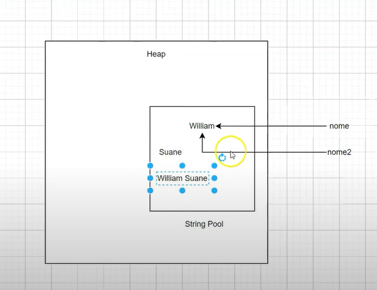
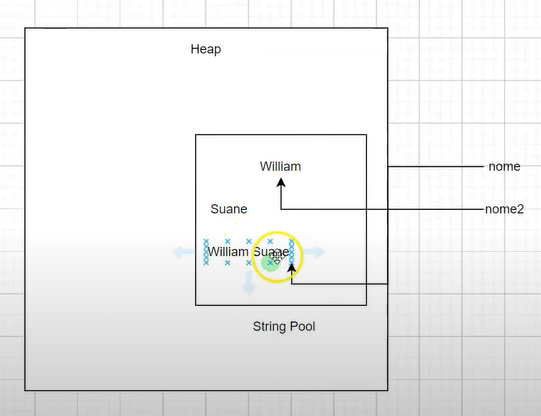
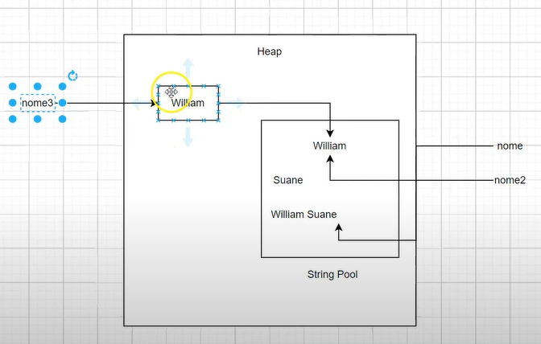

## Classes Utilitárias - Wrappers pt 01

`wrapper` -> encapsula os tipos primitivos e transformam em objetos;

- Para criar é só pegar o nome primitivo e começar com letra maiuscula;
- Poder passar os parametros nos valores numericos por referencia não mais por valor caso você queira fazer alguma alteração dentro do método;
- Quando trabalhamos com estrutura de dados no pacote de coleções por exemplo array list eles não trabalham com tipos primitivos; `EX.:` não podemos criar uma lista com tipo primitivo e sim com `Integer`;

**`OUTRO EXEMPLO`**

- Se chamar o `booleanPrimitivo` e apertar `.` você vai ver que não tem nenhum método pra gente chamar mas se chamar `booleanWrapper` você vai ver que temos alguns métodos para utilizar e esses `métodos` estão vindo da própria classe `Boolean` e eles tambem estão vindo de outra interfaces como `Comparable`, `Constable` e no final das contas temos `Boolean` que é um objeto;

```java
public class WrappersTeste {
//Regra da quantidade de bits do tamanho do espaço em memória que você esta alocando:
    public static void main(String[] args) {
        byte bytePrimitivo = 1;
        short shortPrimitivo = 1;
        int intPrimitivo = 1;
        long longPrimitivo = 10L;
        float floatPrimitivo = 10F;
        double doublePrimitivo = 10D;
        char charPrimitivo = 'A';
        boolean booleanPrimitivo = true;
//Regra de polimorfismo é aplicada:
        Byte byteWrapper = 1;
        Short shortWrapper = 1;
        Integer integerWrapper = 1;// auto boxing
        Long longWrapper = 10L;
        Float floadWrapper = 10F;
        Double doubleWrapper = 10D;
        Character characterWrapper = 'A';
        Boolean booleanWrapper = true;
    }
}
```

## Classes Utilitárias - Wrappers pt 02

`Autoboxing` - é quando você tem um tipo primitivo e você simplemente faz o java transformar esse tipo primitivo em tipo `wrapper`;

`unboxing` - é ao contrario; `Ex.:` se tivesse uma variavel `primitiva` e você quer pegar `wrapper`: **`int i = integerWrapper;`** // unboxing, então o java esta se carregando de transformar esse tipo wrapper em tipo primitivo;

```java
public class WrappersTeste {
    public static void main(String[] args) {
//Conversão de String para Float:
        String valor = "10";
        Float f = Float.parseFloat(valor);
        System.out.println(f);
//Verificações de caracteres com Character
        System.out.println(Character.isDigit('9'));
        System.out.println(Character.isLetter('l'));
        System.out.println(Character.isLetterOrDigit('#'));
        System.out.println(Character.isUpperCase('A'));
        System.out.println(Character.isLowerCase('A'));
        System.out.println(Character.toUpperCase('a'));
        System.out.println(Character.toUpperCase('9'));
    }
}
```

## Classes Utilitárias - Strings pt 01

`Strings` são imutáveis, ou seja, quando você muda o valor de uma string, o Java cria um novo espaço na memória em vez de alterar o existente;

`Strings` - objetos String em Java são imutáveis — eles não podem ser modificados depois de criados. Portanto, é seguro ter muitas referências a um objeto String;

`heap` - onde todos os objetos mora;

Essa parte de `String Pool` o java utiliza porque existe um conceito na área da ciência da computação chamado `string interning` - quando você utiliza as strings de forma imutável ou seja toda string que voce esta criando, voce cria ela pela primeira vez ela vai ser alocada no pool de string mas se voce cria uma segunda vez o java não vai duplicar;

- Voce tem uma variavel de referencia `nome` que esta fazendo referencia para o nome la dentro `Eduardo`;

- Quando estamos comparando strings precisa utilizar o `equals` porque ele vai validar se as strings o valor dela é igual mas no exemplo queremos validar a referencia se `nome` e `nome2` estao fazendo referencia para o mesmo objeto em memória nesse caso é `Eduardo` que esta dentro do pool utiliza `==`;



```java
String nome = "Eduardo"; // String constant pool
String nome2 = "Eduardo"; // String constant pool
nome.concat(" Augusto");
System.out.println(nome);
System.out.println(nome == nome2);
```

```
Eduardo
true
```



```java
String nome = "Eduardo"; // String constant pool
String nome2 = "Eduardo"; // String constant pool
nome = nome.concat(" Augusto");
System.out.println(nome);
System.out.println(nome == nome2);
```

```
Eduardo Augusto
false
```

</br>

Se String é objeto criar com se fosse um objeto:

`String nome3 = new String();` - string é uma classe que estamos usando como variavel de referencia, é possivel usar new;

`EXEMPLO` - cria uma string com o nome `Eduardo`->`String nome3 = new String("Eduardo");`

`System.out.println(nome2 == nome3);` - `false` -> nós temos uma variavel de referencia nome3 que esta fazendo referencia a um objeto e e quando faz dessa forma esta criando em outro lugar;

```java
String nome = "Eduardo"; // String constant pool; quando estamos trabalhando com string que chamamos de literal pegamos diretamente do pool;
String nome2 = "Eduardo"; // String constant pool
nome = nome.concat(" Augusto");
System.out.println(nome);
System.out.println(nome == nome2);
String nome3 = new String(Eduardo);// quando cria um objeto a variavel de referencia esta fazendo referencia para o objeto
System.out.println(nome2 == nome3);
```

```
Eduardo Augusto
false
false
```

- Se quisesse pegar o valor que tem Eduardo lá dentro `.intern()`-> ele retorna uma representação canonica desse objeto;

```java
System.out.println(nome2 == nome3.inter());
```

```java
true // ou seja o nome agora esta sendo comparado, o nome2 esta sendo comparado com o valor que temos dentro do pool que é Eduardo
```

## Classes Utilitárias - Strings pt 02

```java
public class StringTestes {
    public static void main(String[] args) {
        String nome = "eduardo";

        //nome.concat("Malcher Jr.");
        nome = nome.concat("Augusto");

        String nome2 = " Augusto.";
        String nome3 = new String("eduardo");
        // 1 Variavel de referencia 2-um obj do tipo String 3- uma String no pool de String

        System.out.println(nome);

        String teste  = "Maria";
        String teste2 = "maria";
        String teste3 = "AAaaaaoooooii";
        String teste4 = "     meio      ";

        System.out.println(teste.charAt(3)); // i
        System.out.println(teste.equalsIgnoreCase(teste2)); // true
        System.out.println(teste.length()); // 5


        System.out.println(teste3.replace('a', 'B')); // AABBBBoooooii
        System.out.println(teste3.toUpperCase()); // AAAAAAOOOOOII
        System.out.println(teste3.toLowerCase()); // aaaaaaoooooii

        System.out.println(teste.substring(0,3)); // Mar
        System.out.println(teste4.trim()); //meio


    }
}

```

## Classes Utilitárias - Strings pt 03 - Desempenho

**Quando deve utilizar String, StringBuilder, StringBuffer:**

- Quando esta trabalhando com sistema você está fazendo um mapeamento das regras de negócios que você tem no mundo real, essa regra de negócio do mundo real é o que vamos dizer se você realmente precisa utilizar String, StringBuilder, StringBuffer, na maioria das vezes é String (pessoa, estudante..); StringBuffer e builder para adiciona um pouco mais de complexidade;

```java
public class StringPerformaceTeste {
    public static void main(String[] args) {
        long inicio = System.currentTimeMillis();
        concatString(30000);
        long fim = System.currentTimeMillis();
        System.out.println("Tempo gasto String "+ (fim-inicio) + " ms");

        inicio = System.currentTimeMillis();
        concatStringBuilder(10000000);
        fim = System.currentTimeMillis();
        System.out.println("Tempo gasto StringBuild "+ (fim-inicio) + " ms");

        inicio = System.currentTimeMillis();
        concatStringBuffer(10000000);
        fim = System.currentTimeMillis();
        System.out.println("Tempo gasto StringBuffer "+ (fim-inicio) + " ms");

        /*
           Tempo gasto String 3079 ms
           Tempo gasto StringBuild 286 ms
           Tempo gasto StringBuffer 523 ms
        */

    }

    private static void concatString(int tam){
        String string = "";
        for(int i = 0; i< tam; i++){
            string += i;
        }
    }
    private static void concatStringBuilder(int tam){
        StringBuilder sb = new StringBuilder(tam);
        for(int i = 0; i< tam; i++){
            sb.append(i);
        }
    }
    private static void concatStringBuffer(int tam){
        StringBuffer sb = new StringBuffer(tam);
        for(int i = 0; i< tam; i++){
            sb.append(i);
        }
    }
}
```

**`Exemplo simples Chatgpt`**

- Imagine que você está escrevendo letras em uma palavra várias vezes, como num jogo de formar palavras. Se usar o jeito mais básico com String, o Java vai criar um novo papel cada vez que você adicionar uma letra. Isso gasta tempo e memória.
- Agora, se você usar algo como `StringBuilder`, o Java só pega o mesmo papel e adiciona a letra no final, economizando esforço.

`Usando String (menos eficiente):`

```java
public class ExemploString {
    public static void main(String[] args) {
        String palavra = ""; // Começa com uma string vazia
        for (int i = 0; i < 5; i++) { // Adiciona letras 5 vezes
            palavra += "a"; // Cada vez cria um novo texto
            System.out.println("Passo " + (i + 1) + ": " + palavra);
        }
    }
}
```

```
Passo 1: a
Passo 2: aa
Passo 3: aaa
Passo 4: aaaa
Passo 5: aaaaa
```

`Usando StringBuilder (mais eficiente):`

```java
public class ExemploStringBuilder {
    public static void main(String[] args) {
        StringBuilder palavra = new StringBuilder(); // Começa com um bloco para montar o texto
        for (int i = 0; i < 5; i++) { // Adiciona letras 5 vezes
            palavra.append("a"); // Adiciona ao mesmo bloco de texto
            System.out.println("Passo " + (i + 1) + ": " + palavra);
        }
    }
}
```

```
Passo 1: a
Passo 2: aa
Passo 3: aaa
Passo 4: aaaa
Passo 5: aaaaa
```

**A diferença é que o StringBuilder não cria um novo texto toda vez, ele só adiciona ao mesmo bloco de texto, o que o torna mais rápido quando o texto cresce.**

**StringBuffer (mais lento, mas seguro para múltiplas threads):**

```java
public class ExemploStringBuffer {
    public static void main(String[] args) {
        StringBuffer texto = new StringBuffer("Olá");
        texto.append(", Mundo!"); // Adiciona texto ao final
        System.out.println(texto); // Saída: Olá, Mundo!
    }
}
```

## Classes Utilitárias - Strings pt 04 - StringBuilder

- String são imutaveis todas as vezes que você faz alguma coisa você esta criando uma string no pool de string de memoria mas quando trabalha com stringbuilder vai trabalhar com string dentro da memoria e do objeto string builder;

```java

public class StringBuildTeste {
    public static void main(String[] args) {
        String s = "Uma Frase COmum";
        StringBuilder sb = new StringBuilder(16);
        // = StringBuffer
        sb.append("0123456789");//adiciona uma string pelo método append
        System.out.println(sb);
        System.out.println(sb.reverse());
        System.out.println(sb.delete(0,2));
        System.out.println(sb.insert(2,"###"));

    }
}
```

```
0123456789
9876543210
76543210
76###543210
```

> Em java `10.000` é o memso que `10_000` | `_`;

**`EXPLICAÇÃO CHGPT HEAP E STACK`**

- O **heap** é uma área de memória usada pela **Java Virtual Machine (JVM)** ou por outros ambientes de execução para armazenar objetos e suas instâncias durante a execução de um programa. Ele faz parte da memória principal do sistema e é gerenciado pelo **garbage collector (GC)**.

**Características principais do heap:**

**Armazenamento de Objetos:**

- É onde todos os objetos criados em tempo de execução, como instâncias de classes e arrays, são armazenados.
- Objetos armazenados no heap permanecem acessíveis enquanto houver referências apontando para eles.

**Gerenciamento Automático:**

O **garbage collector** é responsável por liberar espaço no heap removendo objetos que não são mais acessíveis (ou seja, que não têm mais referências no código).

**Divisão da Memória Heap (na JVM):**

- A memória do heap pode ser dividida em várias regiões para otimizar o desempenho, como:

**Young Generation:** Para objetos de curta duração, como variáveis temporárias.

**Old Generation (ou Tenured Generation):** Para objetos de longa duração, como aqueles que sobrevivem por mais tempo no programa.

**Permanent Generation (PermGen) ou Metaspace (desde o Java 8):** Usada para armazenar metadados de classes, métodos, e outros dados da JVM.

**Alocação Dinâmica:**

- A memória do heap é alocada dinamicamente durante a execução. O tamanho pode aumentar ou diminuir conforme a necessidade.

**Multithreading:**

- O heap é compartilhado entre todas as threads do programa. Isso significa que múltiplas threads podem acessar objetos armazenados nele simultaneamente. Por isso, o controle de sincronização (quando necessário) é importante.

**Heap vs. Stack**

**Heap:**

- Memória usada para armazenar objetos e dados dinâmicos.
- Compartilhada entre threads.
- Mais lenta para acessar em comparação ao stack.
- Gerenciada pelo garbage collector.

**Stack:**

- Memória usada para armazenar variáveis locais e chamadas de métodos.
- Cada thread tem sua própria pilha de execução.
- Mais rápida e tem tamanho fixo.
- Automaticamente limpa quando o método termina.

```java
public class Main {
    public static void main(String[] args) {
        String texto = "Olá"; // Armazenado no heap (como objeto)
        int numero = 10; // Armazenado no stack (como variável primitiva)

        Pessoa pessoa = new Pessoa("Eduardo"); // Objeto "pessoa" armazenado no heap
    }
}

class Pessoa {
    String nome;

    public Pessoa(String nome) {
        this.nome = nome; // Nome também armazenado no heap
    }
}
```
