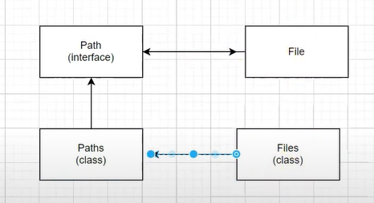

## Classes Utilitárias - NIO pt 01 - Path, Paths, Files pt 01

Foi criado uma ``interface`` chamada ``Path`` que vai trabalhar no lugar de ``File`` e para criar um path precisa de uma ``classe`` `Paths` e depois usar a classe ``Files`` para trabalhar com o arquivo;

