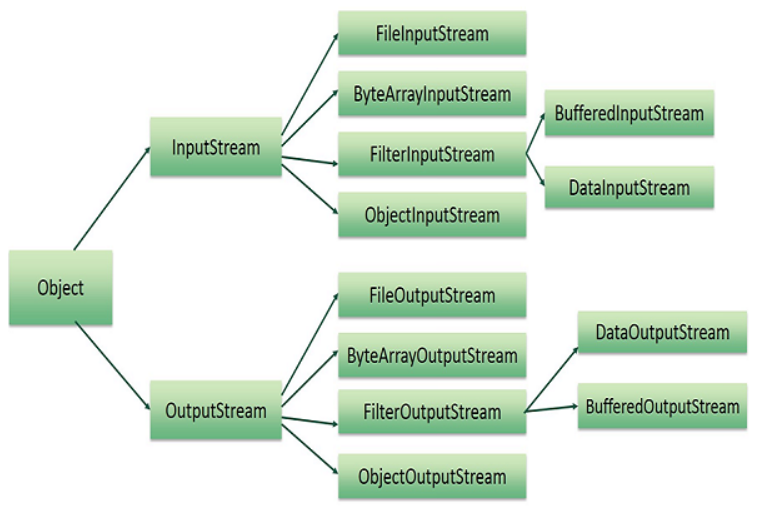

## Classes Utilitárias - Serialization pt 01

`serialization` - é você pegar um objeto que você tem em memória e persistir ele, aonde você vai persistir depende da onde você coloca o seu destino;

- Cria um objeto e digamos que voce quer salvar o estado desse objeto em um arquivo e depois voce ler;

- Primeiro precisa criar o método que salva;

- Para serializar você precisa trabalhar com uma das classes do pacote NIO, quando esta serializando você esta transformando um objeto em um array de bytes, esta trabalhando em baixo nivel, se esta em baixo nivel esta trabalhando com uma das classes String;



```java
public class Turma{
    private String nome;

    public Turma(String nome) {
        this.nome = nome;
    }

    public String getNome() {
        return nome;
    }

    public void setNome(String nome) {
        this.nome = nome;
    }

    @Override
    public String toString() {
        return "Turma{" +
                "nome='" + nome + '\'' +
                '}';
    }
}

```

```java
public class Aluno extends Pessoa implements Serializable { //precisa falar que esse objeto é serializado, Serializable chamamos de interface flag - interface que não tem métodos só serve para testar naquele teste

    private Long id;
    private String nome;
    private transient String password;
    private static String  nomeEscola = "DEVDOJO";

    private transient Turma turma;// transient não é serializado

    public Aluno(Long id, String nome, String password) {
        super();
        this.id = id;
        this.nome = nome;
        this.password = password;
    }

    public Long getId() {
        return id;
    }

    public void setId(Long id) {
        this.id = id;
    }

    public String getNome() {
        return nome;
    }

    public void setNome(String nome) {
        this.nome = nome;
    }

    public String getPassword() {
        return password;
    }

    public void setPassword(String password) {
        this.password = password;
    }

    public static String getNomeEscola() {
        return nomeEscola;
    }

    public static void setNomeEscola(String nomeEscola) {
        Aluno.nomeEscola = nomeEscola;
    }

    @Override
    public String toString() {
        return "Aluno{" +
                "id=" + id +
                ", nome='" + nome + '\'' +
                ", password='" + password + '\'' +
                ", nomeEscola='" + nomeEscola + '\'' +
                ", Turma='" + turma + '\'' +
                '}';
    }

    public Turma getTurma() {
        return turma;
    }

    public void setTurma(Turma turma) {
        this.turma = turma;
    }

    private void writeObject(ObjectOutputStream oss){
        try{
            oss.defaultWriteObject();
            oss.writeUTF(turma.getNome());
        }catch (IOException e){
            e.printStackTrace();
        }
    }
    private void readObject(ObjectInputStream ois){
        try{
            ois.defaultReadObject();
            turma = new Turma(ois.readUTF());
        }catch (IOException | ClassNotFoundException e){
            e.printStackTrace();
        }
    }

}

```

```java
public class SerializacaoTest {
    public static void main(String[] args) {
        gravadorObjeto();
        leitorObjeto();
    }

    public static void gravadorObjeto(){

        Turma t = new Turma("MARATONA JAVA");

        Aluno aluno = new Aluno(1L, "Eduardo", "admin123");

        aluno.setTurma(t);

        try(ObjectOutputStream oss = new ObjectOutputStream(new FileOutputStream("aluno.ser"))){
            oss.writeObject(aluno);
        }catch (IOException e){
            e.printStackTrace();
        }
    }
    public static void leitorObjeto(){
        try(ObjectInputStream osi = new ObjectInputStream(new FileInputStream("aluno.ser"))){
            Aluno aluno = (Aluno) osi.readObject();
            System.out.println(aluno);
        }catch (IOException | ClassNotFoundException e){
            e.printStackTrace();
        }
    }
}
```
