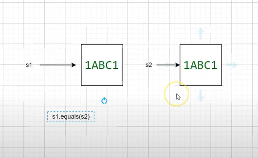
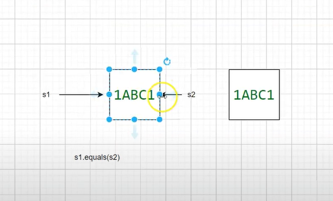

## Coleções pt 01 - equals pt 01

Temos 2 variaveis de referencia e 2 objetos;



````java
public class EqualsTest01 {
    public static void main (String[] args) {
    Smartphone s1 = new Smartphone( serialNumber: "1ABC1", marca: "iPhone");
    Smartphone s2 = new Smartphone( serialNumber: "1ABC1", marca: "iPhone") ;
    System.out.println(s1.equals(s2)) ;|
	}
}
````
````
false
````



````java
public class EqualsTest01 {
    public static void main (String[] args) {
    Smartphone s1 = new Smartphone( serialNumber: "1ABC1", marca: "iPhone");
    Smartphone s2 = s1;
    System.out.println(s1.equals(s2)) ;|
	}
}
````
````
true
````
## Coleções pt 02 - equals pt 02

- Toda vez que for comparar os objetos do tipo smartphone precisa levar em consideração o serialNumber deles e não a referencia;
- Regras para sobrescrever ``equals``:
1. - Reflexivo = x.equals(x) tem que ser true para tudo que for diferente de null
2. - Simetrico para x e y diferentes de null, se x.equals(y) == true logo y.equals(x) tem que ser true

3. - Transitividade para x, y, z diferentes de null, se x.equals(y) == true, logo y.equals(x) == true e x.equals(z) == true logo y.equals(z) também tem que ser true
4. - Consistente x.equals(y) deve sempre retornar o mesmo valor para x diferente de null x.equals(null) tem que retornar false;

5. - Para hashcode
6. - Se x.equals(y) == true y.hashCode() == x.hashCode();
7. - y.hashCode() == x.hashCode() não necessariamente o equals deverá retornar true
8. - x.equals(y) == false
9. - y.hashCode() != x.hashCode() x.equals(y) deverá ser false

````java
   @Override
    public boolean equals(Object obj) {
        if (obj == null) return false;
        if (this == obj) return true;
        if (this.getClass() != obj.getClass()) return false;
        Smartphone smartphone = (Smartphone) obj;
        return serialNumber != null && serialNumber.equals(smartphone.serialNumber);
    }
````