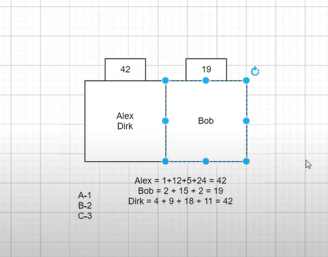
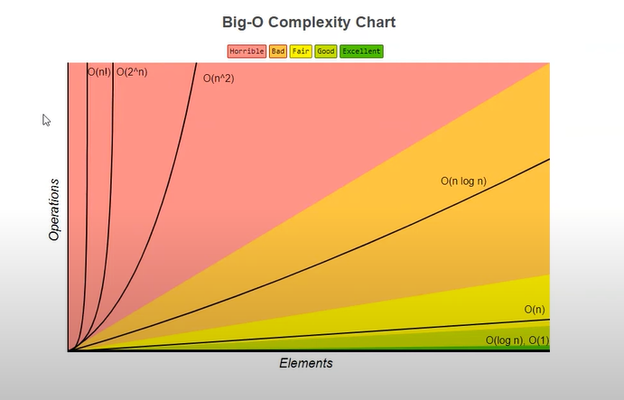
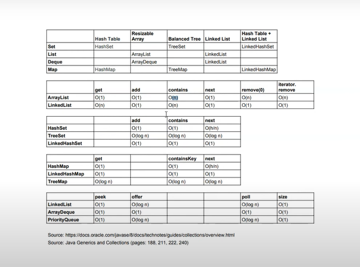

## Coleções pt 03 - hashCode pt 01

`hash` - é um numero que voce gera para identificar o seu valor, melhora a performance, trabalhando pegando diretamente um indice;

Quando tem o mesmo numero com 2 valores diferentes, o java vai utilizar o `equals` porque o equals vai trazer o valor baseado no que nós definimos logicamente, no caso compara a String;

>

```java
// se x. equals (y) == true, y. hashCode() == x. hashCode()
// y.hashCode() == x.hashCode() não necessariamente o equals de y.equals(x) tem que ser true
// x.equals (y) == false
// y.hashCode() != x.hashCode() x.equals(y) deverá ser false.

@Override
    public int hashCode() {
        return serialNumber == null ? 0 : this.serialNumber.hashCode();
    }
```

## Coleções pt 05 - Complexidade Big-O

`Ordered` -> lembra a ordem dos elementos aonde deveriam estar, se esta trabalhando com array tem as posições 1,2,3,4,5, o java lembra dessa ordem, um array é ordenado;

`Sorted` -> quando é sortido a interação da ordem geralmente é baseado em algo que voce pré definiu, digamos que voce tem um conjunto de nomes e você quer esse conjunto de nomes sejam sempre organizados em ordem alfabética então todas as vezes que você inserir em coleção, a coleção tem que se ajustar e ordenar os nomes em forma alfabética;

> Estrutura básica do Framework Java
> 

- `Coleções no Java` não esta referindo a classe collection, esta referindo ao conjunto de dados;
- `Collection` que é uma interface; "passa no teste é um"(List | Queue | Set);

> Performance

> </br>

></br>

- Quando trabalha com coleções tem que tomar cuidado com a complexidade big-o;
