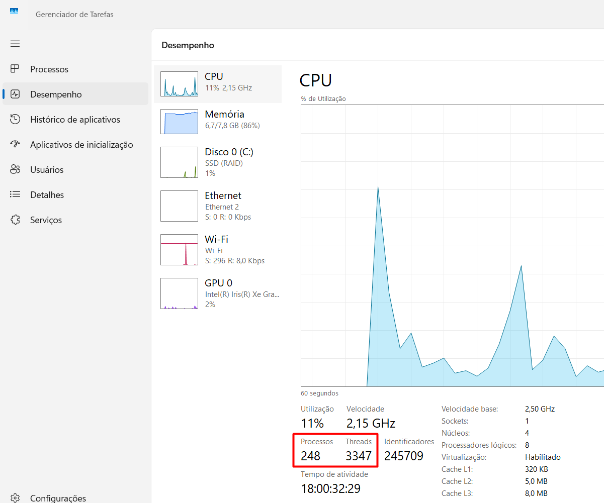

## Threads pt 01 - Introduction

`threads` - tem duas definições pode ser um objeto porque tem uma classe chamada thread e tem um processo é uma linha de execução, no sistema operacional tem diversos tipos de threads ou seja como se fosse trabalhadores que divide a carga de tarefas de um determinado processo;

Geralmente quando esta trabalhando com threads pouca coisa é garantida, a JVM no caso do Java vai tomar conta da execução dessas threads e na maioria dos casos não tem muito o que fazer porque só pode meio que dar indicações do que você gostaria que acontecesse mas a parte de escalonamento quando a thread é executada, quando vai ser terminada é tudo parte da JVM;

Quando tem processador tem os nucleos e os processadores lógicos que geralmente é o dobro então, no meu caso tem 8, 8 threads que podem ser utilizadas paralelamente nesse caso, todas threads que tem são virtuais, não consideradas nativas;



`Daemon x User` - o java pode trabalhar com dois tipos de threads; o java encerra o programa quando todas as threads do tipo `user` são terminadas; as do tipo `daemon` elas não tem tanta prioridade por exemplo a thread que toma conta do collector ou seja aqui vai remover e limpar os objetos de memória uma thread do tipo daemon ou seja aquela thread que vai ser executada e as threads do tipo user tiver sido finalizadas o programa vai acabar independente dessa thread estar rodando ou não, meio que descarta;

- Todo programa tem uma thread e toda thread tem um nome;

**`EXEMPLO CHATGPT`**

Exemplo: Criando e Executando uma Thread com Runnable

```java
public class ExemploRunnable {
    public static void main(String[] args) {
        // Criando uma tarefa que será executada pela thread
        Runnable tarefa = () -> {//A interface Runnable define uma única função, run(), onde colocamos o código que será executado na thread. Aqui usamos uma expressão lambda (Runnable tarefa = () -> {}) para criar a tarefa.
            // Código que será executado dentro da thread
            for (int i = 1; i <= 5; i++) {
                System.out.println("Executando a tarefa na thread: " + Thread.currentThread().getName() + " | Iteração: " + i);
                try {
                    // Faz a thread "dormir" por 500ms para simular processamento
                    Thread.sleep(500); // Pausa de 500 milissegundos
                } catch (InterruptedException e) {
                    System.out.println("A thread foi interrompida.");
                }
            }
        };

        // Criando a thread e associando-a à tarefa
        Thread thread = new Thread(tarefa);

        // Iniciando a thread
        thread.start(); // Isso inicia a execução da tarefa na thread em paralelo com a thread principal.

        // Código na thread principal (main)
        for (int i = 1; i <= 5; i++) {
            System.out.println("Executando na thread principal: " + Thread.currentThread().getName() + " | Iteração: " + i);
            try {
                Thread.sleep(500); // Pausa de 500 milissegundos
            } catch (InterruptedException e) {
                System.out.println("A thread principal foi interrompida.");
            }
        }
    }
}

```

```
Executando na thread principal: main | Iteração: 1
Executando a tarefa na thread: Thread-0 | Iteração: 1
Executando na thread principal: main | Iteração: 2
Executando a tarefa na thread: Thread-0 | Iteração: 2
Executando na thread principal: main | Iteração: 3
Executando a tarefa na thread: Thread-0 | Iteração: 3
Executando na thread principal: main | Iteração: 4
Executando a tarefa na thread: Thread-0 | Iteração: 4
Executando na thread principal: main | Iteração: 5
Executando a tarefa na thread: Thread-0 | Iteração: 5
```

## Threads pt 02 - Estados das threads

**`EXEMPLO CHATGPT`**

NEW -> RUNNABLE -> (BLOCKED / WAITING / TIMED_WAITING) -> TERMINATED

Esses estados são controlados pelo JVM e Thread Scheduler. Como desenvolvedor, você pode interagir com eles através de métodos, mas o agendamento de execução depende do sistema operacional.

- As threads em Java são responsáveis por dividir o trabalho em unidades menores dentro de um único programa/processo.
- O ciclo de execução é organizado por essas threads, que trabalham paralelamente para completar as tarefas.

## Threads pt 03 - Prioridade e Sleep

A prioridade de uma thread em Java define a importância relativa dela para o escalonador (scheduler), que decide qual thread será executada. No entanto, é importante lembrar que a prioridade é apenas uma sugestão para o sistema operacional e não garante ordem ou execução específica.

```java
Thread thread1 = new Thread(() -> {
    System.out.println("Thread com baixa prioridade");
});
thread1.setPriority(Thread.MIN_PRIORITY);

Thread thread2 = new Thread(() -> {
    System.out.println("Thread com alta prioridade");
});
thread2.setPriority(Thread.MAX_PRIORITY);

thread1.start();
thread2.start();
```

`Método sleep()`

O método sleep() da classe Thread faz com que a thread entre no estado TIMED_WAITING (espera por tempo limitado) por um período especificado. Durante esse tempo, a thread pausa sua execução, liberando o processador para outras threads.

```java
try {
    System.out.println("Thread pausada por 2 segundos");
    Thread.sleep(2000); // Pausa por 2000 milissegundos (2 segundos)
    System.out.println("Thread retomou execução");
} catch (InterruptedException e) {
    System.out.println("Thread interrompida");
}
```

## Threads pt 04 - Yield e Join

`Método yield()`

O método yield() da classe Thread é usado para sugerir ao Thread Scheduler que a thread atual deve pausar sua execução e permitir que outras threads de mesma prioridade sejam executadas.

```java
public class YieldExample {
    public static void main(String[] args) {
        Thread thread1 = new Thread(() -> {
            for (int i = 0; i < 5; i++) {
                System.out.println("Thread 1 executando...");
                Thread.yield(); // Sugere ao scheduler ceder o processador
            }
        });

        Thread thread2 = new Thread(() -> {
            for (int i = 0; i < 5; i++) {
                System.out.println("Thread 2 executando...");
            }
        });

        thread1.start();
        thread2.start();
    }
}
```

`Método join()`

O método join() permite que uma thread aguarde a conclusão de outra antes de continuar sua execução.

```java
public class JoinExample {
    public static void main(String[] args) {
        Thread thread1 = new Thread(() -> {
            for (int i = 0; i < 5; i++) {
                System.out.println("Thread 1 executando...");
                try {
                    Thread.sleep(500); // Simula tempo de execução
                } catch (InterruptedException e) {
                    Thread.currentThread().interrupt();
                }
            }
        });

        Thread thread2 = new Thread(() -> {
            System.out.println("Thread 2 esperando a Thread 1 terminar...");
            try {
                thread1.join(); // Aguarda a thread1 concluir
            } catch (InterruptedException e) {
                Thread.currentThread().interrupt();
            }
            System.out.println("Thread 2 retomando execução após a Thread 1");
        });

        thread1.start();
        thread2.start();
    }
}
```

- A Thread 1 começa a executar e pode ocasionalmente ceder o processador para outra thread (dependendo do yield()).
- A Thread 2 aguarda a conclusão da Thread 1 devido ao uso do join().
- Após a Thread 1 concluir, a Thread 2 retoma sua execução.

```java
public class YieldAndJoinExample {
    public static void main(String[] args) {
        Thread thread1 = new Thread(() -> {
            for (int i = 0; i < 3; i++) {
                System.out.println("Thread 1 executando...");
                Thread.yield(); // Sugere ceder o processador
                try {
                    Thread.sleep(500); // Pausa para simular execução
                } catch (InterruptedException e) {
                    Thread.currentThread().interrupt();
                }
            }
        });

        Thread thread2 = new Thread(() -> {
            System.out.println("Thread 2 esperando a Thread 1 terminar...");
            try {
                thread1.join(); // Aguarda a thread1 terminar
            } catch (InterruptedException e) {
                Thread.currentThread().interrupt();
            }
            System.out.println("Thread 2 retomando execução após a Thread 1");
        });

        thread1.start();
        thread2.start();
    }
}
```

## Threads pt 05 - Sincronismo de thread pt 01

**`EXEMPLO CHATGPT`**

O sincronismo de threads em Java é essencial para evitar problemas de condição de corrida (race conditions) e garantir que múltiplas threads não acessem recursos compartilhados ao mesmo tempo de forma conflitante.

`Problema: Condição de Corrida`

Quando duas ou mais threads acessam uma mesma variável ou recurso ao mesmo tempo e pelo menos uma delas modifica o estado, o resultado pode ser imprevisível.

```java
public class ExemploCondicaoDeCorrida {
    private int contador = 0;

    public void incrementar() {
        contador++;
    }

    public static void main(String[] args) {
        ExemploCondicaoDeCorrida exemplo = new ExemploCondicaoDeCorrida();

        Thread t1 = new Thread(() -> {
            for (int i = 0; i < 1000; i++) {
                exemplo.incrementar();
            }
        });

        Thread t2 = new Thread(() -> {
            for (int i = 0; i < 1000; i++) {
                exemplo.incrementar();
            }
        });

        t1.start();
        t2.start();

        try {
            t1.join();
            t2.join();
        } catch (InterruptedException e) {
            Thread.currentThread().interrupt();
        }

        System.out.println("Contador final: " + exemplo.contador); // O resultado pode ser inconsistente
    }
}
```

`Bloco Sincronizado`

```java
public void incrementar() {
    synchronized (this) {
        contador++;
    }
}
```

`Método Sincronizado`

```java
public synchronized void incrementar() {
    contador++;
}
```

Exemplo: Sincronizando o Incremento

```java
public class ExemploSincronizado {
    private int contador = 0;

    public synchronized void incrementar() {
        contador++;
    }

    public static void main(String[] args) {
        ExemploSincronizado exemplo = new ExemploSincronizado();

        Thread t1 = new Thread(() -> {
            for (int i = 0; i < 1000; i++) {
                exemplo.incrementar();
            }
        });

        Thread t2 = new Thread(() -> {
            for (int i = 0; i < 1000; i++) {
                exemplo.incrementar();
            }
        });

        t1.start();
        t2.start();

        try {
            t1.join();
            t2.join();
        } catch (InterruptedException e) {
            Thread.currentThread().interrupt();
        }

        System.out.println("Contador final: " + exemplo.contador); // Agora o resultado é consistente
    }
}
```

`Exemplo Prático de Deadlock`

Deadlock ocorre quando duas threads esperam indefinidamente por recursos que estão bloqueados por outra thread.

```java
public class ExemploDeadlock {
    private final Object lock1 = new Object();
    private final Object lock2 = new Object();

    public void metodo1() {
        synchronized (lock1) {
            System.out.println("Thread 1: Bloqueou lock1");
            synchronized (lock2) {
                System.out.println("Thread 1: Bloqueou lock2");
            }
        }
    }

    public void metodo2() {
        synchronized (lock2) {
            System.out.println("Thread 2: Bloqueou lock2");
            synchronized (lock1) {
                System.out.println("Thread 2: Bloqueou lock1");
            }
        }
    }

    public static void main(String[] args) {
        ExemploDeadlock exemplo = new ExemploDeadlock();

        Thread t1 = new Thread(exemplo::metodo1);
        Thread t2 = new Thread(exemplo::metodo2);

        t1.start();
        t2.start();
    }
}
```

```
Thread 1: Bloqueou lock1
Thread 2: Bloqueou lock2
// Deadlock ocorre, ambas as threads ficam esperando
```

## Threads pt 07 - Sincronismo de thread pt 03 - Classes thread safe

`classes thread safe` - os métodos que tem para acesso dessa classe são métodos sincronizados;

**`EXEMPLO CHATGPT`**

Uma classe thread-safe é aquela que pode ser usada por múltiplas threads ao mesmo tempo sem causar problemas como dados corrompidos ou condições de corrida. Em Java, para garantir que uma classe seja thread-safe, várias técnicas podem ser utilizadas, como o uso de sincronização e bloqueios.

`Sincronização de Métodos`

Uma das formas mais simples de tornar uma classe thread-safe é sincronizando os métodos que acessam ou modificam recursos compartilhados. Isso garante que apenas uma thread tenha acesso ao método de cada vez.

```java
public class ContaBancaria {
    private int saldo;

    public synchronized void depositar(int valor) {
        saldo += valor;
    }

    public synchronized void sacar(int valor) {
        saldo -= valor;
    }

    public synchronized int getSaldo() {
        return saldo;
    }
}
```

Neste exemplo, os métodos depositar, sacar e getSaldo são sincronizados, o que impede que múltiplas threads acessem simultaneamente o saldo da conta, evitando condições de corrida.

`Blocos de Código Sincronizados`

Em vez de sincronizar métodos inteiros, você também pode usar blocos de código sincronizados para restringir o escopo da sincronização, o que pode ser mais eficiente.

```java
public class ContaBancaria {
    private int saldo;

    public void depositar(int valor) {
        synchronized (this) {
            saldo += valor;
        }
    }

    public void sacar(int valor) {
        synchronized (this) {
            saldo -= valor;
        }
    }

    public synchronized int getSaldo() {
        return saldo;
    }
}
```

Aqui, a sincronização é feita apenas nas seções de código onde há acesso ao recurso compartilhado, reduzindo a sobrecarga de sincronizar o método inteiro.

`Usando ReentrantLock`

Outra forma de garantir thread safety é utilizando a classe ReentrantLock, que oferece mais controle sobre o bloqueio de threads.

```java
public class ContaBancaria {
    private int saldo;
    private final Lock lock = new ReentrantLock();

    public void depositar(int valor) {
        lock.lock();
        try {
            saldo += valor;
        } finally {
            lock.unlock();
        }
    }

    public void sacar(int valor) {
        lock.lock();
        try {
            saldo -= valor;
        } finally {
            lock.unlock();
        }
    }

    public int getSaldo() {
        lock.lock();
        try {
            return saldo;
        } finally {
            lock.unlock();
        }
    }
}
```

`Usando Coleções Thread-Safe`

Algumas coleções já vêm implementadas para serem thread-safe, como as encontradas no pacote java.util.concurrent, como o ConcurrentHashMap e o CopyOnWriteArrayList. Essas coleções lidam com a sincronização internamente, permitindo que você as utilize sem a necessidade de implementar controle de sincronização adicional.

Exemplo de uso do ConcurrentHashMap:

```java
public class Cache {
    private final ConcurrentHashMap<String, String> cache = new ConcurrentHashMap<>();

    public void put(String chave, String valor) {
        cache.put(chave, valor);
    }

    public String get(String chave) {
        return cache.get(chave);
    }
}
```

## Threads pt 09 - Sincronismo de thread pt 05 - Wait, notify e notifyAll

**`EXEMPLO CHATGPT`**

wait(), notify(), e notifyAll() são métodos da classe Object em Java que desempenham papéis essenciais no sincronismo entre threads. Eles são usados em blocos sincronizados para coordenar a execução de threads que compartilham um recurso comum.

Esses métodos permitem que uma thread espere até que outra thread notifique sobre uma mudança de estado em um objeto. Eles são frequentemente usados em padrões de produtor-consumidor ou outras situações onde há a necessidade de coordenação.

Exemplo: Produtor-Consumidor

```java
class Buffer {
    private int conteudo;
    private boolean disponivel = false;

    public synchronized void produzir(int valor) throws InterruptedException {
        while (disponivel) {
            wait(); // Aguarda o consumidor consumir
        }
        conteudo = valor;
        disponivel = true;
        System.out.println("Produziu: " + valor);
        notify(); // Notifica o consumidor
    }

    public synchronized int consumir() throws InterruptedException {
        while (!disponivel) {
            wait(); // Aguarda o produtor produzir
        }
        disponivel = false;
        System.out.println("Consumiu: " + conteudo);
        notify(); // Notifica o produtor
        return conteudo;
    }
}

public class ProdutorConsumidor {
    public static void main(String[] args) {
        Buffer buffer = new Buffer();

        Thread produtor = new Thread(() -> {
            try {
                for (int i = 0; i < 5; i++) {
                    buffer.produzir(i);
                }
            } catch (InterruptedException e) {
                Thread.currentThread().interrupt();
            }
        });

        Thread consumidor = new Thread(() -> {
            try {
                for (int i = 0; i < 5; i++) {
                    buffer.consumir();
                }
            } catch (InterruptedException e) {
                Thread.currentThread().interrupt();
            }
        });

        produtor.start();
        consumidor.start();
    }
}
```
