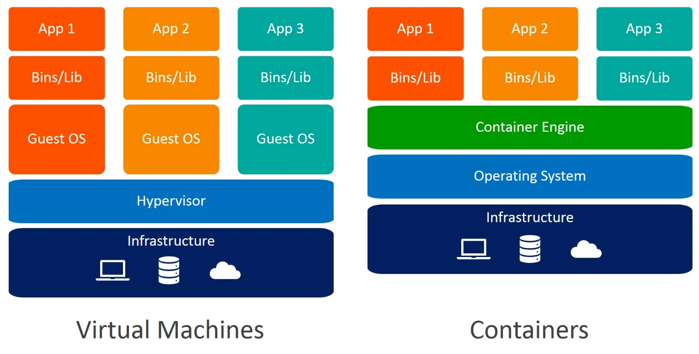
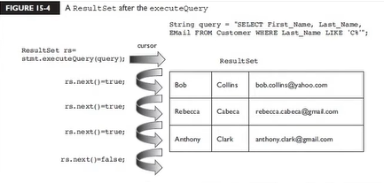
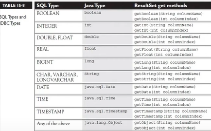
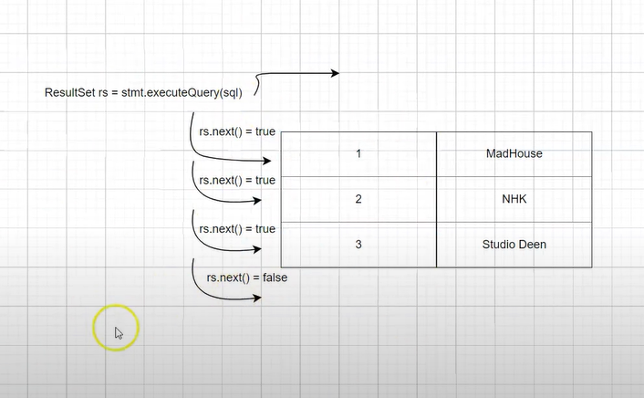

## JDBC pt 01 - Instalando Docker

`Docker` - facilita a utilização de diversos tipos sistemas, não só de bancos de dados; é uma forma mais leve de máquinas virtuais;

- **Vitual Box**: `infrastructure` -> os componentes do computador(memória RAM, processador); `Hypervisor` -> que possibilita a utilizar máquinas virtuais e quando tem máquinas virtuais tradicionais tem que instalar o sistema operacional `Guest OS` para cada máquina virtual instalada precisa instalar um SO em cima do seu SO, não é uma aplicação leve, uma aplicação pesada que precisa de muito recursos então o `docker` veio para solucionar esse problema;

- **Docker** ao invés de ter o `Hypervisor` e o `Guest OS` tem o `Docker Engine` que é basicamente uma aplicação que vai ao invés de voce precisar de um sistema operacional completamente novo ele vai ajudar voce a reutilizar algumas bibliotecas, algumas funcionalidades do SO existente, ai roda o que chamamos de `containers`;



https://docs.docker.com/desktop/setup/install/windows-install/

```sql
**PROMPT**

show databases;

create database agencia;

use agencia;

create table comprador (
    ->     id int not null auto_increment,
    ->     nome varchar(45) not null,
    ->     primary key (id)
    -> );

create table carro (
    ->     id int not null auto_increment,
    ->     placa varchar(8) not null,
    ->     nome varchar(45) not null,
    ->     compradorid int,
    ->     primary key (id),
    ->     foreign key (compradorid) references comprador(id)
    -> );

show tables;

desc carro;

desc comprador;

alter table comprador add column cpf varchar(30);

**WORKBENCH**

select * from agencia.carro;

select * from agencia.comprador;

```

**`JDBC`** é um pacote disponível desde os primórdios do Java. Ele foi criado justamente para abstrair os desenvolvedores dos problemas relacionados ao banco de dados;

- Algumas interfaces que tem no pacote `java.sql:` `Connection` - buscar conexão, `Statement` - realizar operações que vão afetar o estado do banco, `ResultSet` - é como estivesse fazendo select, você esta trabalhando com os resultados daquela consulta, essas são as 3 principais; elas são interfaces porque são dependentes do sistema de banco de dados que você esta utilizando, você não sabe por exemplo como é que faz uma conexão com MySQL, eles implementaram essas interfaces e você só precisa trabalhar chamando essa interface;

- A conexão ela vem através de uma classe chamada `driverManager` - é uma classe concreta e ela vai buscar o conector específico daquele banco de dados e vai devolver pra você uma conexão e a partir da conexão você consegui trabalhar com todas as outras interfaces;

- Para obter a conexão, precisamos de 3 coisas `url`- é o mais importante porque o driveManager é uma fábrica de objetos que vai te devolver uma conexão baseado na url que você especificar aqui, `usuario`, `password`;

- Agora vamos pegar uma conexão `Connection`, a maior parte das classes que estão no pacote `java.sql` vão lançar algum tipo de exceção;

```java
**ConexaoFactory**

package br.com.ZZCjdbc.conn;

import java.sql.Connection;
import java.sql.DriverManager;
import java.sql.SQLException;

public class ConexaoFactory {
    public Connection getConexao() {
        String url = "jdbc:mysql://localhost:3306/agencia";
        String user = "root";
        String password = "admin123";

        try {

            Connection connection = DriverManager.getConnection(url, user, password);
            System.out.println(connection);
            return connection;
        } catch (SQLException e) {
            e.printStackTrace();

        }

        return null;
    }
}
```

```java
**TesteConexao**

package br.com.ZZCjdbc.test;

import br.com.ZZCjdbc.conn.ConexaoFactory;

public class TesteConexao {

	public static void main(String[] args) {
		// TODO Auto-generated method stub
		ConexaoFactory conn = new ConexaoFactory();
		conn.getConexao();
	}

}               SAÍDA: com.mysql.cj.jdbc.ConnectionImpl@58e1d9d
```

- O método getConexao não esta utilizando nenhum atributo de classe e a conexão é a mesma independente de quantas vezes você chamar esse objeto então por isso coloca com `static`;
- O comando `Inline Variable` no Eclipse é uma funcionalidade de refatoração que substitui todas as referências de uma variável no código pelo valor ou expressão atribuída a ela (Alt + Shift + I);

```java
            Connection connection = DriverManager.getConnection(url, user, password);
            return connection;
            (Alt + Shift + I)
            return DriverManager.getConnection(url, user, password);
```

- Toda vez que abre uma conexão ela precisa ser fechada e tratada;

- Criar um pacote DB e criar uma classe CompradorDB, depois precisa de uma conexão, criar um `Statement` é o objeto que irá trabalhar com os dados lá no banco é o que vai executar essa instrução de comando `INSERT INTO...`;
- Quase todos os métodos lançam sql exception porque geralmente o banco de dados precisa passar pela rede para ser acessado e essa rede pode estar indisponível;
- Agora que nós temos o statement podemos executar `stmt.execute`; tem vários tipos de `execute`, quando precisar executar algo que vai mudar o estado do banco de dados por exemplo atualizar, inserir ou deletar utiliza `executeUpdate` se não tiver certeza no que vai executar até receber esse sql execute o `execute`, `executeQuery` que quando quer fazer uma consulta você vai ter diversos resultados para trabalhar;

```java
**ConexãoFactory**

		String url = "jdbc:mysql://localhost:3306/agencia";
		String user = "root";
		String password = "admin123";

		try {

			return DriverManager.getConnection(url, user, password);
		} catch (SQLException e) {
			e.printStackTrace();

		}

		return null;
	}

	public void close(Connection connection) {
		try {
			if (connection != null) {
				connection.close();
			}

		} catch (SQLException e) {
			e.printStackTrace();

		}
	}

	public void close(Connection connection, Statement stmt) {
		close(connection);
		try {
			if (stmt != null) {
				stmt.close();
			}

		} catch (SQLException e) {
			e.printStackTrace();

		}
```

```java
**CompradorDB**
String sql = "INSERT INTO `agencia`.`comprador` (`nome`, `cpf`) VALUES ('Maria', '123.456.789.12')";
		Connection conn = null;
		Statement stmt = null;

		try {
			conn = ConexaoFactory.getConexao();
			stmt = conn.createStatement();
			int rowsAffected = stmt.executeUpdate(sql);
			System.out.println("Linhas afetadas: " + rowsAffected);
		} catch (SQLException e) {
			e.printStackTrace();
		} finally {
			try {
				if (stmt != null)
					stmt.close();
				if (conn != null)
					conn.close();
			} catch (SQLException e) {
				e.printStackTrace();
			}
		}
```

```java
**TesteConexao**
		CompradorDB compradordb = new CompradorDB();
		compradordb.save();

        SAÍDA: Linhas afetadas: 1
```

- Alterando os códigos para passar os objetos:
- Criar um pacote classes e uma classe Comprador;

```java

public class Comprador {
	private Integer id;
	private String cpf;
	private String nome;

	public Comprador() {

	}


	public Comprador(Integer id, String cpf, String nome) {
		this.id = id;
		this.cpf = cpf;
		this.nome = nome;
	}
	public Integer getId() {
		return id;
	}
	public void setId(Integer id) {
		this.id = id;
	}
	public String getCpf() {
		return cpf;
	}
	public void setCpf(String cpf) {
		this.cpf = cpf;
	}
	public String getNome() {
		return nome;
	}
	public void setNome(String nome) {
		this.nome = nome;
	}


	@Override
	public int hashCode() {
		return Objects.hash(id);
	}


	@Override
	public boolean equals(Object obj) {
		if (this == obj)
			return true;
		if (obj == null)
			return false;
		if (getClass() != obj.getClass())
			return false;
		Comprador other = (Comprador) obj;
		return Objects.equals(id, other.id);
	}

```

```java
public class TesteConexao {

	public static void main(String[] args) {
		Comprador comprador = new Comprador("Teste122", "111.111.221-30");
		CompradorDB compradordb = new CompradorDB();
		compradordb.save(comprador);
	}
}
```

```java
public class CompradorDB {
	public void save(Comprador comprador) {
		String sql = "INSERT INTO `agencia`.`comprador` (`nome`, `cpf`) VALUES ('" + comprador.getCpf() + "', '" + comprador.getNome() + "')";
```

```java
package db;

import java.sql.Connection;
import java.sql.SQLException;
import java.sql.Statement;

import br.com.ZZCjdbc.conn.ConexaoFactory;
import classes.Comprador;

public class CompradorDB {
	public static void save(Comprador comprador) {
		String sql = "INSERT INTO `agencia`.`comprador` (`nome`, `cpf`) VALUES ('" + comprador.getCpf() + "', '"
				+ comprador.getNome() + "')";
		Connection conn = null;
		Statement stmt = null;

		try {
			conn = ConexaoFactory.getConexao();
			stmt = conn.createStatement();
			int rowsAffected = stmt.executeUpdate(sql);
			System.out.println("Registro com sucesso");
			System.out.println("Linhas afetadas: " + rowsAffected);
		} catch (SQLException e) {
			e.printStackTrace();
		} finally {
			try {
				if (stmt != null)
					stmt.close();
				if (conn != null)
					conn.close();
			} catch (SQLException e) {
				e.printStackTrace();
			}
		}
	}

	public static void delete(Comprador comprador) {
		if (comprador == null || comprador.getId() == null) {
			System.out.println("Não excluiu, esta sem id");
			return;
		}
		String sql = "DELETE FROM `agencia`.`comprador` WHERE (`id` = '" + comprador.getId() + "');";
		Connection conn = null;
		Statement stmt = null;

		try {
			conn = ConexaoFactory.getConexao();
			stmt = conn.createStatement();
			int rowsAffected = stmt.executeUpdate(sql);
			System.out.println("Registro excluido");
			System.out.println("Linhas afetadas: " + rowsAffected);
		} catch (SQLException e) {
			e.printStackTrace();
		} finally {
			try {
				if (stmt != null)
					stmt.close();
				if (conn != null)
					conn.close();
			} catch (SQLException e) {
				e.printStackTrace();
			}
		}

	}

	public static void update(Comprador comprador) {
		if (comprador == null || comprador.getId() == null) {
			System.out.println("Não atualizo, esta sem id");
			return;
		}
		String sql = "UPDATE `agencia`.`comprador` SET `nome` = '" + comprador.getNome() + "', `cpf` = '"
				+ comprador.getCpf() + "' WHERE `id` = '" + comprador.getId() + "';";
		Connection conn = null;
		Statement stmt = null;

		try {
			conn = ConexaoFactory.getConexao();
			stmt = conn.createStatement();
			int rowsAffected = stmt.executeUpdate(sql);
			System.out.println("Registro atualizado");
			System.out.println("Linhas afetadas: " + rowsAffected);
		} catch (SQLException e) {
			e.printStackTrace();
		} finally {
			try {
				if (stmt != null)
					stmt.close();
				if (conn != null)
					conn.close();
			} catch (SQLException e) {
				e.printStackTrace();
			}
		}

	}
}

```

```java
package br.com.ZZCjdbc.test;

import br.com.ZZCjdbc.conn.ConexaoFactory;
import classes.Comprador;
import db.CompradorDB;

public class TesteConexao {

	public static void main(String[] args) {
//		deletar();
		atualizar();
	}


	public static void inserir() {
		Comprador comprador = new Comprador("Teste122", "111.111.221-30");
		CompradorDB.save(comprador);
	}

	public static void deletar() {
		Comprador comprador = new Comprador();
		comprador.setId(2);
		CompradorDB.delete(comprador);
	}

	public static void atualizar() {
		Comprador comprador = new Comprador(1, "222.222.444-45", "MARIA");
		CompradorDB.update(comprador);
	}
}

```

- `ResultsSet` - quando executa uma `Query` você está retornando um `ResultsSet`- ele vai retornar o que aquela consulta obteve, primeiramente quando executa algum tipo de registro o cursor ele não vai apontar o primeiro registro, vai apontar para antes do primeiro registro e vai precisar utilizar o `next` para andar até que o next retorne false e sai do laço;



- Os dados que nós pegamos são representados pelos tipos de Java;



- O INDICE NO RESULTSSET SEMPRE COMEÇA COM 1 DIFERENTE DE ARRAYS, LISTAS;

## JDBC pt 02 - Criando container MySQL

- Criar o arquivo `docker-compose.yml`; `yml` - é um padrão de arquivos de propriedades baseado no python;

```
version: '2.4'
services:
  db:
    image: mysql
    container_name: mysql
    environment:
      MYSQL_ROOT_PASSWORD: root
    ports:
      - "3307:3306"
    volumes:
      - devdojo_maratona_data:/var/lib/mysql

volumes:
  devdojo_maratona_data:
```

- `version: '2.4'` - é a melhor versão para trabalhar com imagens direto, sem precisar ser gerenciadas por outros aplicativos;
- `services` - tanto faz o nome;
- `image` - qual imagem eu quero instalar (https://hub.docker.com/);
- `container_name`- precisa colocar um nome para o container;
- `environment` - precisa passar as configurações de ambiente; o mysql é uma aplicação que esta rodando dentro de container então imagina como se você estivesse instalando sua aplicação dentro do sistema operacional e você precisa de alguns dados por exemplo do password `command` - vai ser executado quando inicializar o seu container, é um comando executável que é utilizado pelo própio mysql;
- `restart: always` - se ele parasse ele automaticamente subiria, é bom quando esta em ambiente onde precisa ter certeza absoluta de que o container esta sempre rodando;
- `ports` - se você tiver a porta padrão mysql sendo utilizada 3306, pode trocar e utilizar qualquer porta mas precisa utilizar essa sintaxe a porta do container : a porta do pc;
- `volumes` - o container é como se fosse uma máquina virtual que vai matar, reiniciar mas os dados você não quer perder, então geralmente os dados não fica dentro do container;
- Pode ter várias aplicação cada aplicação com volume diferente;
- Vai salvar os volumes separadamente do container:

```
volumes:
 - devdojo_maratona_data:
```

- Abri o docker desktop e no terminal do eclipse `docker ps` vai mostrar que não tem nenhum container sendo excutado no momento mas o docker esta sendo executado;

```
C:\Users\eduar>docker ps
CONTAINER ID   IMAGE     COMMAND   CREATED   STATUS    PORTS     NAMES
```

- Para iniciar aplicação `docker-compose up`; precisa estar no caminho certo listar `dir` e `cd`; ele vai fazer download da imagem, ele separa a imagem por camadas e no final vai montar essa imagem e container vai ser inicializado; abri outro terminal e verifica se foi:

```
C:\Users\eduar\eclipse-workspace\JDBC\JDBC>docker ps
CONTAINER ID   IMAGE     COMMAND                  CREATED         STATUS         PORTS                               NAMES
06e5fbe0282f   mysql     "docker-entrypoint.s…"   2 minutes ago   Up 2 minutes   33060/tcp, 0.0.0.0:3307->3306/tcp   mysql
```

- Para mostrar todos os containers mesmo que parados `docker ps -a`;
- `docker-compose down` - para remover o container mas se estivesse dados eles continuariam salvos em volumes `docker volume ls`;

## JDBC pt 04 - Instalando e adicionando maven ao projeto

Pesquisar por imagens disponíveis `docker search maven`;

Comando para obter a versão do Maven no Docker: `docker run -it --rm maven mvn -version`;

Binary zip archive - https://maven.apache.org/download.cgi

## JDBC pt 06 - Inserindo dados com Statement

**`EXEMPLO CHATGPT`**

A inserção de dados utilizando um objeto Statement é uma maneira direta de executar comandos SQL no banco de dados.

```sql
CREATE TABLE pessoa (
    id INT AUTO_INCREMENT PRIMARY KEY,
    nome VARCHAR(100),
    idade INT
);
```

```java
public class InserirDadosComStatement {
    public static void main(String[] args) {
        // Dados de conexão com o banco
        String url = "jdbc:mysql://localhost:3306/seu_banco"; // URL do banco de dados
        String user = "seu_usuario"; // Usuário do banco
        String password = "sua_senha"; // Senha do banco

        // SQL para inserir um registro
        String sql = "INSERT INTO pessoa (nome, idade) VALUES ('João Silva', 30)";

        /*
         * Try-with-Resources:
         * Aqui, Connection e Statement são declarados dentro dos parênteses do try.
         * Esses recursos implementam a interface AutoCloseable, então serão
         * fechados automaticamente ao final do bloco try, mesmo que ocorra uma exceção.
         */
        try (
            // Estabelecendo a conexão com o banco de dados
            Connection conn = DriverManager.getConnection(url, user, password);

            // Criando um Statement para executar o comando SQL
            Statement stmt = conn.createStatement()
        ) {
            // Executando o comando SQL
            int linhasAfetadas = stmt.executeUpdate(sql);
            System.out.println("Linhas inseridas: " + linhasAfetadas);

        } catch (Exception e) {
            // Tratamento de exceções
            e.printStackTrace();
        }
        // Aqui, Connection e Statement são fechados automaticamente
    }
}
```

**Sem Try-with-Resources:**

```java
try {
    Connection conn = DriverManager.getConnection(url, user, password);
    Statement stmt = conn.createStatement();
    stmt.executeUpdate(sql);
} catch (Exception e) {
    e.printStackTrace();
} finally {
    // Fechando os recursos manualmente
    if (stmt != null) try { stmt.close(); } catch (Exception e) { e.printStackTrace(); }
    if (conn != null) try { conn.close(); } catch (Exception e) { e.printStackTrace(); }
}
```

**Conclusão: Sempre que possível, prefira o Try-with-Resources para tornar o código mais robusto e limpo.**

## JDBC pt 07 - Lombok e Log4J2

# 10min

**`DEPENDENCIAS`**

`lombok` - evita de ficar criando get, set, equals, haschcode, builder, cria automatico;

**`EXEMPLO CHATGPT`**

```xhtml
<dependency>
  <groupId>org.projectlombok</groupId>
  <artifactId>lombok</artifactId>
  <version>1.18.28</version>
  <scope>provided</scope>
</dependency>
```

```java
import lombok.Data;
import lombok.NoArgsConstructor;
import lombok.AllArgsConstructor;

@Data                       // Gera getters, setters, equals, hashCode, toString automaticamente
@NoArgsConstructor          // Gera um construtor sem argumentos
@AllArgsConstructor         // Gera um construtor com todos os argumentos
public class Carro {
    private String marca;
    private String modelo;
    private int ano;
}
```

```java
public class Main {
    public static void main(String[] args) {
        // Usando construtor gerado pelo Lombok
        Carro carro = new Carro("Toyota", "Supra", 2022);

        // Usando os getters e setters gerados automaticamente
        System.out.println("Marca: " + carro.getMarca());
        System.out.println("Modelo: " + carro.getModelo());
        System.out.println("Ano: " + carro.getAno());

        // Modificando valores
        carro.setAno(2023);
        System.out.println("Ano atualizado: " + carro.getAno());
    }
}
```

```
Marca: Toyota
Modelo: Supra
Ano: 2022
Ano atualizado: 2023
```

**`ATÉ O MOMENTO AGENTE ESTAVA UTILIZANDO SYSTEM OUT PRINTLN MAS NA VERDADE NUNCA VAI UTILIZAR EM AMBIENTES CORPORATIVOS, SEMPRE VAI UTILIZAR UMA BIBLIOTECA QUE TRABALHA EXCLUSIVAMENTE COM LOGS PARA VER AS COISAS NO TERMINAL`**

- `A performance do system out println é ruim;`
- Com o lombok precisa adicionar uma biblioteca de log;

`Log4j2` - é uma das melhores bibliotecas que tem para utilização de logs que ao invés de utilizar o system out println usa log.info("Teste {}", );

```xml
<dependency>
  <groupId>org.apache.logging.log4j</groupId>
  <artifactId>log4j-core</artifactId>
  <version>2.24.3</version>
</dependency>
```

Exemplo 1: Com System.out.println (Syso)

```java
public class Produto {
    private String nome;
    private double preco;

    public Produto(String nome, double preco) {
        this.nome = nome;
        this.preco = preco;
    }

    public static void main(String[] args) {
        Produto produto = new Produto("Notebook", 3500.00);
        System.out.println("Produto: " + produto.nome);
        System.out.println("Preço: R$ " + produto.preco);
    }
}
```

Exemplo 2: Usando uma biblioteca de logs (Lombok e SLF4J)

```xml
<dependency>
    <groupId>org.projectlombok</groupId>
    <artifactId>lombok</artifactId>
    <version>1.18.30</version>
</dependency>
<dependency>
    <groupId>org.slf4j</groupId>
    <artifactId>slf4j-api</artifactId>
    <version>2.0.9</version>
</dependency>
<dependency>
    <groupId>ch.qos.logback</groupId>
    <artifactId>logback-classic</artifactId>
    <version>1.4.11</version>
</dependency>

```

```java
import lombok.extern.slf4j.Slf4j;

@Slf4j // Lombok adiciona automaticamente um Logger para a classe
public class Produto {
    private String nome;
    private double preco;

    public Produto(String nome, double preco) {
        this.nome = nome;
        this.preco = preco;
    }

    public void exibirInformacoes() {
        log.info("Produto: {}", nome); // Substitui System.out.println
        log.info("Preço: R$ {}", preco);
    }

    public static void main(String[] args) {
        Produto produto = new Produto("Notebook", 3500.00);
        produto.exibirInformacoes();
    }
}

```

```
INFO  Produto - Produto: Notebook
INFO  Produto - Preço: R$ 3500.0
```

Estrutura do Projeto

```
project
├── src
│   └── main
│       └── java
│           └── com
│               └── exemplo
│                   └── App.java
│   └── resources
│       └── log4j2.xml
└── pom.xml
```

Passo 1: Dependência Maven para Log4j2

```xml
<dependencies>
    <dependency>
        <groupId>org.apache.logging.log4j</groupId>
        <artifactId>log4j-core</artifactId>
        <version>2.20.0</version>
    </dependency>
    <dependency>
        <groupId>org.apache.logging.log4j</groupId>
        <artifactId>log4j-api</artifactId>
        <version>2.20.0</version>
    </dependency>
</dependencies>

```

Passo 2: Arquivo de Configuração log4j2.xml

**https://mkyong.com/logging/log4j2-xml-example/**

```xml
<?xml version="1.0" encoding="UTF-8"?>
<Configuration status="DEBUG">
    <Appenders>
        <!-- Configuração para salvar logs em um arquivo -->
        <File name="LogToFile" fileName="logs/app.log">
            <PatternLayout>
                <Pattern>%d %p %c{1.} [%t] %m%n</Pattern>
            </PatternLayout>
        </File>
        <!-- Configuração para exibir logs no console -->
        <Console name="Console" target="SYSTEM_OUT">
            <PatternLayout>
                <Pattern>%d [%t] %-5level %logger{36} - %msg%n</Pattern>
            </PatternLayout>
        </Console>
    </Appenders>
    <Loggers>
        <!-- Logger específico para o pacote com nível DEBUG -->
        <Logger name="com.exemplo" level="debug" additivity="false">
            <AppenderRef ref="LogToFile"/>
            <AppenderRef ref="Console"/>
        </Logger>
        <!-- Logger raiz com nível ERROR -->
        <Root level="error">
            <AppenderRef ref="LogToFile"/>
            <AppenderRef ref="Console"/>
        </Root>
    </Loggers>
</Configuration>
```

Passo 3: Código Java

```java
package com.exemplo;

import org.apache.logging.log4j.LogManager;
import org.apache.logging.log4j.Logger;

public class App {
    private static final Logger logger = LogManager.getLogger(App.class);

    public static void main(String[] args) {
        logger.debug("Este é um log de DEBUG.");
        logger.info("Este é um log de INFO.");
        logger.warn("Este é um log de WARN.");
        logger.error("Este é um log de ERROR.");
        logger.fatal("Este é um log de FATAL.");

        System.out.println("Verifique os logs no console e no arquivo logs/app.log.");
    }
}
```

```
2025-01-14 10:00:00 [main] DEBUG App - Este é um log de DEBUG.
2025-01-14 10:00:00 [main] INFO  App - Este é um log de INFO.
2025-01-14 10:00:00 [main] WARN  App - Este é um log de WARN.
2025-01-14 10:00:00 [main] ERROR App - Este é um log de ERROR.
2025-01-14 10:00:00 [main] FATAL App - Este é um log de FATAL.
```

```
2025-01-14 10:00:00 DEBUG App [main] Este é um log de DEBUG.
2025-01-14 10:00:00 INFO App [main] Este é um log de INFO.
2025-01-14 10:00:00 WARN App [main] Este é um log de WARN.
2025-01-14 10:00:00 ERROR App [main] Este é um log de ERROR.
2025-01-14 10:00:00 FATAL App [main] Este é um log de FATAL.
```

## DBC pt 09 - Atualizando dados com Statement

**PII - Personally Identifiable Information**

Ao lidar com informações de identificação pessoal (PII, na sigla em inglês para Personally Identifiable Information) em logs, é crucial tomar cuidados para evitar a exposição indevida desses dados. Aqui estão algumas práticas recomendadas:

- Evitar registrar PII: Sempre que possível, evite registrar qualquer informação pessoal nos logs. Isso inclui dados como nomes, endereços, números de telefone, e-mails e números de documentos (CPF, RG, etc.).

- Máscara de dados sensíveis: Se for necessário registrar informações sensíveis, aplique uma máscara (como substituir parte do número do cartão de crédito, CPF ou telefone com asteriscos). Por exemplo, ao registrar um número de telefone, ele poderia aparecer como XXX-XXX-1234.

- Criptografia: Para dados que devem ser registrados, use criptografia tanto em repouso (quando armazenados) quanto em trânsito (durante a transmissão), garantindo que os logs criptografados não sejam acessíveis sem a chave de descriptografia.

- Permissões restritas: Limite o acesso aos logs. Apenas pessoal autorizado e sistemas com necessidade legítima devem poder acessar os logs.

- Auditoria: Implemente auditoria e monitoramento para verificar se PII está sendo registrada nos logs e para identificar comportamentos inseguros.

- Log rotacionado e retenção: Defina políticas de rotação e retenção de logs para garantir que dados sensíveis não fiquem armazenados por tempo indefinido.

Essas práticas são essenciais para proteger a privacidade dos usuários e garantir conformidade com regulamentações como o GDPR (Regulamento Geral de Proteção de Dados) e a LGPD (Lei Geral de Proteção de Dados).

## JDBC pt 10 - Buscando dados com ResultSet pt 01 - findAll

**https://www.ibm.com/docs/en/cognos-analytics/11.1.0?topic=dqedg-data-type-conversions-from-jdbcsql-data-types-java-data-types**

`findAll` - literalmente traz tudo, geralmente não tem o findall em bancos de dados de verdade;

Para trazer os dados tem que utilizar o `ResulSet` mas o resulSet você cria a partir do `Statement`;

> </br>
