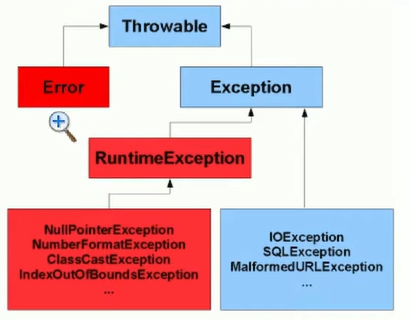
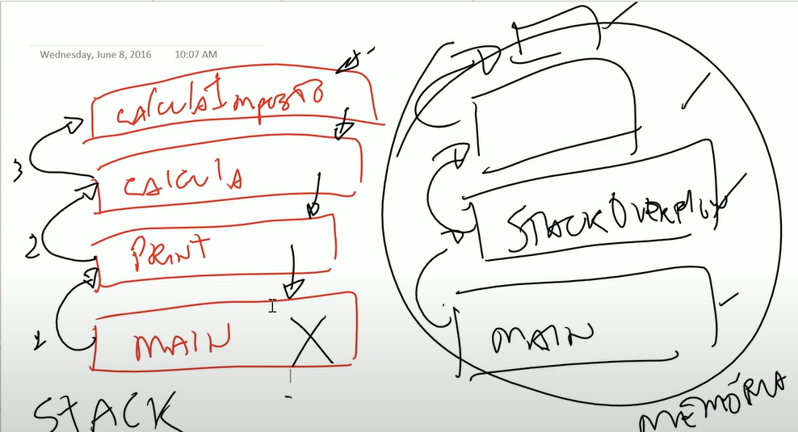
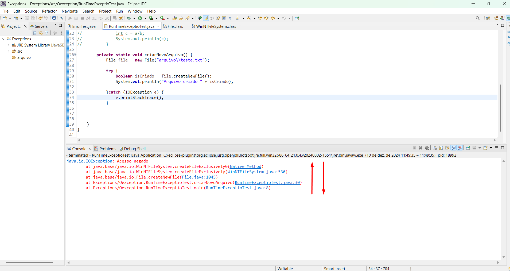

## 95 - Exceções pt 01 - Errors

**`Exceptions`**

- Fluxos que não seguem o caminho que deveriam ser seguidos, pode estar previsto ou não no código, foi criado para tratar todos os imprevistos que podem acontecer;
- São classes e todas elas são filhas da classe **`Throwable`** - significa todas as exceções que podem ser lançadas;
- Quando ocorre alguma exceção no Java dizemos que aquele método lançou uma exceção;

> </br>

**`Error`** -> exceções elas podem ser tratadas, tem como contornar e prevenir porem quando esta trabalhando com error
não precisa criar tratamentos porque simplesmente vão afetar de uma forma a execução do programa;

```java
package Oexception;

public class ErrorTest {

    public static void main(String[] args) {
        // TODO Auto-generated method stub
        stackOverflowError();
    }

    public static void stackOverflowError() {
        stackOverflowError();
    }
}
 SAÍDA: Exception in thread "main" java.lang.StackOverflowError
```

- Criando erro -> quando chamar o método satckOverflowError() ele vai se chamar, fazendo isso até ter um erro; **`stack`** é o empilhamento da chamada dos objetos em memória;

> Como funciona a chamada de métodos no Java:

- Do método main chamo o método print, dentro do método print tem uma chamada para o método calcula e dentro do método calcula tem uma chamada para calculaImposto, esta montando uma pilha que chama de `stack`;

- Quando tem o método em cima da pilha calculaImposto, caso esse método lançar uma exceção e essa exceção não for tratada, ele vai jogar para o método calcula se o calcula tambem não tratar vai jogar para o print se o print tambem não fizer nenhum tipo de tratamento vai jogar para o main e se o main não fizer nenhum tratamento o programa vai parar de executar;

- Quando tem um **`stackOverflowError`** -> significa que essa pilha estourou o espaço disponível na memória;

> </br>

**`Exceptions`**

`Checked`(Checado) -> sempre que a exceção for do tipo checked vai ser obrigado a criar algum tipo de tratamento para aquela exceção; o compilador já está esperando que crie um tratamento antes mesmo de executar um programa; são exceções que estão além do domínio controle do programador;

`Ex.:` -> Uma conexão com o banco de dados remotos simplesmente não está mais funcionando apesar do código estar corretamente;

`Unchecked`(Não Checado) -> são exeções que não precisam criar nenhum tipo de tratamento para seu código compilar, geralmente a maioria das exeções são erros de lógica; erros do programador;

`Ex.:` -> caso tente acessar uma posição no array essa posição não existe então isso é um problema de lógica de programação;

**`RuntimeException`** -> filhas de `RuntimeException` são consideradas `Unchecked`;

**`Exception`** -> todas que são filhas de `Exceptions` são do tipo `Checked`;

`Ex.:` `IOException` -> caso tente abrir um arquivo e esse arquivo não exista é uma exceção que deve tratar; quando vai tentar abrir um arquivo já tem que criar um tratamento para caso esse arquivo não exista;

`SQLException` -> quando esta criando uma conexão com banco de dados é obrigado a criar um tratamento para caso essa conexão não consiga ser obtida;

`ArithmeticException` -> é quando tenta fazer uma condição aritmética que não é permitida;

`Ex.:` um inteiro dividido por 0;

```java
package Oexception;

public class RunTimeExceptioTest {
    public static void main(String[] args) {
        int a = 10/0;
        System.out.println(a);
    }
}

    SAÍDA: Exception in thread "main" java.lang.ArithmeticException: / by zero
    at Exceptions/Oexception.RunTimeExceptioTest.main(RunTimeExceptioTest.java:5)
```

- `RuntimeException` teve um erro em tempo de execução, colocamos o 0 mas poderia ter pegado esse 0 do banco de dados ou algum usuário ter digitado 0; é um erro em tempo de execução por não foi tratado;

- Erros em tempo de execução geralmente são erros causados pela lógica do programador;

```java
package Oexception;

public class RunTimeExceptioTest {
    public static void main(String[] args) {
        int a = 10;
        int b = 0;
        if (b != 0) {
            int c = a / b;
            System.out.println(c);
        }

    }
}
```

> https://docs.oracle.com/javase/8/docs/api/java/lang/ArithmeticException.html

`NullPointerException` -> erro em tempo de execução e ele acontece quando tenta acessar um método através de uma variável de referencia em que essa variavel de referencia não tem nenhum objeto em memória sendo referenciado;

- A classe `Object` tem vários métodos para poder utilizar;
- A variavel de referencia nunca vai executar um método, quem vai executar um método é sempre um objeto;
- `Ex.:` caso eu tente chamar um método de uma variavel de referencia que nao tem nenhum objeto sendo referenciado por ela;

```java
        Object o = null;
        System.out.println(o.toString());
```

> https://docs.oracle.com/javase/8/docs/api/java/lang/NullPointerException.html

## 97 - Exceções pt 03 - Exception

No exemplo esta fazendo uma tratativa para o arquivo que esta sendo criado de uma exceção, `e.printStackTrace`-> imprimi tudo o que aconteceu na stack para tentar identificar mas o programa não vai simplesmente parar de funcionar porque fez uma tratativa; ele retorna `void` então não pode colocar dentro de um `syso`; **Lógica de negócio não deve colocar dentro do `catch`**;

```java
package Oexception;

import java.io.File;
import java.io.IOException;

public class RunTimeExceptioTest {
	public static void main(String[] args) {
		criarNovoArquivo();

	}
		private static void criarNovoArquivo() {
			File file = new File("arquivo\\teste.txt");

			try {
				boolean isCriado = file.createNewFile();
				System.out.println("Arquivo criado " + isCriado);

			}catch (IOException e) {
				e.printStackTrace();
			}
	}
}
```

Para simular o erro alterei as permissões de segurança na pasta arquivo;

- Tento criar no `Método Nativo`, ai o `createNewFile` dentro da classe `File` lanço aquela exceção:



## 98 - Exceções pt 04 - Lançando exceção unchecked

`throw new` - para lançar novas exceções e o objeto `IllegalArgumentException` - método recebeu um argumento inapropriado, é uma filha ou subclasse de `RuntimeException`; caso queira a avisar outras pessoas que estão utilizando novo método, coloca na assinatura do método depois do parentese `throws` - é tipo uma flag falando existe a possibilidade de lançar e coloca a exceção;

**`Sempre bom tentar utilizar as exceções mais específicas possíveis`**

- Esse é um exemplo quando estiver fazendo diversos tipos de métodos, idade - não deixar as pessoas colocar idade negativo, uma idade maior que 150 anos, esses tipos de coisa vai tratar com `exceções` e **não** com `retorno` que tecnicamente é inválido, sempre que tiver que fazer alguma validação pode lançar uma nova exceção e se lança uma exceção tambem poderia colocar um `try catch` dentro do médoto main;

- As exceções do tipo `Runtime` não precisam ter declaração aqui na nossa assinatura do método, pode colocar uma mensagem falando "olha essa divisão tenho possibilidade de lançar `IllegalArgumentException`" o que acontece é que quando faz isso, você vai na divisão, ele mostra que existe a possibilidade de `IllegalArgumentException` quando você diz isso você ta falando para outras pessoas que estão utilizando o seu método que caso alguma coisa aconteça vai ser lançado uma exceção;

```java
public class RunTimeExceptioTest {
	public static void main(String[] args) {
		divisao(1, 0);
		System.out.println("Código finalizado");
	}
	/**
	 *
	 * @param a
	 * @param b não pode ser 0
	 * @return
	 * @throws IllegalArgumentException caso b seja zero
	 */

	private static int divisao(int a, int b) {
		if (b == 0) {
			throw new IllegalArgumentException("Argumento ilegal, não pode ser 0");
		}
		return a / b;
	}
   }
      SAÍDA: Exception in thread "main" java.lang.IllegalArgumentException: Argumento ilegal, não pode ser 0
	at Exceptions/Oexception.RunTimeExceptioTest.divisao(RunTimeExceptioTest.java:24)
	at Exceptions/Oexception.RunTimeExceptioTest.main(RunTimeExceptioTest.java:9)

```

## 99 - Exceções pt 05 - Lançando exceção checked

- Se esta criando um `método privado` as chances é que você vai acabar usando `try catch` porque o método privado ninguém fora dessa classe, vai poder chamar esse método criar novo arquivo, então não faz sentido usar `throws IOException`; se estivesse criando como `método publico` nesse momento você não faz idéia de quem pode chamar, qualquer pessoa em qualquer parte do projeto pode chamar o método criando arquivo, nesse caso é interessante manter o `throws IOException`;

- Existe a opção em fazer algo `híbrido` ou seja você captura a exceção e relança a exceção `Ex.:` imagina que estou criando esse novo arquivo ou um carrinho de compras e tem que efetuar um pagamento; quando tentar efetuar o pagamento ele pode falhar, quando falha você quer ver no console 'pagamento falhou' após falhar precisa aparecer para o cliente a opção de uma nova tentativa; então você quer capturar essa exceção, mostrar no console mas você ainda quer retornar para quem esta chamando o seu método;
- `throws e;` - joga novamente;

## 100 - Exceções pt 06 - Bloco Finally

Quando precisa que algum pedaço de código seja executado independente da condição que esta acontecendo dentro do seu `try catch`:

- `finally` - é um bloco de código que sempre vai ser executado independente se executou normalmente ou não;

```java
	public static void abreConexao() {
		try {
			System.out.println("Abrindo arquivo");
			System.out.println("Escrevendo dados no arquivo");
		}catch (Exception e) {
			e.printStackTrace();
		} finally {
			System.out.println("Fechando recurso liberado pelo SO");
		}
	}

            SAÍDA: Abrindo arquivo
                   Escrevendo dados no arquivo
                   Fechando recurso liberado pelo SO

```

## 101 - Exceções pt 07 - Capturando múltiplas exceções

- Existe casos onde um método vai lançar mais de uma exceção;

`spring` - praticamente todos os outros frameworks que trabalha com web, eles tem protocolos que vão retornar exceções, tem vários tipos de `status` quando esta fazendo requisições `http`;

- É possível tratar várias exceções mas tem algumas `regras`;

1 - Não podemos colocar um tipo mais genérico a frente dos outros catch porque quando tem a `RuntimeException` tem o tipo mais genérico, todas do exemplo são filhas de RuntimeException significa que qualquer uma dessas exceções que temos elas podem ser referenciadas por um objeto da classe RuntimeException pela regra do polimorfismo ou seja se colocar o `catch RuntimeException` acima não vai acontecer nenhuma das outras exceções, **exceções mais genéricas sempre tem que vir no final** porque se não a referência do objeto vai diretamente para ela;

`throw new ArrayIndexOutOfBoundsException` -> quando executar esse código o Java vai procurar qual dessa exceções, ele consegue fazer a associação para variável de referência, aqui entra de novo o `polimorfismo` um objeto ArrayIndex ele tem duas opções `ArrayIndexOutOfBoundsException` ou `IndexOutOfBoundsException` sempre pega o primeiro catch;

```java
	public static void main(String[] args) {
		// TODO Auto-generated method stub
		try {
			throw new ArrayIndexOutOfBoundsException();
		}catch (ArrayIndexOutOfBoundsException e) {
			System.out.println("Dentro do ArrayIndexOutOfBoundsException");
		}catch (IndexOutOfBoundsException e) {
			System.out.println("Dentro do IndexOutOfBoundsException");
		}catch (IllegalArgumentException e) {
			System.out.println("Dentro do IllegalArgumentException");
		}catch (ArithmeticException e) {
			System.out.println("Dentro do ArithmeticException");
		}catch (RuntimeException e) {
			System.out.println("Dentro do RuntimeException");
	}

        SAÍDA: Dentro do ArrayIndexOutOfBoundsException
```

- Quando não tem o `catch` correto vai ter a exceção explodindo fazendo o programa ser terminado;

Classes filhas de `exception`:

`throws SQLException, FileNotFoundException` pode lançar mais de uma exceção, ambas exceções do tipo `checked` elas são filhas de `exception` mas elas não estão na mesma linha de `herança`, não importa a ordem que colocar; para tratar pode usar a regra de polimorfismo porque as duas são filhas de `Exception`- no exemplo independente da exceção que lançar o exception vai ser capaz de capturar aquele objeto e fazer referência para variável;

```java
		try {
			talvezLanceException();
		}catch (Exception e) {

		}
	}

	private static void talvezLanceException() throws SQLException, FileNotFoundException{

	}
```

## 102 - Exceções pt 08 - Multi catch em linha

- Existe uma sintaxe que foi criada para facilitar e melhorar a legibilidade do código, essa `sintaxe` fala que pode colocar exceções que não estão na mesma linha de herança, dentro de uma mesmo catch separados via pai; `EX.:` `SQLException, FileNotFoundException` ambas exceções são feitas de exception mas não fazem parte da mesma herança, então o que pode fazer e ir no primeiro catch e dizer captura `SQLException | ou FileNotFoundException`;

```java
		try {
			talvezLanceException();
		}catch (SQLException | FileNotFoundException e) {
			e.printStackTrace();
		}
```

- Tem que tomar cuidado porque não pode fazer isso quando tem classes na mesma linha de herança um `EX.:` digamos que `throws SQLException, FileNotFoundException, IOException`:
- Vai ter um erro porque o Java vai identificar da mesma forma que faria com todos os catch qual exceção ela server e bate para fazer a referencia para essa variável, temos aqui a variável e;

```java
	try {
			talvezLanceException();
		}catch (SQLException | FileNotFoundException | IOException e) {
			e.printStackTrace();
		}

	}

	private static void talvezLanceException() throws SQLException, FileNotFoundException, IOException {

	}
```

## 103 - Exceções pt 09 - Try with resources

Exemplo para ler arquivo usando Java:

- Classe `Reader` do pacote `java.io` - classes responsáveis para trabalhar com a leitura de arquivos;
- Criando uma variável de referência com valor nulo separadamente em seguida ler o arquivo `BufferedReader` é uma versão mas otimizad;
- `FileReader` lança uma exceção, ou adiciona a assinatura no método e joga a bronca para quem chamo ou `try catch`;

- O `try()` com recursos tem a seguinte sintaxe, dentro do parentese declara a variável e instância objeto; o try com recursos esta se encarregando de tomar conta de fechar a conexão dessa variável de referência;
- Quando esta trabalhando com `try resources` pode remover o catch porem é obrigado a utilizar o `throws` e a exceção que esta sendo lançada `IOException`;

- Pode declarar quantas variáveis quiser a diferença é eu preciso que essas variáveis implementem a interface `closeable`

```java
	public static void lerArquivo() {
		try (Leitor1 leitor1 = new Leitor1();
			Leitor2 leitor2 = new Leitor2()) {


		} catch (IOException e) {
		}
```

- O java foi responsável por chamar o `close` e eles são fechados na ordem inversa que eles foram declarados, isso é util quando esta trabalhando com banco de dados, precisa fechar na ordem inversa;

```java
public class RuntimeExceptionTest06 {
	public static void main(String[] args) {
			lerArquivo();
	}


	public static void lerArquivo() {
		try (Leitor1 leitor1 = new Leitor1();
			Leitor2 leitor2 = new Leitor2()) {


		} catch (IOException e) {
		}

	}

    SAÍDA: Leitor 2 fechando
           Leitor 1 fechando
```

## 104 - Exceções pt 10 - Exceção customizada

Existe casos específicos aonde o Java não vai proporcionar exceções que voce quer, ai precisa fazer tratamento específico;

`EX.:` login e senha de usuário; classe `LoginInvalidoException` `extends` ai define se quer estender do tipo `checked` ou `unchecked` é uma exceção que voce vai forçar a pessoa fazer um tratamento ou não vai forçar, nesse caso vai forçar então `extends Exception` só isso ja significa que tem voce tem sua própria exceção customizada;
