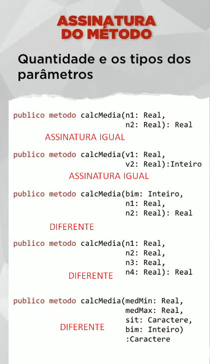
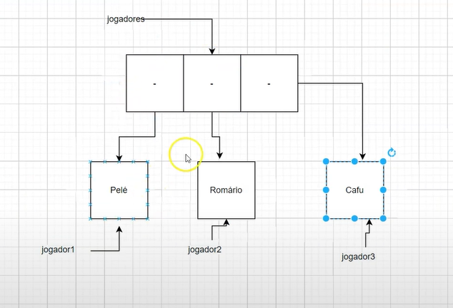

<h1 align="center">JAVA Programação Orientada a Objetos</h1>

<h3 align="center"> Canal do YouTube: <a href="https://www.youtube.com/watch?v=KlIL63MeyMY&list=PLHz_AreHm4dkqe2aR0tQK74m8SFe-aGsY">Gustavo Guanabara
</a> </h3>

> POO -> aproximar o mundo digital do mundo real

> </br>

> Vantagens</br>

> </br>

> Objeto -> pode ser concretos (físicos - carro, celular) ou conceituais (abstrações - um horário marcado, uma aula)

- características - atributo, propriedade, dados;
- comportamentos - métodos, procedimentos das rotinas internas desse objeto;
- estado ou status - características atuais no momento em que esta analisando esse objeto;
- Todo objeto vem a partir de uma classe, um molde que foi utilizado para criar essa classe, esse objeto precisa ser planejado;

> </br>

- Consegui dentro dos métodos mexer com os atributos do objeto e interagir dessa maneira com usuário:

> </br>

> </br>

> Classe e Objeto -> um conceito depende do outro

- Quando tem uma classe e quero transformar em objeto é instanciamento;

- Instanciar é quando pega uma classe e consegui gerar um objeto a partir dela, não transforma uma classe em objeto, gera um objeto a partir de uma classe chama isso de instanciar;

- Uma classe define os atributos e métodos comuns que serão compartilhados por um objeto;

- O objeto é uma instância de uma classe, quando instâcia uma classe cria um objeto;</br>

> </br>

> Conceito de abstração</br>

- Quais são os atributos que me importam nesse momento ? EX.: pessoas tem várias caracteristicas, em um cadastro escolar não precisa ter peso, altura, cor dos olhos...</br>

> 'this' -> é o nome do objeto que chamo, no exercicio quem chamo tampar foi 'c1', então o 'this' é substituido por 'c1' no momento em que 'c1' chamar o método tampar;</br>

- Sempre que quiser modificar algum atributo dentro da própria classe coloque a palavra 'this' na frente da linha que vai mexer nesse atributo:</br>

> </br>

> Conceito LMU ou UML - lINGUAGEM DE MODELAGEM UNIFICADA</br>

- Diagrama de classes -> em diagrama de classes toda classe é um retângulo(não precisa desenhar uma classe/molde - simplifica);

- Dentro desse retângulo na parte superior geralmente em negrito e a primeira letra em maiúsculo, coloca o nome da classe, depois faz 2 traços separando a parte de cima o cabeçalho, o miolo o corpo central e a parte de baixo;</br>

> Classe - primeira letra maiúscula </br>

> Atributo - tudo minúscula e sem ()</br>

> Método - tudo minúscula e com ()</br>

> </br>

> Modificadores de Visibilidade</br>

- Indicam o nível de acesso aos componentes internos de uma classe (atributos e métodos);</br>

> '+' público -> a classe atual e todas as outras classes; </br>

> '-' privado -> somente a classe atual; </br>

> '#' protegido -> a classe atual e todas as suas sub-classes; 'só minha mãe e os filhos dela';</br>

> </br> 

> </br>

- A parte de fora pode ter acesso publico, interface;

- Os componentes é privado para não danificar;</br>

**Cria-se essa cápsula para proteger e deixar disponível somente a parte publica**

- O componente que faz a transmissão infravermelho na televisão para fazer a interface, o uso desse componente tem que ficar inacessível ao dono mas também tem que deixar ele acessível a televisão, seria uma espécie de atributo protegido;

> </br>

- O que está executando é o método 'main', ele está dentro de uma classe que está utilizando a classe caneta;

- Dentro da classe Aula02, tem um método principal que está utilizando o objeto 'c1' que é uma caneta então ele vai deixar mexer num atributo protegido porque ele esta dentro de uma classe que utiliza a classe caneta mas não dos privados:

```java
public class Caneta
public String modelo;
public String cor;
private float ponta;
protected int carga;
protected boolean tampada;
public void status()
```

```java
public class Aula02

public static void main(String[] args) {
    Caneta c1 = new Caneta();
    c1.modelo = "BIC cristal";
    c1.cor = "Azul";
    // c1.ponta = 0.5f;
    c1.carga = 80;
    c1.tampada = true;
    c1.status();
}
        SAÍDA: Modelo: BIC cristal
                Uma caneta Azul
                Ponta: 0.0
                Carga: 80
                Está tampada? true
```

- Não pode mexer no atributo 'tampada' e os métodos passa para publico;

- 'tampar' e 'destampar' que são métodos publicos vão dar acesso ao atributo 'tampada' que é privado;

- Chamei o 'destampar' e dentro do código 'destampar' esta fazendo com que o 'tampada' fique falso;

- O privado só quem pode mexer é a própria classe;

```java
private boolean tampada;
```

```java
public void tampar() {
    this.tampada = true;

}

public void destampar() {
    this.tampada = false;

}
```

```java
public static void main(String[] args) {
    // TODO Auto-generated method stub
    Caneta c1 = new Caneta();
    c1.modelo = "BIC cristal";
    c1.cor = "Azul";
    // c1.ponta = 0.5f;
    c1.carga = 80;
//		c1.tampada = true;
    c1.destampar();
    c1.status();
    c1.rabiscar();

}       SAÍDA: Modelo: BIC cristal
                Uma caneta Azul
                Ponta: 0.0
                Carga: 80
                Está tampada? false
                Rabiscando
```

> Métodos especiais

> Métodos acessores -> métodos que dão acesso uma determinada coisa, tecnicamente são mais conhecidos como 'getters' e 'setters'

> Getters

- O método getter vai proibir que tenha acesso diretamente ao atributo, vai dificultar o acesso direto ao objeto;
- Conseguem acessar um determinado atributo mantendo a segurança de acesso a ele;

> </br>

- Exemplo: a estante é o objeto com documentos é os atributos e as pessoas querem saber quantos documentos é referente a elas;

> </br>

> Métodos modificadores

> Setters

- Modificam coisas que estão dentro do objeto garantindo támbem uma total segurança do atributo, eu não vou deixar as pessoas mexerem diretamente um atributo;
- Preciso passar um documento como parâmetro, dentro dos parêntese '(doc)', normalmente o método 'setter' precisa de um parâmetro para poder funcionar;
- Na imagem a parte de baixo foi mais abstrato mais simplificado, na parte de cima teve que ser mais descritivo:

> </br>

- Declarei os 2 atributos (Caractere/Real), coloquei visibilidade (publico/privado), definindo o getter e o setter de modelo, coloca as linhas de declaração do get modelo e set modelo, o set modelo recebe um parâmetro que é do mesmo tipo do atributo, o método set modelo recebe 'm' que é caractere que é o mesmo tipo de modelo que é o atributo do método setter esta mexendo **(m:Caractere)**;
- Definindo o get modelo -> é retornar o modelo, o 'retorne' vai retornar o modelo que é um atributo, para fazer o set modelo, vai ter que mudar o atributo modelo, para mudar precisa colocar modelo recebe 'm' **(modelo = m)**;
- Temos o código definitivo desse trecho da classe;
- Criando o objeto da classe caneta **(c1 = nova Caneta)**;
- c1 é um objeto de caneta -> **(c1.setModelo("BIC Cristal"))** = c1 seja do modelo 'BIC Cristal', passei uma string, uma cadeia de caracteres para set modelo, em set modelo recebe uma cadeia de caractere **(m:Caractere)** então Bic Cristal vai ser o valor de 'm';
- Dessa maneira consegui modificar o atributo sem deixar o programador mexesse diretamente no atributo;
- A chamada para o setters -> c1.setModelo("BIC Cristal");
- Chamdas para os **getters** -> **Escreva ((c1.getModelo()))** -> get normalmente não passa parâmetro, vai escrever o resultado de c1.getModelo, o retorno: chamei o método getModelo que vai retornar o valor de modelo (BIC Cristal) que foi feito na chamada setModelo;

**Método é a mesma coisa que procedimento e função**

> </br>

> Método Construtor -> executa uma tarefa sem que o usuário faça uma chamda, que inicie automatico;

- Assim que colocar o comando **c1 = nova Caneta** vai criar uma caneta azul e ela vai estar tampada:

> </br>

> Támbem pode começar com parâmetros:

- Criar um método construtor com 3 parâmetros **'m/c/p'**, faz a chamada de 3 médotos modificadores **'set'** e **'tampar'**; e faz o instanciamento **'c1 = nova Caneta'** com os parâmetros;

> </br>

> EXERCÍCIO:

```java
Caneta

package com.aula4.pacote;

public class Caneta {
public String modelo;
private float ponta;

public String getModelo() {
    return this.modelo;
}

public void setModelo(String m) {
    this.modelo = m;
}

public float getPonta() {
    return this.ponta;
}

public void setPonta(float p) {
    this.ponta = p;
}

public void status() {
    System.out.println("Sobre a caneta:");
    System.out.println("Modelo: " + this.modelo);
    System.out.println("Ponta: " + this.ponta);

// saída com get
System.out.println("Modelo: " + this.getModelo());
    System.out.println("Ponta: " + this.getPonta());
}
}
```

> </br>

> Construtor -> o método construtor sempre tem o nome da classe;

```java
package com.aula4.pacote;

public class Caneta {
public String modelo;
private float ponta;
private String cor;
private boolean tampada;

public Caneta() {
    this.tampar();
    this.cor ="Azul";
}

public String getModelo() {
    return this.modelo;
}

public void setModelo(String m) {
    this.modelo = m;
}

public float getPonta() {
    return this.ponta;
}

public void setPonta(float p) {
    this.ponta = p;
}

public void tampar() {
    this.tampada = true;
}

public void destampar() {
    this.tampada = false;
}

public void status() {
    System.out.println("Sobre a caneta:");
    System.out.println("Modelo: " + this.modelo);
    System.out.println("Ponta: " + this.ponta);

    System.out.println("Modelo: " + this.getModelo());// saida com get
    System.out.println("Ponta: " + this.getPonta());

    System.out.println("Cor: " + this.cor);
    System.out.println("Tampada: " + this.tampada);
}
}
```

> </br>

> Contrutor com parâmetros

> </br>

```java
package com.aula4.pacote;

public class Aula4 {

public static void main(String[] args) {
    Caneta c1 = new Caneta("Teste", "Vermelho", 0.8f);
    c1.status();

    Caneta c2 = new Caneta("Teste2", "Laranja", 1.0f);
    c2.status();
}
}               SAÍDA:Sobre a caneta:
                    Modelo: Teste
                    Ponta: 0.8
                    Cor: Vermelho
                    Tampada: true
                    Sobre a caneta:
                    Modelo: Teste2
                    Ponta: 1.0
                    Cor: Laranja
                    Tampada: true
```

> EXERCÍCIO:

```java
aula5

ContaBanco

Atributos:

TODOS ATRIBUTOS VÃO TER GET E SET / CONSTRUTOR SEMPRE QUE CRIAR UMA CONTA SEU STATUS É FALSE(pq a conta está fechada ainda e o saldo definido como 0)

+ numConta
# tipo -> vai aceitar apenas 2 valores / caractere 'cc' 'cp'
- nome
- saldo
- status

Métodos:

+ abrirConta() -> quando abri a conta muda o status para true / se não esta aberta é false, quando abrir a conta precisa dizer que tipo é cc ou cp

+ adicional se abrir conta cc já ganha 50$ e cp 150$

+ fecharConta() -> não vai poder ter dinheiro e não vai poder ter débito

+ depositar() -> ela tem que estar aberta o status true

+ sacar() -> ela tem que estar aberta o status true e também precisa de saldo

+ pagarMensalidade() -> ela é cobrada mensal, cc paga 12$ cp paga 20$
```

> </br>

> </br>

> </br>

> </br>

> </br>

> </br>

```java
****ContaBanco****

package com.aula05.pacote;

public class ContaBanco {
public int numConta;
protected String tipo;
private String dono;
private double saldo;
private boolean status;

public void estadoAtual() {
    System.out.println("----------------------------");
    System.out.println("Conta: " + this.getNumConta());
    System.out.println("Tipo: " + this.getTipo());
    System.out.println("Dono: " + this.getDono());
    System.out.println("Saldo: " + this.getSaldo());
    System.out.println("Status: " + this.getStatus());
}

public void ContaBanco() {
    this.saldo = 0;
    this.status = false;
}

public int getNumConta() {
    return this.numConta;
}

public void setNumConta(int n) {
    this.numConta = n;
}

public String getTipo() {
    return this.tipo;
}

public void setTipo(String t) {
    this.tipo = t;
}

public String getDono() {
    return this.dono;
}

public void setDono(String d) {
    this.dono = d;
}

public double getSaldo() {
    return this.saldo;
}

public void setSaldo(double s) {
    this.saldo = s;
}

public boolean getStatus() {
    return this.status;
}

public void setStatus(boolean st) {
    this.status = st;
}

public void abrirConta(String t) {
    this.setTipo(t);
    this.setStatus(true);
    if (t.equals("CC")) {
        this.setSaldo(50);
    } else if (t.equals("CP")) {
        this.setSaldo(150);
    }
    System.out.println("Conta aberta com sucesso");
}

public void fecharConta() {
    if (this.getSaldo() > 0) {
        System.out.println("Conta com dinheiro");
    } else if (this.getSaldo() < 0) {
        System.out.println("Conta em débito");
    } else {
        this.setStatus(false);
        System.out.println("Conta fechada com sucesso");
    }

}

public void depositar(double v) {
    if (status == true) {
//			saldo += v; outra forma
        this.setSaldo(getSaldo() + v);
        System.out.println("Dépósito realizado com sucesso");
    } else {
        System.out.println("Imposível deposita"); // Conta fechada
    }
}

public void sacar(double v) {
    if (this.getStatus()) { // Verifica se a conta está ativa
        if (this.getSaldo() >= v) { // Verifica se há saldo suficiente
            this.setSaldo(this.getSaldo() - v);
            System.out.println("Saque realizado com sucesso!");
        } else {
            System.out.println("Saldo insuficiente");
        }
    } else {
        System.out.println("Impossível sacar: conta inativa");
    }
}

public void pagarMensalidade() {
    double v = 0; // Atribui um valor inicial à variável v

    if (tipo.equals("CC")) { // Verifica se tipo é "CC"
        v = 12;
    } else if (tipo.equals("CP")) { // Verifica se tipo é "CP"
        v = 20;
    } else {
        System.out.println("Tipo inválido");
        return; // Se o tipo não for "CC" nem "CP", sai do método
    }

    if (status == true) {
        if (saldo > v) {
            this.setSaldo(getSaldo() - v); // Atualiza o saldo
        } else {
            System.out.println("Saldo insuficiente");
        }
    }
}

}

```

```java
Aula05

package com.aula05.pacote;


public class Aula05 {
public static void main(String[] args) {
    ContaBanco p1 = new ContaBanco();
    p1.setNumConta(1111);
    p1.setDono("Eduardo");
    p1.abrirConta("CC");

    p1.depositar(500);
    p1.sacar(150);
    p1.fecharConta();

    p1.estadoAtual();

    ContaBanco p2 = new ContaBanco();
    p2.setNumConta(2222);
    p2.setDono("Augusto");
    p2.abrirConta("CP");

    p2.estadoAtual();
}
}

```

> Os pilares da POO -> Encapsulamento / Herança / Polimorfismo

> Encapsulamento -> cria um padrão e tem proteção;

> Conceito de cápsula

- Um software encapsulado tem um mesmo padrão, protege o usuário do código e o código do usuário, o usuário no caso o programador;
- Um código encapsulado usa interfaces, usa moldes padrão e esses moldes padrão fazem com que o código que tá la dentro não importe como eu vou fazer o código, o que importa é que o resultado seja sempre o mesmo;

> Conceito de encapsular

- Ocultar partes independentes da implementação, permitindo construir partes invisíveis ao mundo exterior;

**Encapsular não é obrigatório, mas é uma boa prática para produzir Classes mais eficientes**

> </br>

> Vantagens de encapsular ->

> 1 - Tornar mudanças invisíveis

- Se eu tiver que mudar um software por dentro, se ele está bem encapsulado mantendo a interface, mantendo o padrão;

> 2 - Facilitar a reutilização do código

- Um software e uma classe bem encapsulada pode ser utilizada em outros projetos;

> 3 - Reduzir efeitos colaterais

- Um software não encapsulado pode ser 'destruído' por um programador, o programa de um programador pode ser afetado se uma classe modificar e não tiver bem encapsulada, se mudar a interface;

- EXEMPLO.: um carro é uma capsula, o pedal a direção seria a interface, utilizamos mas não precisamos saber o que acontece por dentro;

> Para Encapsular -> usando a sintaxxe UML

- 1 - Criando a interface, é parecida com uma classe só que ela não tem atributo, uma interface só tem métodos;
- Métodos abstratos -> é aquele método que não vai ser desenvolvido na interface, eu não vou escrever o código do método na interface, eu só vou dizer na interface que vai existir um método de abrir, vai existir um método de aumentar volume(Ex.: 1 controle de DVD e um de TV), não preciso dizer o que vai acontecer para aumentar o volume, eu só quero saber qual vai ser a reação; exemplo.: a ação de apertar aumentar o volume é a mesma, a interface é a mesma, só que o funcionamento, a implementação é diferente;
- Geralmente dentro de uma interface todos os métodos que são definidos, são definidos como público;

> </br>

- Quando encapsula, todos atributos devem ser privados, até protegidos mas nunca públicos;

> </br>

- Abstrato significa que eu não vou desenvolver o código ali dentro eu vou definir ele em outro lugar quando eu implementar minha interface;

> </br>

> </br>

> </br>

> </br>

> </br>

> </br>

- Método abstrato não precisa abrir e fechar bloco;

> EXERCÍCIO AULA 06

> </br>

> </br>

- **Override** -> significa sobrescrever, que eu já tinha um método definido que era um método abstrato e que agora eu estou sobrescrevendo isso, eu estou desconsiderando aquela programação que não tinha sido feita e agora eu vou programar cada um deles;

> </br>

> </br>

> </br>

> </br>

````java
Aula06

package com.aula06.pacote;

public class Aula06 {
public static void main(String[] args) {
    ControleRemoto c = new ControleRemoto();
    c.ligar();
    c.maisVolume();
    c.abrirMenu();

}

}
```

```
Controlador

package com.aula06.pacote;

public interface Controlador {
public abstract void ligar();
public abstract void desligar();
public abstract void abrirMenu();
public abstract void fecharMenu();
public abstract void maisVolume();
public abstract void menosVolume();
public abstract void ligarMudo();
public abstract void desligarMudo();
public abstract void play();
public abstract void pause();
}
```

```
ControleRemoto

package com.aula06.pacote;

public class ControleRemoto implements Controlador {
private int volume;
private boolean ligado;
private boolean tocando;

public ControleRemoto() {
    this.setVolume(50);
    this.setLigado(false);
    this.setTocando(false);

}

private int getVolume() {
    return this.volume;
}

private void setVolume(int v) {
    this.volume = v;
}

private boolean getLigado() {
    return this.ligado;
}

private void setLigado(boolean l) {
    this.ligado = l;
}

private boolean getTocando() {
    return this.tocando;
}

private void setTocando(boolean t) {
    this.tocando = t;
}

@Override
public void ligar() {
    // TODO Auto-generated method stub
    this.setLigado(true);
}

@Override
public void desligar() {
    // TODO Auto-generated method stub
    this.setLigado(false);
}

@Override
public void abrirMenu() {
    // TODO Auto-generated method stub
    System.out.println("Está ligado? " + this.getLigado());
    System.out.println("Está tocando? " + this.getTocando());
    System.out.print("Volume: " + this.getVolume());
    for(int i = 0; i<= this.getVolume(); i+=10) {
        System.out.print("|");
    }
}

@Override
public void fecharMenu() {
    // TODO Auto-generated method stub
    System.out.println("Fechando Menu");
}

@Override
public void maisVolume() {
    // TODO Auto-generated method stub
    if (this.getLigado()) {
        this.setVolume(this.getVolume()+5);

    }
}

@Override
public void menosVolume() {
    // TODO Auto-generated method stub
    if (this.getLigado()) {
        this.setVolume(this.getVolume()-5);
    }

}

@Override
public void ligarMudo() {
    // TODO Auto-generated method stub
    if (this.getLigado() && this.getVolume() >0) {
        this.setVolume(0);
    }
}

@Override
public void desligarMudo() {
    // TODO Auto-generated method stub
    if (this.getLigado() && this.getVolume() == 0) {
        this.setVolume(50);
    }
}

@Override
public void play() {
    // TODO Auto-generated method stub
    if (this.getLigado() && !(this.getTocando())) {
        this.setTocando(true);
    }
}

@Override
public void pause() {
    // TODO Auto-generated method stub
    if (this.getLigado() && this.getTocando()) {
        this.setTocando(false);
    }

}
}
````

> Relacionamento entre Classes

- O construtor vai fazer essa chamada e eu vou definir o objeto de forma simples usando apenas uma linha;
- Tem que fazer a definição de cada um deles e já pode chamar os métodos;

> </br>

> </br>

- Objeto dentro de um vetor: Lutador[] L = new Lutador[6];

```java
AULA 7

package com.ufc.pacote;

public class Ufc {
public static void main(String[] args) {
    Lutador[] L = new Lutador[6];
    L[0] = new Lutador ("JAVA", "França", 31, 1.75f, 68.9f, 11, 3, 1);
    L[1] = new Lutador ("JS", "Brasil", 31, 1.7f, 57.8f, 11, 3, 1);
    L[2] = new Lutador ("CSS", "Argentina", 31, 1.75f, 80.9f, 11, 3, 1);
    L[3] = new Lutador ("HTML", "Holanda", 31, 1.75f, 81.6f, 11, 3, 1);
    L[4] = new Lutador ("REACT", "Espanha", 31, 1.75f, 62f, 11, 3, 1);
    L[5] = new Lutador ("C#", "Alemanha", 31, 1.75f, 53f, 11, 3, 1);
    L[0].status();
    L[3].apresentar();
}
}
```

```java
package com.ufc.pacote;

public class Lutador {
private String nome;
private String nacionalidade;
private int idade;
private double altura;
private double peso;
private String categoria;
private int vitorias;
private int derrotas;
private int empates;

public Lutador(String no, String na, int i, double a, double p, int v, int d, int e) {
    this.setNome(no);
    this.setNacionalidade(na);
    this.setIdade(i);
    this.setAltura(a);
    this.setPeso(p);
    this.setVitorias(v);
    this.setDerrotas(d);
    this.setEmpates(e);
}

public String getNome() {
    return this.nome;
}

public void setNome(String no) {
    this.nome = no;
}

public String getNacionalidade() {
    return this.nacionalidade;
}

public void setNacionalidade(String na) {
    this.nacionalidade = na;
}

public int getIdade() {
    return this.idade;
}

public void setIdade(int i) {
    this.idade = i;
}

public double getAltura() {
    return this.altura;
}

public void setAltura(double a) {
    this.altura = a;
}

public double getPeso() {
    return this.peso;
}

public void setPeso(double p) {
    this.peso = p;
    this.setCategoria();

}

public String getCategoria() {
    return this.categoria;
}

public void setCategoria() { // categoria não vai ser utilizada do lado de fora, vai ser um método interno
                                // por isso não tem parâmetro
    if (this.getPeso() < 52.2) {
        this.categoria = "Inválido";
    } else if (this.getPeso() <= 70.3) {
        this.categoria = "Leve";
    } else if (this.getPeso() <= 83.9) {
        this.categoria = "Médio";
    } else if (this.getPeso() <= 120.2) {
        this.categoria = "Pesado";
    } else {
        this.categoria = "Inválido";
    }
}

public int getVitorias() {
    return this.vitorias;
}

public void setVitorias(int v) {
    this.vitorias = v;
}

public int getDerrotas() {
    return this.derrotas;
}

public void setDerrotas(int d) {
    this.derrotas = d;
}

public int getEmpates() {
    return this.empates;
}

public void setEmpates(int e) {
    this.empates = e;
}

public void apresentar() {
    System.out.println("--------------------------");
    System.out.println("Lutador: " + this.getNome());
    System.out.println("Origem: " + this.getNacionalidade());
    System.out.println(this.getIdade() + "anos");
    System.out.println(this.getAltura() + " m de altura");
    System.out.println("Pesando: " + this.getPeso() + "Kg");
    System.out.println("Ganhou: " + this.getVitorias());
    System.out.println("Perdeu: " + this.getDerrotas());
    System.out.println("Empatou: " + this.getEmpates());
}

public void status() {
    System.out.println(this.getNome());
    System.out.println("É um peso de " + this.getCategoria());
    System.out.println(this.getVitorias() + "vitórias");
    System.out.println(this.getDerrotas() + "derrotas");
    System.out.println(this.getEmpates() + "empates");

}

public void ganharLuta() {
    this.setVitorias(this.getVitorias() + 1);
}

public void perderLuta() {
    this.setDerrotas(this.getDerrotas() + 1);

}

public void empatarLuta() {
    this.setEmpates(this.getEmpates() + 1);

}
}
```

> Relação de agregação na POO -> é quando um objeto tem um outro objeto isso vai fazer com que eu tenha que criar uma classe que agregue outras classes</br>

> Tipos abstratos de dados -> transaformar classes em determinados tipos</br>

> Diagramas de relacionamentos só contém dentro das entidades dados no caso do diagrama de classes eu tenho dados e funções:</br>

> </br>

> 'desafiado' 'desafiante' -> se colocar caractere vai ter que colocar o nome do lutador, em vez de utilizar um tipo primitivo, coloca um tipo abstrato, vou ter uma instância de lutador e essa instância de lutador vai o meu desafiado, cria uma relação entre o tipo abstrato e uma instâcia de uma determinada classe:

- Essa classe esta relacionando com outra classe; os atributos desafiado e desafiantes são instâncias de outra classe;
- A agregação é conhecida como relacionamento do tipo tem um, 'uma luta tem um lutador';

```java
package com.ufc.pacote;

public class Luta {
private Lutador desafiado;
private Lutador desafiante;
private int rounds;
private boolean aprovada;
}
```

> </br>

> </br>

```java
LUTA

package com.ufc.pacote;

import java.util.Random;

public class Luta {
private Lutador desafiado;
private Lutador desafiante;
private int rounds;
private boolean aprovada;


public Lutador getDesafiado() {
    return this.desafiado;
}

public void  setDesafiado(Lutador ado) {
    this.desafiado = ado;
}

public Lutador getDesafiante() {
    return this.desafiante;
}

public void setDesafiante(Lutador ante) {
    this.desafiante = ante;
}

public int getRounds() {
    return this.rounds;
}

public void setRounds(int r) {
    this.rounds = r;
}

public boolean getAprovada() {
    return this.aprovada;
}

public void setAprovada(boolean a) {
    this.aprovada = a;
}

public void marcarLuta(Lutador L1, Lutador L2){
    if (L1.getCategoria().equals(L2.getCategoria())
        &&  L1 != L2) {
            this.aprovada = true;
            this.desafiado = L1;
            this.desafiante = L2;
        } else {
            this.aprovada = false;
            this.desafiado = null;
            this.desafiante = null;
        }
}

public void lutar() {
    if (this.aprovada) {
        System.out.println("DESAFIADO");
        this.getDesafiado().apresentar();
        System.out.println("DESAFIANTE");
        this.getDesafiante().apresentar();

        Random aleatorio = new Random();
        int vencedor = aleatorio.nextInt(3); // vai gerar 3 resultados 0 1 2
        switch(vencedor) {
        case 0: //Empate
            System.out.println("EMPATOU");
            this.getDesafiado().empatarLuta();
            this.getDesafiante().empatarLuta();
            break;

        case 1:// Desafiado vence
            System.out.println("Vitória do " + this.getDesafiado().getNome());
            this.getDesafiado().ganharLuta();
            this.desafiante.perderLuta();
            break;
        case 2: // Desafiante vence
            System.out.println("Vitória do " + this.getDesafiante().getNome());
            this.getDesafiante().ganharLuta();
            this.getDesafiado().perderLuta();
            break;
        }


    } else {
        System.out.println("A luta não pode acontecer");
    }

}
}
```

```java
MAIN

package com.ufc.pacote;

public class Ufc {
public static void main(String[] args) {
    Lutador[] L = new Lutador[6];
    L[0] = new Lutador("JAVA", "França", 31, 1.75f, 68.9f, 11, 3, 1);
    L[1] = new Lutador("JS", "Brasil", 31, 1.7f, 57.8f, 11, 3, 1);
    L[2] = new Lutador("CSS", "Argentina", 31, 1.75f, 80.9f, 11, 3, 1);
    L[3] = new Lutador("HTML", "Holanda", 31, 1.75f, 81.6f, 11, 3, 1);
    L[4] = new Lutador("REACT", "Espanha", 31, 1.75f, 62f, 11, 3, 1);
    L[5] = new Lutador("C#", "Alemanha", 31, 1.75f, 53f, 11, 3, 1);

    Luta UEC01 = new Luta();
    UEC01.marcarLuta(L[0], L[1]);
    UEC01.lutar();

    L[0].status();
    L[1].status();

}
}
```

> EXERCICIO

> </br>

> 'to.string' -> ele retorna uma String

> </br>

```java
LIVRO
public String detalhes() {
    return "Livro [titulo=" + titulo + ", autor=" + autor + ", totPaginas=" + totPaginas + ", pagAtual=" + pagAtual
            + ", aberto=" + aberto + ", leitor=" + leitor.getNome() + "]";
}
```

```java
AULA 08 - MAIN
System.out.println(l[0].detalhes());
```

> HERANÇA -> os filhos herdam características e comportamentos de uma mãe;</br>

> </br>

> </br>

> </br>

- 'extends' -> é ampliar, nesse exemplo estou ampliando as características de pessoas;

> </br>

```java
package com.aula09.pacote;

public class Aluno extends Pessoa {
private int matr;
private String curso;
}
```

> </br>

> TIPOS DE HERANÇA

> 1 - Herança de implementação -> também é conhecida como herança pobre, a mais simples que existe;

> 2 - Herança para diferença -> é a herança mais completa;

> </br>

> CONCEITO ABSTRATO E FINAL -> vai depender de onde aplicar esse conceito, um método e uma classe podem ser abstratos e finais, então pode ter um método abstrato e final e também pode ter uma classe abstrata e uma classe final, o nome é o mesmo o final e abstrato mas a funcionalidade a operabilidade disso vai ser diferente;

- CLASSE ABSTRATA -> defini uma classe como abstrata, ela não pode gerar filhos 'objetos';
- MÉTODO ABSTRATO -> só pode ser colocado dentro de uma interface ou de uma classe abstrata;
- CLASSE FINAL -> ela não pode ter filhos, é obrigatoriamnete uma folha, ela não pode utilizar herança;
- MÉTODO FINAL -> ele não pode ser sobreposto isso é não pode gerar uma especialização desse método;

> </br>

> </br>

> </br>

- 'final' -> utilizar nas classe quando não quiser que ela tenha filho e nos métodos quando não quiser que esse método seja sobreposto;

> CONCEITO POLIMORFISMO -> poli = muitas / morfo = formas; muitas formas de se fazer alguma coisa;

> </br>

- ASSINATURA DO MÉTODO -> todo método tem uma assinaturae precisa identificar, diferenciar assianaturas iguais e diferentes poque o polimorfismo trata desses conceitos na sua essência;
- A quantidade e o tipo de parâmetro identifica essa assinatura;

> </br>

> </br>

> TIPOS DE POLIMORFISMO - OS 2 PRINCIPAIS

- 1 -> Sobreposição: é uma características, é um dos polimorfismos mais utilizados; fazer uma determinada coisa com o mesmo nome e essa coisa poder agir de diferentes maneiras;
- 2 -> Sobrecarga:

- Quando tem métodos abstratos é obrigado a desenvolve-los;

> </br>

> </br>

> </br>

> </br>

> </br>

> </br>

> </br>

> </br>

> </br>

> EXERCICIO AULA 11

> POLIMORFISMO TIPO SOBRECARGA ->

> </br>

> </br>

> </br>

> </br>

> </br>

<h3 align="center"> Canal do YouTube: <a href="https://www.youtube.com/watch?v=EyuPFLuvD7Q&list=PL62G310vn6nFIsOCC0H-C2infYgwm8SWW&index=40">DevDojo
</a> </h3>

## Introdução a classes parte 1

**`Tenho uma classe x, no pacote main faço uma instancia criando um objeto y, esse objeto y é minha variavel de referencia, essa minha variavel de referencia é que pode acessar os atributos da classe x.`**

```java
package br.com.abc.javacore.introducaoclasses.classes;

public class Estudante {
public String nome;
public String matricula;
public int idade;

}


```

```java
public class EstudanteTest {
public static void main(String[] args) {
    Estudante eduardo = new Estudante();

    eduardo.nome = "Eduardo";
    eduardo.matricula = "107206";
    eduardo.idade = 28;

    System.out.println(eduardo.nome);
    System.out.println(eduardo.matricula);
    System.out.println(eduardo.idade);

}
}

```

## Coesão

**`Coesão`** -> é algo que está relacionado ao propósito das suas classes, quando fala que o código é altamente coeso, estamos falando que as nossas classes elas não estão misturando os propósitos delas existirem;

## static

1. - `Atributo static` é um atributo compartilhado por todas as instâncias de uma classe. Se um atributo é static, ele é único para toda a classe e não é vinculado a uma instância específica da classe.

2. - `Método static` é um método que pode ser chamado sem a necessidade de criar uma instância da classe.

**`EXEMPLO CHATGPT`**

```java
class ContaBancaria {
static int totalContas = 0; // Atributo static

String nomeTitular;
double saldo;

ContaBancaria(String nomeTitular, double saldo) {
    this.nomeTitular = nomeTitular;
    this.saldo = saldo;
    totalContas++; // Incrementa o total de contas
}

static int getTotalContas() {
    return totalContas;
}
}

public class Main {
public static void main(String[] args) {
    ContaBancaria conta1 = new ContaBancaria("João", 1000);
    ContaBancaria conta2 = new ContaBancaria("Maria", 1500);

    System.out.println("Total de contas: " + ContaBancaria.getTotalContas());
}
}
```

```java
class Calculadora {
static int somar(int a, int b) {
    return a + b;
}
}

public class Main {
public static void main(String[] args) {
    int resultado = Calculadora.somar(5, 10);
    System.out.println("Resultado da soma: " + resultado);
}
}
```

## Métodos com parâmetros

- Parametro - > entre parentese passa o tipo e o nome do identificador;

```java
public class Calculadora {

public void somaDoisNumeros() {
    System.out.println(5 + 5);
}

public void subtraiDoisNumeros() {
    System.out.println(5 - 5);
}

public void multiplicaDoisNumero(double num1, int num2) {
    System.out.println(num1 * num2);
}
}

```

```java
public class CalculadoraTest {
public static void main(String[] args) {
    Calculadora calc = new Calculadora();
    calc.somaDoisNumeros();
    System.out.println("Continua...");
    calc.subtraiDoisNumeros();
    calc.multiplicaDoisNumero(2.2, 100);
    System.out.println("fim!");
}
}

```

---

## Retorno de métodos parte 01

**`Sempre quando vou chamar um metodo com parametro e retorno na classe, no main preciso colocar o tipo, colocar um nome para o identificador(isso se eu quiser usar o valor do retorno, outro caso é só retornar esse valor sem precisar criar uma variavel local para armazenar esse valor retornado) atribuir o metodo e passar um valor local(ou dizer passar argumentos)`**

```java
public class Calculadora {

public void somaDoisNumeros() {
    System.out.println(5 + 5);
}

public void subtraiDoisNumeros() {
    System.out.println(5 - 5);
}

public void multiplicaDoisNumero(double num1, int num2) {
    System.out.println(num1 * num2);
}

public double divideDoisNumeros(double num1, double num2) {
    if(num2 == 0){
        return 0; // funciona mais ou menos como o break, ele não vai parar mas quando chegar nessa linha ele vai voltar, para quem chamo;
    }
    return num1 / num2;
}
}

```

```java
public class CalculadoraTest {
public static void main(String[] args) {
    Calculadora calc = new Calculadora();
    System.out.println("Soma");
    calc.somaDoisNumeros();
    System.out.println("Subatração");
    calc.subtraiDoisNumeros();
    System.out.println("Multiplicação");
    calc.multiplicaDoisNumero(2.2, 100);

    System.out.println("Divisão");
    double result = calc.divideDoisNumeros(10,0);// volta sempre aqui
    System.out.println(result);
    System.out.println(calc.divideDoisNumeros(20,2));

    System.out.println("fim!");
}
}

```

---

**`Se colocar uma chamada de método dentro de uma 'SYSO' que o retorno não existe é void, vai ter erro de compilação porque o 'SYSO' precisa de um valor para imprimir no console`**

## Parâmetros tipo primitivo

```java
public class Calculadora {
public void alteraDoisNumeros(int num1, int num2){
    num1 = 99;
    num2 = 33;
    System.out.println("Dentro do método alteraDoisNumeros");
    System.out.println("num1 = " + num1);
    System.out.println("num2 = " + num2);
}
}

```

```java
public class CalculadoraTest {
public static void main(String[] args) {
    Calculadora calcu = new Calculadora();
    int num1 = 1;
    int num2 = 2;

    calcu.alteraDoisNumeros(num1, num2);

    System.out.println("Dentro do método Principal de Teste");
    System.out.println("num1 = "+ num1);
    System.out.println("num2 = "+ num2);
}

        SAÍDA: Dentro do método alteraDoisNumeros
                num1 = 1
                num2 = 2
                Dentro do método Principal de Teste
                num1 = 99
                num2 = 33
}
```

**`Quando passa valores do tipo primitivo para um método, não esta passando a referência daquele objeto memória, esta passando uma cópia`**

**`Quando você passa objetos como argumento você na verdade está passando a referência aonde que o objeto esta guardado`**

**`Eu tenho uma classe x valor de referencia, criei outra classe y com método e tambem esta com valor de referencia, no meu método main ao criar um objeto e atribuir um valor fixo na minha classe y, esse valor de referencia vai sobrescrever qualquer valor atribuido dentro do meu main`**

**`Não alterar os dados de dentro dos objetos que esta passando no método, se precisar fazer algum tipo de alteração, você meio que cria uma cópia do objeto e retorna um novo objeto com estado alterado`**

> </br>

```java
public class Test04_parametrosTiposReferencia {
public static void main(String[] args) {

    /**
        * Passagem de paramentros
        * Tipo Referência
        *
        * usando classe especifica para imprimir objetos
        */

    // instancia classe Estudantes e ImprimeEstudante
    // duas variaveis de referencia que estão fazendo referencia a 2 objetos
    Estudante estudante01 = new Estudante();
    Estudante estudante02 = new Estudante();
    //agora temos uma variavel impressora que tem um método
    ImpressoraEstudante impressora = new ImpressoraEstudante();

    estudante01.nome = "Joao";
    estudante01.idade = 15;
    estudante01.sexo = 'M';

    estudante02.nome = "Maria";
    estudante02.idade = 16;
    estudante02.sexo = 'F';

    // "estudante01 e 02" estão sendo referenciado para o "estudante" da
    // classe ImprimeEstudante, onde os valores são atribuídos e executados
    // método "imprime";
    impressora.imprime(estudante01);
    impressora.imprime(estudante02);

    /**
        * Passagem de paramentros
        * Tipo Referência
        *
        * usando metodo dentro da propria classe para imprimir
        */
}
}

```

```java
public class ImpressoraEstudante {
public void imprime(Estudante estudante) {//tem dentro desse método uma variavel de referencia estudante
    System.out.println("----------------");
    System.out.println(estudante.nome);
    System.out.println(estudante.sexo);
    System.out.println(estudante.idade);
}
}

```

- `this` ->"quero utilizar a variavel de classe que foi declarada em cima"; variavel de referencia vai mandar um sinal para dentro desse objeto e esse objeto vai ser responsável por executar;

```java
public class Estudante {
public String nome;
public int idade;
public char sexo;


public void imprime() {
    System.out.println("----------------");
    System.out.println(this.nome);
    System.out.println(this.sexo);
    System.out.println(this.idade);
}
}

    main

        estudante01.imprime();
        estudante02.imprime();

```

- Se você não usar o this, o compilador assume que você está se referindo à variável mais próxima no escopo, que é o parâmetro do método. Nesse caso, o atributo da classe não seria atualizado.
- Se o nome do parâmetro for diferente do atributo, o this se torna opcional.
- this.nome: Refere-se ao atributo da classe.
- nome (sem this): Refere-se ao parâmetro do método/construtor.
- Quando os nomes são iguais, o this é necessário para diferenciar entre atributo e parâmetro.
- Se os nomes forem diferentes, o uso do this é opcional.

```java
public class Pessoa {
private String nome;

public void setNome(String novoNome) { // Parâmetro com nome diferente
    nome = novoNome; // Sem necessidade do 'this'
}

public String getNome() {
    return nome;
}

public static void main(String[] args) {
    Pessoa pessoa = new Pessoa();
    pessoa.setNome("Eduardo");
    System.out.println(pessoa.getNome()); // Saída: Eduardo
}
}
```

## Varargs

- **`Varargs (ou varíable arguments)`** é um recurso do Java que permite passar uma quantidade variável de argumentos para um método. Em vez de usar um array fixo, o recurso varargs facilita a passagem de valores, tornando o código mais flexível e legível.

- `Sintaxe de Varargs`

Para definir um parâmetro varargs em um método, você utiliza três pontos `(...)` seguidos pelo `tipo do argumento` e pelo `nome da variável`:

```java
public void metodoVarArgs(int... numeros) {
// lógica do método
}
```

- Esse método usa varargs (int... numeros), permitindo que o usuário passe uma quantidade variável de inteiros diretamente, sem precisar criar um array manualmente.
- Internamente, o Java cria um array de inteiros com os valores fornecidos.

```java
public void somaVarArgs(int... numeros) {
int soma = 0;
for (int num : numeros) {
    soma += num;
}
System.out.println(soma);
}
```

Exemplo de chamada:

```java
somaVarArgs(1, 2, 3, 4); // Saída: 10
somaVarArgs(5, 5);       // Saída: 10
```

**`Regra`**: Só pode haver um parâmetro varargs e ele deve ser o último parâmetro da lista.

## Modificador de acesso private, get e set

`SETTER`

- Esses atributos eles só vão poder ser acessados pelo objeto;
- Quando cria atributos privados, precisa ter um método para acessa-los, então o método fica público e o atributo em si fica privado mas cria uma camada que vai receber esse atributo;

`public` -> para quem quiser colocar os valores, vai atribuir através desse método;</br>

`void` -> porque se estou colocando um valor em memória, não quero retorno, eu sei o valor, se estou falando que meu nome é João eu não preciso que retorne João eu sei eu estou passando o nome; </br>

`set` -> todas as vezes que você esta criando um metodo para colocar um valor dentro de um atributo, dentro da memória você começa dizendo a palavra `set` seguindo o nome da `variável`;</br>

`()` -> colocar dentro do meu atributo, `tipo` e geralmente o nome que coloca no `atributo` é o mesmo que coloca no `parametro` que é a variavel `local`; </br>

**ESCOPO** -> a variavel (`tipo` `variavel`) vai receber ela mesmo, e quando acabar nada vai mudar:</br>

{o nome que coloca no `atributo` = o nome que coloca no `atributo`}

**`Por isso precisa usar o THIS`**

{this.o nome que coloca no `atributo` = o nome que coloca no `atributo`}

> </br>

**`Se colocar um set dentro de um SYSO ele retorna void por isso precisa do método get para pegar`**

`GETTER`

`public` -> precisa ser oublico se não a outra classe nunca vai conhecer;</br>

Não é mais `void` porque eu quero um nome, preciso de um retorno que é o mesmo da variavel, `tipo` e geralmente o nome que coloca no `atributo` em seguida a convenção `get` e o nome da `variavel`;</br>

`()` -> não precisa de parametro porque eu quero pegar o valor que esta em memória;</br>

`return` -> termina com return this.o nome que coloca no `atributo`;

**Não podemos acessar atraves da variavel de referencia os atributos privados é como se não existisse**

> </br>

- Como você está dentro do objeto você tem acesso a tudo que tem dentro do objeto incluindo os métodos;</br>

`Exemplo:` nosso `método imprime` ao invés de pegar `this.nome`(this.nome esta retornando o espaço disponivel em memória); o this.nome e o getNome eles tem a mesma função, eles estão retornando o valor que esta em memória para variavel nome;

## init(inicialização) e construtor

- `Construtor`: Usa quando a inicialização deve ocorrer no momento da criação do objeto;

- `Método init`: Usa quando você quer ter mais controle sobre quando e como inicializar o objeto, ou quando precisa reutilizar a inicialização; está colocando dentro da memória os valores que estamos passando (String nome);

- O `construtor` é excutado antes de qualquer método que você tem na sua classe;

```java
public class Pessoa {
String nome;

// Construtor padrão
public Pessoa() {
    System.out.println("Objeto criado, mas sem inicialização.");
}

// Método init
public void init(String nome) {
    this.nome = nome;
    System.out.println("Objeto inicializado com o nome: " + this.nome);
}

public static void main(String[] args) {
    Pessoa pessoa = new Pessoa(); // Chama o construtor padrão
    pessoa.init("Eduardo");       // Chama init explicitamente
}
}
```

---

## Sobrecarga de métodos

- É você ter o método com o mesmo nome porém o tipo ou a quantidade de parametros são diferentes;

- O problema é que esta repetindo código:

```java
public void init(String nome, String tipo, int episodios) {
        this.nome = nome;
        this.tipo = tipo;
        this.episodios = episodios;
        }

public void init(String nome, String tipo, int episodios, String genero) {
        this.nome = nome;
        this.tipo = tipo;
        this.episodios = episodios;
        this.genero = genero;
        }
```

```java
public void init(String nome, String tipo, int episodios) {
        this.nome = nome;
        this.tipo = tipo;
        this.episodios = episodios;
        }

public void init(String nome, String tipo, int episodios, String genero) {
        this.init(nome, tipo, episodios);
        this.genero = genero;
        }
```

## Construtores

- Todas as vezes que você esta criando um objeto, na verdade você esta construindo um objeto independente de você ver ou não ver um construtor na sua classe, você tem um criado por você;

- Quando cria `new X()` o `()` não é um método e sim um construtor;

- Construtores é um inicializador dos objetos é o responsável pela criação no momento que você pede determinados parametros você obrigatoriamente precisa passar a não ser que você tenha um construtor sobrecarregado

## **`regras`**

- A primeira regra é construtor não tem nenhum tipo de retorno;
`public`- modificador de acesso seguido pelo nome da `classe` seguido de `()` e as `{}`;

- No momento da criação do objeto estamos passando o nome, não posso mais ter um sem nome, preciso obrigatoriamente colocar;

```java
public Anime (String nome) {
    System.out.println("Dentro do construtor");
    this.nome = nome;
}
public void init(String nome, String tipo, int episodios) {
        this.nome = nome;
        this.tipo = tipo;
        this.episodios = episodios;
        }

public void init(String nome, String tipo, int episodios, String genero) {
        this.init(nome, tipo, episodios);
        this.genero = genero;
        }

MAIN

Anime anime = new Anime ("teste");

```

- No Java no momento que você adiciona um construtor ele obrigatoriamente vai ter que seguir regra, o Java não vai adicionar um outro construtor para você;

- Não quero mais utilizar o init porque agora pode inicializar o objeto na criação;

- Inicializando o construtor inteiramente no objeto:

```java
public Anime (String nome, String tipo, int episodios, String genero) {
    System.out.println("Dentro do construtor");
    this.nome = nome;
    this.tipo = tipo;
    this.episodios = episodios;
    this.genero = genero;
}

MAIN

Anime anime = new Anime ("Teste", "TV", 12, "Ação");
anime.imprime();
```

## Sobrecarga construtor

- Construtor é relacionado a objeto, o this se referea ao próprio usuarion construtor para chamar outro construtor, só precisa escrever `this();`- esse objeto em memoria vai ser construido sem argumentos;

```java
public Anime (String nome, String tipo, int episodios, String genero) {
    this();
    this.nome = nome;
    this.tipo = tipo;
    this.episodios = episodios;
    this.genero = genero;
}
public Anime (String nome, String tipo, int episodios, String genero) {
    this(nome, tipo, episodios, genero)
    this.estudio = estudio;
}
```

`this`-> só pode ser utilizado dentro do consultor e o this tem que ser obrigatoriomente a primeira linha executavel do corpo do seu construtor;

## Blocos de inicialização

- A inicialização dos objetos acontece antes mesmo da execução da construtor;

- Blocos de inicialização: geralmete coloca no começo antes dos contrutores e depois dos atributos;

```java
{
//bloco de inicialização de intancia porque é executado todas as vezes que esse objeto é criado

}
```

```java
public class Cliente {

/*
*   1 - Alocado espaço na memória para o objete que será criado
*   2 - Cada atributo de classe é criado e inicializado com seus valores default ou o que for passado
*   3 - Bloco de inicialização é executado
*   4 - o construtor é executado
*
* */

//private int[] parcelas = {1,2,3,4,5,6,7,8,9,10,11,12,13,14,15};
private int[] parcelas;//atributo decalrado

// inicio do bloco de inicialização
{
    parcelas = new int[100];//100 posiçoes/tamanho, 0 a 99 indices
    System.out.println("Dentro do blobo de inicialização!");
    for(int i = 1 ; i <= 100; i++){
        parcelas[i - 1] = i;//Começar com valor de i=1; i-1=indice 0; parcelas[i-1](valor armazenado)
    }
}

public Cliente() {
//O construtor não precisa fazer nada específico, pois a inicialização das parcelas já foi tratada no bloco;
//        System.out.println("Dentro do construtor");
//        for (int parcela : this.parcelas){
//            System.out.print(parcela + " ");
//        }
}

public int[] getParcelas() {
    return parcelas;
}

public void setParcelas(int[] parcelas) {
    this.parcelas = parcelas;
}
}

```

```java
public class ClienteTeste {
public static void main(String[] args) {
    Cliente c = new Cliente();
    System.out.println("Exibindo quantidade de parcelas possíveis");
    for(int parcela : c.getParcelas()){
        System.out.print(parcela + " ");
    }
}
}

```

## **`EXEMPLO CHATGPT`**

- Bloco de inicialização de instância:

```java
class Exemplo {
private int valor;

// Bloco de inicialização de instância
{
    valor = 10;
    System.out.println("Bloco de inicialização de instância executado!");
}

public Exemplo() {
    System.out.println("Construtor executado!");
}

public int getValor() {
    return valor;
}
}

public class Main {
public static void main(String[] args) {
    Exemplo exemplo1 = new Exemplo();
    Exemplo exemplo2 = new Exemplo();
}
}
```

- Bloco de inicialização estático:

```java
class Exemplo {
private static int valorEstatico;

// Bloco de inicialização estático
static {
    valorEstatico = 100;
    System.out.println("Bloco de inicialização estático executado!");
}

public static int getValorEstatico() {
    return valorEstatico;
}
}

public class Main {
public static void main(String[] args) {
    System.out.println("Valor estático: " + Exemplo.getValorEstatico());
    // O bloco estático já foi executado, não será executado novamente.
    System.out.println("Valor estático novamente: " + Exemplo.getValorEstatico());
}
}
```

## Quando usar?

- Bloco de inicialização de instância: Para lógica comum de inicialização que deve ser aplicada antes do construtor de cada objeto.

- Bloco de inicialização estático: Para inicializar variáveis ou recursos que pertencem à classe e só precisam ser inicializados uma vez.

## Modificador static

`velocidadeLimite:`

- É um atributo static, ou seja, pertence à classe e não a instâncias individuais;

- Todos os objetos da classe Carro compartilham esse atributo;

```java
public class Carro {
// velocidade limite deve ser de 240 km/h

private String nome;
private double velocidadeMaxima;
public static double velocidadeLimite = 240;

public Carro(String nome, double velocidadeMaxima) {
    this.nome = nome;//Inicializa os atributos nome e velocidadeMaxima para cada objeto criado.
    this.velocidadeMaxima = velocidadeMaxima;
}

public String getNome() {
    return nome;
}

public void setNome(String nome) {
    this.nome = nome;
}

public double getVelocidadeMaxima() {
    return velocidadeMaxima;
}

public void setVelocidadeMaxima(double velocidadeMaxima) {
    this.velocidadeMaxima = velocidadeMaxima;
}

// Não pode em static
/*public double getVelocidadeLimite() {
    return velocidadeLimite;
}

public void setVelocidadeLimite(double velocidadeLimite) {
    this.velocidadeLimite = velocidadeLimite;
}*/

public void imprime(){
    System.out.println("--------------------------------------------");
    System.out.println("Nome " + this.nome);
    System.out.println("Velocidade Máxima " + this.velocidadeMaxima);
    //System.out.println("Velocidade Limite " + this.velocidadeLimite);
    System.out.println("Velocidade Limite " + Carro.velocidadeLimite);
    //O atributo velocidadeLimite pode ser acessado diretamente sem usar this, já que é um atributo static
}
}

```

```java
public class CarroTest {
public static void main(String[] args) {
    Carro c1 = new Carro("BMW", 210);
    Carro c2 = new Carro("Audi", 220);
    Carro c3 = new Carro("Mercedes", 230);

    c1.imprime();
    c2.imprime();
    c3.imprime();

    System.out.println("##################################################");

    //c1.setVelocidadeLimite(300);
    Carro.velocidadeLimite = 200;

    c1.imprime();
    c2.imprime();
    c3.imprime();

}
}

```

## Métodos estáticos

- Posso chamar pelo nome da classe e alterar sem precisar criar um objeto;

````java
package br.com.abc.javacore.modificadorestatico;

public class Carro {
// velocidade limite dece ser de 240 km/h

private String nome;
private double velocidadeMaxima;

private static double velocidadeLimite = 240;

public Carro(String nome, double velocidadeMaxima) {
    this.nome = nome;
    this.velocidadeMaxima = velocidadeMaxima;
}

public String getNome() {
    return nome;
}

public void setNome(String nome) {
    this.nome = nome;
}

public double getVelocidadeMaxima() {
    return velocidadeMaxima;
}

public void setVelocidadeMaxima(double velocidadeMaxima) {
    this.velocidadeMaxima = velocidadeMaxima;
}

/* Métodos estáticos */
public static double getVelocidadeLimite() {
    return velocidadeLimite;
}
/* Métodos estáticos */
public static void setVelocidadeLimite(double velocidadeLimite) {
    //se chamar o set sem ter um objeto não vai referenciar nada por isso não usa this
    Carro.velocidadeLimite = velocidadeLimite;
    //this se refere ao objeto por isso não coloco aqui
}

public void imprime(){
    System.out.println("--------------------------------------------");
    System.out.println("Nome " + this.nome);
    System.out.println("Velocidade Máxima " + this.velocidadeMaxima);
    //System.out.println("Velocidade Limite " + this.velocidadeLimite);
    System.out.println("Velocidade Limite " + velocidadeLimite);
}
}

```

```java
package br.com.abc.javacore.modificadorestatico;

public class CarroTest {
public static void main(String[] args) {
    //Carro.velocidadeLimite = 200;
    Carro.setVelocidadeLimite(300);

    Carro c1 = new Carro("BMW", 210);
    Carro c2 = new Carro("Audi", 220);
    Carro c3 = new Carro("Mercedes", 230);

    c1.imprime();
    c2.imprime();
    c3.imprime();

    System.out.println("##################################################");

    //c1.setVelocidadeLimite(300);

    c1.imprime();
    c2.imprime();
    c3.imprime();


}
}
````

---

## Bloco de inicialização (estático)

```java
public class Cliente {

/*
    *   0 - Bloco de inicialização é executado quando a JVM carrega  a classe(static executa apenas uma vez e em primeiro)
    *   1 - Alocado espaço na memória para o objeto que será criado
    *   2 - Cada atributo de classe é criado e inicializado com seus valores default ou valores explicitados
    *   3 - Bloco de inicialização é executado
    *   4 - o construtor é executado
    */

//private int[] parcelas = {1,2,3,4,5,6,7,8,9,10,11,12,13,14,15};
private static int[] parcelas;

// inicio do bloco de inicialização
{
    parcelas = new int[100];
    System.out.println("Dentro do blobo de inicialização NÃO ESTÁTICO");
    for (int i = 1; i <= 100; i++) {
        parcelas[i - 1] = i;
    }
}


static {
    System.out.println("Dentro do bloco de inicialização ESTÁTICO 1");
}

static {
    System.out.println("Dentro do bloco de inicialização ESTÁTICO 2");
}

public Cliente() {
//        System.out.println("Dentro do construtor");
//        for (int parcela : this.parcelas){
//            System.out.print(parcela + " ");
//        }
}

public static int[] getParcelas() {
    return parcelas;
}

/*
public static void setParcelas(int[] parcelas) {
    Cliente.parcelas = parcelas;
}
*/
}

```

```java
public class ClienteTeste {
public static void main(String[] args) {
    Cliente c = new Cliente();
    Cliente c1 = new Cliente();
    Cliente c2 = new Cliente();
    System.out.println("Exibindo quantidade de parcelas possíveis");
    /*for(int parcela : c.getParcelas()){
        System.out.print(parcela + " ");
    }*/
}
}

```

```
Dentro do blobo de inicialização ESTÁTICO 1
Dentro do blobo de inicialização ESTÁTICO 2
Dentro do blobo de inicialização NÃO ESTÁTICO
Dentro do blobo de inicialização NÃO ESTÁTICO
Dentro do blobo de inicialização NÃO ESTÁTICO
Exibindo quantidade de parcelas possíveis

```

## Associação pt 01 - Arrays com Objetos

- Temos 3 jogadores e queros guardar em um array, digamos que queremos utilizar todos os jogadores em um lugar só;

- Criamos 3 objetos em memória e colocamos dentro de um array e estamos imprimindo;

```java
public class Test02_associacaoJogadorTime {
public static void main(String[] args) {
    Jogador jogador1 = new Jogador("Neymar");
    Jogador jogador2 = new Jogador("Messi");
    Jogador jogador3 = new Jogador("Romario");
    Jogador[] jogadores = {jogador1, jogador2, jogador3};

    for(Jogador jogador : jogadores) {
        jogador.imprime();
    }
```

> </br>

## Associação unidirecional um para muitos

1. Departamento possui uma única referência a Funcionario:

- Usamos o método setFuncionario para associar um funcionário ao departamento.

2. Sem listas:

- Como é apenas um exemplo simples, apenas um único funcionário é associado ao departamento.

3. Exibição das informações:

- O método exibirInformacoes mostra o nome do departamento e o nome do funcionário associado.

**`EXEMPLO CHATGPT`**

```java
public class Departamento {
private String nome;
private Funcionario funcionario;

public Departamento(String nome) {
    this.nome = nome;
}

public void setFuncionario(Funcionario funcionario) {
    this.funcionario = funcionario;
}

public void exibirInformacoes() {
    System.out.println("Departamento: " + nome);
    if (funcionario != null) {
        System.out.println("Funcionário: " + funcionario.getNome());
    } else {
        System.out.println("Nenhum funcionário associado.");
    }
}
}
```

```java
public class Funcionario {
private String nome;

public Funcionario(String nome) {
    this.nome = nome;
}

public String getNome() {
    return nome;
}
}
```

```java
public class Main {
public static void main(String[] args) {
    // Criando um departamento
    Departamento departamento = new Departamento("Recursos Humanos");

    // Criando um funcionário
    Funcionario funcionario = new Funcionario("Maria");

    // Associando o funcionário ao departamento
    departamento.setFuncionario(funcionario);

    // Exibindo as informações
    departamento.exibirInformacoes();
}
}
```

```
Departamento: Recursos Humanos
Funcionário: Maria
```

## Associação unidirecional muitos para um

- A relação "muitos para um" é modelada ao criar múltiplos objetos Funcionario, cada um com uma referência ao mesmo objeto Departamento;

```java
public class Departamento {
private String nome;

public Departamento(String nome) {
    this.nome = nome;
}

public String getNome() {
    return nome;
}
}
```

```java
public class Funcionario {
private String nome;
private Departamento departamento;

public Funcionario(String nome, Departamento departamento) {
    this.nome = nome;
    this.departamento = departamento;
}

public String getNome() {
    return nome;
}

public Departamento getDepartamento() {
    return departamento;
}

public void exibirInformacoes() {
    System.out.println("Funcionário: " + nome);
    if (departamento != null) {
        System.out.println("Departamento: " + departamento.getNome());
    } else {
        System.out.println("Sem departamento associado.");
    }
}
}
```

```java
public class Main {
public static void main(String[] args) {
    // Criando um departamento
    Departamento departamento = new Departamento("Recursos Humanos");

    // Criando funcionários e associando ao departamento
    Funcionario funcionario1 = new Funcionario("Maria", departamento);
    Funcionario funcionario2 = new Funcionario("João", departamento);

    // Exibindo as informações dos funcionários
    funcionario1.exibirInformacoes();
    funcionario2.exibirInformacoes();
}
}
```

```
Funcionário: Maria
Departamento: Recursos Humanos
Funcionário: João
Departamento: Recursos Humanos
```

## Associação bidirecional

Uma associação bidirecional significa que duas classes possuem referências entre si. Por exemplo, em um relacionamento entre Departamento e Funcionario:

- Um Departamento conhece seus Funcionarios.

- Cada Funcionario sabe a qual Departamento pertence.

```java
import java.util.ArrayList;
import java.util.List;

public class Departamento {
private String nome;
private List<Funcionario> funcionarios;

public Departamento(String nome) {
    this.nome = nome;
    this.funcionarios = new ArrayList<>();
}

public String getNome() {
    return nome;
}

public List<Funcionario> getFuncionarios() {
    return funcionarios;
}

public void adicionarFuncionario(Funcionario funcionario) {
    funcionarios.add(funcionario);
    funcionario.setDepartamento(this); // Estabelece a relação bidirecional
}

public void listarFuncionarios() {
    System.out.println("Funcionários do Departamento " + nome + ":");
    for (Funcionario funcionario : funcionarios) {
        System.out.println("- " + funcionario.getNome());
    }
}
}
```

```java
public class Funcionario {
private String nome;
private Departamento departamento;

public Funcionario(String nome) {
    this.nome = nome;
}

public String getNome() {
    return nome;
}

public Departamento getDepartamento() {
    return departamento;
}

public void setDepartamento(Departamento departamento) {
    this.departamento = departamento;
}

public void exibirInformacoes() {
    System.out.println("Funcionário: " + nome);
    if (departamento != null) {
        System.out.println("Departamento: " + departamento.getNome());
    } else {
        System.out.println("Sem departamento associado.");
    }
}
}
```

```java
public class Main {
public static void main(String[] args) {
    // Criando um departamento
    Departamento departamento = new Departamento("Recursos Humanos");

    // Criando funcionários
    Funcionario funcionario1 = new Funcionario("Maria");
    Funcionario funcionario2 = new Funcionario("João");

    // Associando funcionários ao departamento
    departamento.adicionarFuncionario(funcionario1);
    departamento.adicionarFuncionario(funcionario2);

    // Exibindo informações do departamento
    departamento.listarFuncionarios();

    // Exibindo informações de cada funcionário
    funcionario1.exibirInformacoes();
    funcionario2.exibirInformacoes();
}
}
```

```
Funcionários do Departamento Recursos Humanos:
- Maria
- João
Funcionário: Maria
Departamento: Recursos Humanos
Funcionário: João
Departamento: Recursos Humanos
```

> </br>

## Leitura de dados pelo console

- `next` -> só pega a primeira palavra se quiser ler a linha inteira `netLine`;

```java
import java.util.Scanner;

public class ConsoleInputExample {
public static void main(String[] args) {
    Scanner scanner = new Scanner(System.in);

    // Lendo com next (apenas uma palavra)
    System.out.println("Digite seu primeiro nome:");
    String firstName = scanner.next();
    System.out.println("Você digitou (com next): " + firstName);

    // Limpando o buffer do scanner
    scanner.nextLine();

    // Lendo com nextLine (linha inteira)
    System.out.println("Digite seu nome completo:");
    String fullName = scanner.nextLine();
    System.out.println("Você digitou (com nextLine): " + fullName);

    scanner.close();
}
}
```

```
Digite seu primeiro nome:
Você digitou (com next): Eduardo

Digite seu nome completo:
Você digitou (com nextLine): Eduardo Augusto Pereira
```

## Herança

- `herança` -> sempre esta falando sobre a extensão das funcionalidades de alguma classe (pega todos atributos e classes);

- Utiliza herança quando você quer estender a funcionalidade de uma classe e manter um relacionamento entre elas, esta acoplando fortemente o código;

```java
public class Pessoa {
private String nome;
private String cpf;
private Endereco endereco;

public String getNome() {
    return nome;
}

public void setNome(String nome) {
    this.nome = nome;
}

public String getCpf() {
    return cpf;
}

public void setCpf(String cpf) {
    this.cpf = cpf;
}

public Endereco getEndereco() {
    return endereco;
}

public void setEndereco(Endereco endereco) {
    this.endereco = endereco;
}

public void imprime(){
    System.out.println("Nome: " + this.nome);
    System.out.println("CPF: " + this.cpf);
    System.out.println("Rua : " + this.endereco.getRua());
}
}

```

```java
public class Funcionario extends Pessoa{
private double salario;

public double getSalario() {
    return salario;
}

public void setSalario(double salario) {
    this.salario = salario;
}
}

```

```java
public class Endereco {
private String rua;
private String bairro;

public String getRua() {
    return rua;
}

public void setRua(String rua) {
    this.rua = rua;
}

public String getBairro() {
    return bairro;
}

public void setBairro(String bairro) {
    this.bairro = bairro;
}
}

```

```java
public class HerancaTest {
public static void main(String[] args) {
    Pessoa p = new Pessoa();
    Endereco end = new Endereco();
    p.setNome("Jose");
    p.setCpf("789");
    end.setRua("Rua Tal");
    end.setBairro("Marco");
    p.setEndereco(end);
    p.imprime();

    System.out.println("------------------");

    Funcionario f = new Funcionario();
    f.setNome("Jose Funcionario");
    f.setCpf("916");
    f.setSalario(3000.00);
    f.setEndereco(end);
    f.imprime();
}
}

```

```
Nome: Jose
CPF: 789
Rua : Rua Tal
------------------
Nome: Jose Funcionario
CPF: 916
Rua : Rua Tal

```

## Herança pt 02 - Super

- Temos 2 objetos e cada um representa um objeto na memória;

- Classe cria origem ao objeto e o objeto é responsável por executar e guardar os dados;

- `Sobrescrever` - escreve um método com a mesma assinatura que a classe pai;

- `super` - está se referindo ao objeto e é o objeto mais genérico, objeto superclasse desse funcionário nesse caso pessoa;

- Quando chama `super.imprime` ele vai chamar `this.nome..cpf` é do objeto funcionario e não do objeto pessoa;

- Se eu tiver na propria classe uso o `this` em subclasses uso o `super`;

```java
public class Funcionario extends Pessoa{
private double salario;

public double getSalario() {
    return salario;
}

public void setSalario(double salario) {
    this.salario = salario;
}

@Override
public void imprime() {
    super.imprime();
    System.out.println("Salario: "+ this.salario);
}
}

```

> </br>

## Herança pt 03 - protected

`protected` - modificador de acesso que qualquer subclasse em qualquer pacote vai ter acesso direto aos atributos, como se tivesse os atributos na sua própria classe porem todas as classes que estão no mesmo pacote tambem vão ter acesso;

```java
public class Pessoa {
protected String nome;
protected String cpf;
protected Endereco endereco;

```

```java
public class Funcionario extends Pessoa{
//(...)
@Override
public void imprime() {
    super.imprime();
    System.out.println("Salario: "+ this.salario);
    imprimeReciboPagamento();
}

public void imprimeReciboPagamento(){
    System.out.println("Eu " + super.getNome() + " Recebi "+ this.salario);
}
//(...)
}
```

```
Nome: Jose
CPF: 789
Rua : Rua Tal
------------------
Nome: Jose Funcionario
CPF: 916
Rua : Rua Tal
Salario: 3000.0
Eu Jose Funcionario Recebi 3000.0
```

## Herança pt 04 - Construtores

**`regra`** -> se você tem um construtor na classe mãe na superclasse e não exite nenhum outro construtor na subclasse que automaticamente pode chamar, você precisa ciar um construtor que vai atender os requisitos para criar os objetos da superclasse;

**`Todas as classes no java são filhas de uma classe chamada Object (pacote java.lang) e todas as classes são um objeto de alguma forma; no exemplo a classe Object é avô da classe funcionario`**

```java
//(...)
public class Pessoa {
protected String nome;
protected String cpf;
protected Endereco endereco;

public Pessoa(String nome) {//Criei um construtor
    this.nome = nome;
}

public String getNome() {
    return nome;
}

public Pessoa(String nome, String cpf) {
    this(nome);//Construtor sobrecarragado, primeira linha valida
    this.cpf = cpf;// e depois valida essa
}
//(...)
}
```

```java
//(...)
public class Funcionario extends Pessoa{
private double salario;

public Funcionario(String nome) {
    super(nome); //quando criar um funcionario é obrigatoriamente precisa passar um nome
}
//(...)
}
```

## Herança pt 05 - Sequência de inicialização

- Espaço em memória é alocado para o objeto sendo contruído;

- Cada um dos atributos do objeto é criado e inicializando com os valores default;

- o construtor da superclasse é chamado;

- A inicialização dos atributos via declaração e o codigo do bloco de inicialização de superclasse são executados na ordem qm que aparecem;

- O código do construtor da super classe é chamado;

- Passo 4 para a subclasse é executado;

- O código do construtor da classe é executado.

1. - A ordem dos blocos de inicialização e construtores é sempre seguida rigorosamente, garantindo que a hierarquia de classes seja inicializada de forma consistente.

2. - Blocos estáticos só são executados na primeira vez que a classe é carregada pela JVM.

3. - Blocos de instância e construtores são executados sempre que um novo objeto é criado.

```java
public class Pessoa {
protected String nome;
protected String cpf;
protected Endereco endereco;

public Pessoa(String nome) {
    this.nome = nome;
}

public String getNome() {
    return nome;
}

public Pessoa(String nome, String cpf) {
    this(nome);
    this.cpf = cpf;
}

static{
    System.out.println("BLoco de inicilização estático - PESSOA");
}
{
    System.out.println("BLoco de inicialização - 1 - pessoa");
}
{
    System.out.println("BLoco de inicialização - 2 - pessoa");
}

public void setNome(String nome) {
    this.nome = nome;
}

public String getCpf() {
    return cpf;
}

public void setCpf(String cpf) {
    this.cpf = cpf;
}

public Endereco getEndereco() {
    return endereco;
}

public void setEndereco(Endereco endereco) {
    this.endereco = endereco;
}

public void imprime(){
    System.out.println("Nome: " + this.nome);
    System.out.println("CPF: " + this.cpf);
    System.out.println("Rua : " + this.endereco.getRua());
}
}

```

```java
public class Funcionario extends Pessoa{
private double salario;

public Funcionario(String nome) {
    super(nome); // primeira linha sempre!
}

public double getSalario() {
    return salario;
}

public void setSalario(double salario) {
    this.salario = salario;
}
static{
    System.out.println("BLoco de inicilização estático - FUNCIONARIO");
}
{
    System.out.println("BLoco de inicialização - 1 - funcionario");
}
{
    System.out.println("BLoco de inicialização - 2 - funcionario");
}

@Override
public void imprime() {
    super.imprime();
    System.out.println("Salario: "+ this.salario);
    imprimeReciboPagamento();
}

public void imprimeReciboPagamento(){
    System.out.println("Eu " + super.getNome() + " Recebi "+ this.salario);
}
}

```

```java
public class HerancaTest {
public static void main(String[] args) {
    //Pessoa p = new Pessoa("Jose");
    Endereco end = new Endereco();
    //p.setNome("Jose");
    //p.setCpf("789");
    //end.setRua("Rua Tal");
    end.setBairro("Marco");
    //p.setEndereco(end);
    //p.imprime();

    System.out.println("------------------");

    Funcionario f = new Funcionario("Jose Funcionario");
    //f.setNome("Jose Funcionario");
    f.setCpf("916");
    f.setSalario(3000.00);
    f.setEndereco(end);
    //f.imprime();
}
}

```

```
BLoco de inicilização estático - PESSOA
BLoco de inicilização estático - FUNCIONARIO
BLoco de inicialização - 1 - pessoa
BLoco de inicialização - 2 - pessoa
BLoco de inicialização - 1 - funcionario
BLoco de inicialização - 2 - funcionario

```

## Sobrescrita do método toString

`toString` -> é um método da classe `Object` ele pega o `getClass().getName()` ou seja ele vai trazer o pacote da onde a classe ta mais o nome ai `@` mais um `hascode`, toda vez que imprimimos isso que esta sendo retornado para gente; esse método pode ser sobrescrito em nossas classes por causa da regra da herança;

`@override` -> coloca para ter certeza que estamos sobrescrevendo, porque se colocamos um nome diferente esta criando um novo metodo e não sobrescrevendo;

**`regras`**

- o nome precisa ser exatamente o mesmo, a quantidade de parametros precisar exatamente o mesmo independente se tem ou não; o tipo de retorno tem que ser exatamente a classe ou alguma subclasse, isso se chama covariância de retorno e o modificador de acesso nunca pode ser mais restritivo;

```java
public class Pessoa {
private String nome;
private int idade;

public String getNome() {
    return nome;
}

public void setNome(String nome) {
    this.nome = nome;
}

public int getIdade() {
    return idade;
}

public void setIdade(int idade) {
    this.idade = idade;
}

@Override
public String toString() {
    return "Pessoa{" +
            "nome='" + nome + '\'' +
            ", idade=" + idade +
            '}';
}
}

```

```java
public class PessoaTest {
public static void main(String[] args) {
    Pessoa p = new Pessoa();
    p.setNome("Jose Malcher jr");
    p.setIdade(34);
    System.out.println(p);
    System.out.println(p.toString());
}
}

```

```
Pessoa{nome='Jose Malcher jr', idade=34}
Pessoa{nome='Jose Malcher jr', idade=34}
```

## Modificador final pt 01 - Tipo primitivo

- Existem certos tipos de atributos que você não quer que sejam modificados esses atributos são o que chamamos de `constantes` que em java é definida pela palavra `final` ou seja uma vez criados eles vão permanecer daquele jeito;

- `convenção java sobre constantes` -> tudo em `uppercase` e separados quando tiver mais de uma palavras po `_`;

```java
public class Carro {
private String nome;
public static final double VELOCIDADE_LIMITE = 250;
}
```

## Modificador final pt 02 - Tipo referência

- Você esta falando que a referencia que essa variavel `COMPRADOR` tem para esse objeto `new Comprador` nunca podera ser alterada;

- Variaveis do tipo referencia quando são finais o que você não pode alterar é a referencia para o objeto;

- `QUANDO É UTIL` -> existem casos na programação aonde voceê não quer ficar criando objeto então por `exemplo`: digamos que você tem uma classe que vai lidar com banco de dados e todas as vezes que você esta abrindo uma conexão com banco de dados precisa fazer uma logica mas a logica é a mesma, se tiver mil pessoas abrindo uma conexão com seu servidor para conectar com seu banco de dados, voce nao quer criar mil objetos, na verdade tem quer ter 1 objeto que vai gerenciar as conexoes entao nesse caso a gente precisa de apenas uma instancia;

- `Singleton pattern` -> é um padrão de design onde você tem apenas uma instância e no java para atingir isso é atraves do modificador final;

```java
public class Carro {
private String nome;
public static final double VELOCIDADE_LIMITE = 250;
public final Comprador COMPRADOR = new Comprador();
}
```

**`EXEMPLO CHAGPT FINAL`**

```java
class Pessoa {
private String nome;

public Pessoa(String nome) {
    this.nome = nome;
}

public String getNome() {
    return nome;
}
}

public class ExemploComFinal {
public static void main(String[] args) {
    final Pessoa pessoa = new Pessoa("João");

    // A referência "pessoa" aponta para o primeiro objeto
    System.out.println("Nome inicial: " + pessoa.getNome());

    // Tentando alterar a referência (não permitido)
    // pessoa = new Pessoa("Maria"); // Isso causará erro de compilação

    // Podemos modificar o estado do objeto, mas não a referência
    System.out.println("Nome permanece: " + pessoa.getNome());
}
}
```

```
Nome inicial: João
Nome permanece: João
```

## Modificador final pt 03 - Classes e métodos

- Esta lidando diretamente com herança;

1. - final em Classes: Impede que a classe seja estendida ou seja não pode ser uma superclasse.

2. - final em Métodos: Impede que o método seja sobrescrito em subclasses.

`String` -> é uma classe `final` no java, os arquitetos do java colocaram String como final porque quando você permite a herança e permite a sobrescrita ta falando que voce esta autorizado ou autorizando outras classes a trocarem o comportamento da classe;

**se coloca final em uma classe não tem necessidade de colocar no método**

**`EXEMPLO CHAGPT FINAL`**

```java
final class Animal {
public void som() {
    System.out.println("O animal faz um som");
}
}

// Isso dará erro de compilação
// class Cachorro extends Animal { }
```

Uso:

- Classes finais são úteis quando você quer garantir que ninguém possa sobrescrever ou modificar o comportamento dessa classe.

```java
class Animal {
public final void som() {
    System.out.println("O animal faz um som");
}
}

class Cachorro extends Animal {
// Isso dará erro de compilação
// public void som() {
//     System.out.println("O cachorro late");
// }
}
```

Uso:

- Métodos finais são úteis quando você quer garantir que o comportamento original do método não seja alterado por subclasses.

## Enumeração pt 01 - Introdução

- É um tipo especial de classes, aonde todos os atributos que vamos criar é constante;

- Quando precisar criar um `atributo` que representa um determinado `tipo`;

```java
public class Cliente {
private String nome;
private TipoCliente tipo;

public Cliente(String nome, TipoCliente tipo) {
    this.nome = nome;
    this.tipo = tipo;
}

public String getNome() {
    return nome;
}

public void setNome(String nome) {
    this.nome = nome;
}

public TipoCliente getTipo() {
    return tipo;
}

public void setTipo(TipoCliente tipo) {
    this.tipo = tipo;
}

@Override
public String toString() {
    return "Cliente{" +
            "nome='" + nome + '\'' +
            ", tipo=" + tipo +
            '}';
}
}

```

```java
public enum TipoCliente {
PESSOA_FISICA , PESSOA_JURIDICA;
}

```

```java
public class ClienteTest {
public static void main(String[] args) {
    Cliente cliente = new Cliente("Jose", TipoCliente.PESSOA_FISICA);
    System.out.println(cliente);
}
}

```

```
Cliente{nome='Jose', tipo=PESSOA_FISICA}
```

## Enumeração pt 02 - Construtores e atributos

`enum` -> pode ficar dentro de uma classe tambem, é mais organizado separar em outro arquivo;

`sem modificador de acesso` -> chama modificador de acesso de pacote, significa que qualquer classe dentro do mesmo pacote podera acessar diretamente esse atributo;

```java
public class Cliente {
private String nome;
private TipoCliente tipo;
private TipoPagamento tipoPagamento;

enum TipoPagamento{
    AVISTA, APRAZO;
}

public Cliente(String nome, TipoCliente tipo, TipoPagamento tipoPagamento) {
    this.nome = nome;
    this.tipo = tipo;
    this.tipoPagamento = tipoPagamento;
}

public String getNome() {
    return nome;
}

public void setNome(String nome) {
    this.nome = nome;
}

public TipoCliente getTipo() {
    return tipo;
}

public void setTipo(TipoCliente tipo) {
    this.tipo = tipo;
}


@Override
public String toString() {
    return "Cliente{" +
            "nome='" + nome + '\'' +
            ", tipo=" + tipo +
            ", tipo Valor=" + tipo.getTipo() +
            ", tipo Nome=" + tipo.getNome() +
            ", tipoPagamento=" + tipoPagamento +
            '}';
}
}

```

```java
public enum TipoCliente {
PESSOA_FISICA(1, "Pessoa Física") , PESSOA_JURIDICA(2, "Pessoa Juridica"); //sempre na primeira linha

private int tipo;
private String nome;

TipoCliente(int tipo, String nome) {
    this.tipo = tipo;
    this.nome = nome;
}

public String getNome() {
    return nome;
}

public int getTipo() {
    return tipo;
}

}

```

```java
public class ClienteTest {
public static void main(String[] args) {
    Cliente cliente = new Cliente("Jose", TipoCliente.PESSOA_FISICA, Cliente.TipoPagamento.AVISTA);
    Cliente cliente2 = new Cliente("Jose 2", TipoCliente.PESSOA_JURIDICA, Cliente.TipoPagamento.APRAZO);
    System.out.println(cliente);
    System.out.println(cliente2);
}
}

```

```
Cliente{nome='Jose', tipo=PESSOA_FISICA, tipo Valor=1, tipo Nome=Pessoa Física, tipoPagamento=AVISTA}
Cliente{nome='Jose 2', tipo=PESSOA_JURIDICA, tipo Valor=2, tipo Nome=Pessoa Juridica, tipoPagamento=APRAZO}
```

**`EXEMPLO CHATGPT ENUM`**

```java
enum DiaDaSemana {
SEGUNDA(1, "Início da semana"),
TERCA(2, "Dia comum"),
QUARTA(3, "Dia comum"),
QUINTA(4, "Dia comum"),
SEXTA(5, "Quase fim de semana"),
SABADO(6, "Fim de semana!"),
DOMINGO(7, "Fim de semana!");

private final int numero; // Atributo para armazenar o número do dia
private final String descricao; // Atributo para armazenar a descrição

// Construtor do enum
DiaDaSemana(int numero, String descricao) {
    this.numero = numero;
    this.descricao = descricao;
}

// Métodos para acessar os atributos
public int getNumero() {
    return numero;
}

public String getDescricao() {
    return descricao;
}
}

public class ExemploEnum {
public static void main(String[] args) {
    // Acessando as constantes e seus atributos
    for (DiaDaSemana dia : DiaDaSemana.values()) {
        System.out.println("Dia: " + dia +
                            ", Número: " + dia.getNumero() +
                            ", Descrição: " + dia.getDescricao());
    }
}
}
```

```
Dia: SEGUNDA, Número: 1, Descrição: Início da semana
Dia: TERCA, Número: 2, Descrição: Dia comum
Dia: QUARTA, Número: 3, Descrição: Dia comum
Dia: QUINTA, Número: 4, Descrição: Dia comum
Dia: SEXTA, Número: 5, Descrição: Quase fim de semana
Dia: SABADO, Número: 6, Descrição: Fim de semana!
Dia: DOMINGO, Número: 7, Descrição: Fim de semana!
```

## Enumeração pt 03 - Sobrescrita de métodos

```java
public enum TipoCliente {
PESSOA_FISICA(1, "Pessoa Física") , PESSOA_JURIDICA(2, "Pessoa Juridica"){
    public String getId(){
        return  "B"; //Sobrescreve o método para PESSOA_JURIDICA
    }
};

private int tipo;
private String nome;

TipoCliente(int tipo, String nome) {
    this.tipo = tipo;
    this.nome = nome;
}

public String getNome() {
    return nome;
}

public int getTipo() {
    return tipo;
}

classes

public String getId(){
    return  "A";// Valor padrão para os outros tipos, que no caso vai ser para PESSOA_FISICA
}

}

```

```java
public class ClienteTest {
public static void main(String[] args) {
    Cliente cliente = new Cliente("Jose", TipoCliente.PESSOA_FISICA, Cliente.TipoPagamento.AVISTA);
    Cliente cliente2 = new Cliente("Jose 2", TipoCliente.PESSOA_JURIDICA, Cliente.TipoPagamento.APRAZO);
    System.out.println(cliente);
    System.out.println(cliente2);
    System.out.println(TipoCliente.PESSOA_FISICA.getId());
    System.out.println(TipoCliente.PESSOA_JURIDICA.getId());
}
}

```

```
Cliente{nome='Jose', tipo=PESSOA_FISICA, tipo Valor=1, tipo Nome=Pessoa Física, tipoPagamento=AVISTA}
Cliente{nome='Jose 2', tipo=PESSOA_JURIDICA, tipo Valor=2, tipo Nome=Pessoa Juridica, tipoPagamento=APRAZO}
A
B
```

**`EXEMPLO CHATGPT`**

1. - `Enum TipoAnimal`: </br>
    Cada constante (CACHORRO, GATO, PASSARO) implementa o método abstrato emitirSom() de forma personalizada.

2. - `Método emitirSom`:</br>
    É definido como abstrato na enum para forçar cada constante a fornecer sua própria implementação.

```java
public enum TipoAnimal {
CACHORRO {
    @Override
    public String emitirSom() {
        return "Au Au!";
    }
},
GATO {
    @Override
    public String emitirSom() {
        return "Miau!";
    }
},
PASSARO {
    @Override
    public String emitirSom() {
        return "Piu Piu!";
    }
};

// Método padrão que será sobrescrito
public abstract String emitirSom();
}
```

```java
public class TesteTipoAnimal {
public static void main(String[] args) {
    // Testando cada animal
    System.out.println("Som do cachorro: " + TipoAnimal.CACHORRO.emitirSom());
    System.out.println("Som do gato: " + TipoAnimal.GATO.emitirSom());
    System.out.println("Som do pássaro: " + TipoAnimal.PASSARO.emitirSom());
}
}
```

## Enumeração pt 04 - Busca por atributos

1. - `Enum com Atributos`: A enum Fruta possui dois atributos: nome e cor.

2. - `Método Estático`: O método buscarPorCor percorre os valores da enum para encontrar uma fruta que corresponda à cor informada.

3. - `Busca Simples`: Na classe principal, chamamos o método e tratamos o resultado.

4. - `Método values()` é um método especial que todas as enumerações (enums) em Java possuem automaticamente. Ele retorna um array contendo todas as constantes definidas na enum, na ordem em que foram declaradas.

**`EXEMPLO CHATGPT`**

```java
public enum Fruta {
MACA("Maçã", "Vermelha"),
BANANA("Banana", "Amarela"),
UVA("Uva", "Roxa"),
LARANJA("Laranja", "Laranja");

private final String nome;
private final String cor;

// Construtor
Fruta(String nome, String cor) {
    this.nome = nome;
    this.cor = cor;
}

// Getters
public String getNome() {
    return nome;
}

public String getCor() {
    return cor;
}

// Método estático para buscar por cor
public static Fruta buscarPorCor(String cor) {
    for (Fruta fruta : Fruta.values()) {
        if (fruta.getCor().equalsIgnoreCase(cor)) {
            return fruta;
        }
    }
    return null; // Ou você pode lançar uma exceção
}
}
```

```java
public class Main {
public static void main(String[] args) {
    // Buscar uma fruta por sua cor
    String corProcurada = "Amarela";
    Fruta fruta = Fruta.buscarPorCor(corProcurada);

    if (fruta != null) {
        System.out.println("Fruta encontrada: " + fruta.getNome());
    } else {
        System.out.println("Nenhuma fruta encontrada com a cor: " + corProcurada);
    }
}
}
```

## Classes abstratas pt 01

**`classes abstratas`** -> foi criado para resolver um problema de designer de desenho de código; imagina o seguinte você tem sua empresa, ela tem funcionarios e dentro da empresa precisa ter cargos, o funcionario em si é algo abstrato é como se fosse um template, funcionario em si não existe, o que existe é uma das implementações do funcionario que é o que seria os cargos das pessoas;

- Quando você coloca uma classe como `abstrata` você esta falando essa classe agora é como se fosse um template ou seja você não pode mais criar algo concreto; classe abstrata não pode ser instanciada, nao tem objeto, só pode ter objeto as que estendem a funcionalidade de funcionario;

- Na classe funcionarios tem construtor porque estamos trabalhando com herança, herança trabalha da mesma forma com classes abstratas e concretas no sentido que você precisa de um nome, salário para criar um funcionário, você vai precisar de nome, salário para criar um gerente;

- Uma classe abstrata ela foi criada para ser estendida, vai ser uma superclasse e como ela foi criada para ser superclasse você não pode misturar `final` com `abstract` porque final diz que não pode ser estendida;

```java
public abstract class Funcionario {
protected String nome;
protected String clt;
protected double salario;

public Funcionario() {
}

public Funcionario(String nome, String clt, double salario) {
    this.nome = nome;
    this.clt = clt;
    this.salario = salario;
}

public abstract void calculaSalario();
/*{
    this.salario = salario + (salario * 0.1);
}*/

public String getNome() {
    return nome;
}

public void setNome(String nome) {
    this.nome = nome;
}

public String getClt() {
    return clt;
}

public void setClt(String clt) {
    this.clt = clt;
}

public double getSalario() {
    return salario;
}

public void setSalario(double salario) {
    this.salario = salario;
}

@Override
public String toString() {
    return "Funcionario{" +
            "nome='" + nome + '\'' +
            ", clt='" + clt + '\'' +
            ", salario=" + salario +
            '}';
}
}

```

```java
public class Gerente extends Funcionario {
public Gerente() {
}

public Gerente(String nome, String clt, double salario) {
    super(nome, clt, salario);
}

@Override
public void calculaSalario() {
    //super.calculaSalario();
    this.salario = salario + (salario * 0.2);
}
}

```

```java
public class Vendedor extends Funcionario {

private double vendas;

@Override
public void calculaSalario() {
    this.salario = salario + (vendas * 0.5);
}

public Vendedor() {
}

public Vendedor(String nome, String clt, double salario, double vendas) {
    super(nome, clt, salario);
    this.vendas = vendas;
}

public double getVendas() {
    return vendas;
}

public void setVendas(double vendas) {
    this.vendas = vendas;
}
}

```

```java
public class FuncionarioTeste {
public static void main(String[] args) {
    //Funcionario f = new Funcionario("Marcos", "2018", 2000);
    Gerente g = new Gerente("Ana", "123-123", 2000);
    Vendedor v = new Vendedor("Camila", "123", 2000, 5000);
    //f.calculaSalario();
    g.calculaSalario();
    v.calculaSalario();
    //System.out.println(f);
    System.out.println(v);
    System.out.println(g);
}
}

```

```
Funcionario{nome='Camila', clt='123', salario=4500.0}
Funcionario{nome='Ana', clt='123-123', salario=2400.0}
```

## Classes abstratas pt 02 - Métodos abstratos

`método abstratos` -> significa que não pode ter corpo;

- Métodos abstratos só podem existir dentro de classes abstratas mas uma classe abstrata pode ter método concreto e abstrato;

- `Exemplo de quando é util` - criar uma funcionalidade para deletar um funcionario, então a funcionalidade que você fizer para deletar um funcionario não depende do tipo se é gerente, vendedor, desenvolvedor.., é uma só, então nesse caso faria sentido você ter um método concreto dentro da classe funcionario e em caso especifico caso uma subclasse precisasse trocar a funcionalidade era só sobrescrever;

- Um método abstrato é um método que declara apenas a assinatura (o nome, os parâmetros e o tipo de retorno) sem fornecer uma implementação. A implementação desse método é deixada para as classes que herdam a classe abstrata;

1. - Animal é uma classe abstrata que possui um método abstrato emitirSom() e um método concreto mover().

2. - Cachorro e Gato são classes concretas que herdam Animal e implementam o método abstrato emitirSom() de maneiras diferentes.

3. - Ao instanciar objetos de Cachorro e Gato, é possível chamar tanto os métodos abstratos quanto os métodos concretos que foram herdados.

**`EXEMPLO CHATGPT`**

```java
// Classe abstrata Animal
abstract class Animal {
// Método abstrato
abstract void emitirSom();

// Método concreto (não precisa ser abstrato)
void mover() {
    System.out.println("O animal está se movendo.");
}
}

// Classe concreta Cachorro que herda de Animal
class Cachorro extends Animal {
@Override
void emitirSom() {
    System.out.println("Au! Au!");
}
}

// Classe concreta Gato que herda de Animal
class Gato extends Animal {
@Override
void emitirSom() {
    System.out.println("Meow! Meow!");
}
}

public class Main {
public static void main(String[] args) {
    Animal cachorro = new Cachorro();
    Animal gato = new Gato();

    cachorro.emitirSom(); // Saída: "Au! Au!"
    cachorro.mover();     // Saída: "O animal está se movendo."

    gato.emitirSom();     // Saída: "Meow! Meow!"
    gato.mover();         // Saída: "O animal está se movendo."
}
}
```

## Classes abstratas pt 03 - Métodos abstratos regras

- Classe abstrata pode estender outra classe abstrata;

**`EXEMPLO CHATGPT`**

```java
// Classe abstrata A
abstract class A {
abstract void metodoA();

void metodoComum() {
    System.out.println("Método comum da classe A.");
}
}

// Classe abstrata B que estende A
abstract class B extends A {
abstract void metodoB();

@Override
void metodoA() {
    System.out.println("Implementação do método A em B.");
}

void metodoComum() {
    System.out.println("Método comum da classe B.");
    super.metodoComum(); // Chama o método comum da classe A
}
}

// Classe concreta C que estende B
class C extends B {
@Override
void metodoB() {
    System.out.println("Implementação do método B em C.");
}
}

public class Main {
public static void main(String[] args) {
    C obj = new C();
    obj.metodoA(); // Chamando métodoA de C que chama o métodoA de B
    obj.metodoB(); // Chamando métodoB de C
    obj.metodoComum(); // Chamando método comum que chama tanto o de B quanto o de A
}
}
```

## Orientação Objetos - Interfaces pt 01 - Introdução

`interface` - Uma interface em Java é um contrato que define um conjunto de métodos (e, opcionalmente, constantes) que uma classe pode implementar. Ela serve como um esqueleto para estabelecer comportamentos que as classes devem fornecer, sem especificar como esses comportamentos serão implementados.

- Na interface todos os métodos por padrão já são `public abstract`;

- Quando estiver trabalhando com insterfaces utiliza `implements` depois vem no me da interface, como é um método abstrato é obrigado a prover a implementação daquele método;

```java
public class Produto implements ITributavel, ITransportavel {
//Interface ITributavel; Declara uma constante IMPOSTO (taxa de 20%) e o método abstrato calcularImposto(); A constante é automaticamente public static final e o método public abstract, mesmo que essas palavras-chave sejam omitidas.

//Interface ITransportavel; Define o método abstrato calculaFrete() que será implementado pelas classes que prometem calcular o frete.

//Classe Produto; Implementa as interfaces ITributavel e ITransportavel, ou seja, fornece uma implementação para os métodos calcularImposto() e calculaFrete().

private String nome;
private double peso;
private double preco;
private double precoFinal;
private double valorFrete;

@Override
public void calcularImposto() {
    this.precoFinal = this.preco + (this.preco * IMPOSTO);
}

@Override
public void calculaFrete() {
    this.valorFrete = this.preco / peso * 0.1;
}

public Produto(String nome, double peso, double preco) {
    this.nome = nome;
    this.peso = peso;
    this.preco = preco;

}

public String getNome() {
    return nome;
}

public void setNome(String nome) {
    this.nome = nome;
}

public double getPeso() {
    return peso;
}

public void setPeso(double peso) {
    this.peso = peso;
}

public double getPreco() {
    return preco;
}

public void setPreco(double preco) {
    this.preco = preco;
}

public double getPrecoFinal() {
    return precoFinal;
}

public double getValorFrete() {
    return valorFrete;
}

@Override
public String toString() {
    return "Produto{" +
            "nome='" + nome + '\'' +
            ", peso=" + peso +
            ", preco=" + preco +
            ", precoFinal=" + precoFinal +
            ", valorFrete=" + valorFrete +
            '}';
}
}

```

```java
public interface ITransportavel {
public void calculaFrete();
}

```

```java
public interface ITributavel {

// Atributos
//public static final double IMPOSTO = 0.2;
double IMPOSTO = 0.2;

// Métodos
//public abstract void calcularImposto();
void calcularImposto();
}

```

```java
public class ProdutoTeste {
public static void main(String[] args) {
    Produto p = new Produto("Notebook", 4, 2000);
    p.calcularImposto();
    p.calculaFrete();
    System.out.println(p);
}
}

```

```
Produto{nome='Notebook', peso=4.0, preco=2000.0, precoFinal=2400.0, valorFrete=50.0}
```

**`EXEMPLO CHATGPT`**

```java
public interface Desenhavel {
void desenhar(); // Método abstrato
}
```

```java
public class Circulo implements Desenhavel {
@Override
public void desenhar() {
    System.out.println("Desenhando um círculo.");
}
}

public class Quadrado implements Desenhavel {
@Override
public void desenhar() {
    System.out.println("Desenhando um quadrado.");
}
}
```

```java
Desenhavel d = new Circulo(); // Polimorfismo
d.desenhar(); // Saída: Desenhando um círculo.
```

## Interfaces pt 02 - Implementando múltiplas

- Uma classe pode implementar múltiplas interfaces. Isso é útil quando queremos que uma classe adote comportamentos definidos em várias interfaces diferentes.

- Em classes quando esta trabalhando com extensão você não pode estender mais de uma classe porem quando esta trabalhando com interface pode implementar multiplas interfaces na classe;

- Métodos com implementação a partir do java 8;

**`EXEMPLO CHATGPT`**

```java
public interface Tributavel {
void calcularImposto();
}

public interface Transportavel {
void calcularFrete();
}
```

```java
public class Produto implements Tributavel, Transportavel {
private String nome;
private double preco;
private double peso;
private double precoFinal;
private double valorFrete;

public Produto(String nome, double preco, double peso) {
    this.nome = nome;
    this.preco = preco;
    this.peso = peso;
}

@Override
public void calcularImposto() {
    this.precoFinal = this.preco + (this.preco * 0.2); // 20% de imposto
}

@Override
public void calcularFrete() {
    this.valorFrete = this.peso * 10; // R$10 por kg
}

@Override
public String toString() {
    return "Produto{" +
            "nome='" + nome + '\'' +
            ", preco=" + preco +
            ", peso=" + peso +
            ", precoFinal=" + precoFinal +
            ", valorFrete=" + valorFrete +
            '}';
}
}
```

```java
public class TesteProduto {
public static void main(String[] args) {
    Produto produto = new Produto("Notebook", 3000, 2.5);
    produto.calcularImposto();
    produto.calcularFrete();

    System.out.println(produto);
}
}
```

```
Produto{nome='Notebook', preco=3000.0, peso=2.5, precoFinal=3600.0, valorFrete=25.0}
```

## Collection

`Collection` - (uma lista) para armazenar e manipular diferentes tipos de animais.

```java
public interface Animal {
void emitirSom();
}
```

```java
public class Cachorro implements Animal {
@Override
public void emitirSom() {
    System.out.println("Cachorro: Au Au!");
}
}
```

```java
public class Gato implements Animal {
@Override
public void emitirSom() {
    System.out.println("Gato: Miau!");
}
}
```

```java
import java.util.ArrayList;
import java.util.Collection;

public class TesteCollection {
public static void main(String[] args) {
    // Criação de uma coleção para armazenar animais
    Collection<Animal> animais = new ArrayList<>();

    // Adicionando diferentes tipos de animais
    animais.add(new Cachorro());
    animais.add(new Gato());
    animais.add(new Cachorro());

    // Iterando sobre a coleção e chamando o método emitirSom
    for (Animal animal : animais) {
        animal.emitirSom();
    }
}
}
```

```
Cachorro: Au Au!
Gato: Miau!
Cachorro: Au Au!
```

## Interfaces pt 03 - Atributos e métodos estáticos

- Em Java, interfaces podem ter atributos e métodos estáticos desde o Java 8. Os atributos definidos em uma interface são implicitamente public static final (constantes), e os métodos estáticos podem conter implementações.

1. - Atributos na Interface:

- PI é uma constante (public static final) disponível para todos os usuários da interface.
- Não precisa ser instanciado para ser acessado.

2. - Métodos Estáticos:

- multiplicar e calcularCircunferencia podem ser chamados diretamente na interface.
- Não dependem de nenhuma implementação concreta da interface.

3. - Método Abstrato:

- somar é abstrato e deve ser implementado por qualquer classe que implemente a interface.

4. - Flexibilidade:

- Métodos estáticos fornecem funcionalidades úteis diretamente pela interface, sem precisar criar uma instância de uma classe.

**`EXEMPLO CHATGPT`**

```java
public interface Calculadora {
// Atributo estático (constante)
double PI = 3.14159;

// Método abstrato (obrigatório para implementação)
double somar(double a, double b);

// Método estático com implementação
static double multiplicar(double a, double b) {
    return a * b;
}

// Método estático adicional
static double calcularCircunferencia(double raio) {
    return 2 * PI * raio;
}
}
```

```java
public class CalculadoraSimples implements Calculadora {
@Override
public double somar(double a, double b) {
    return a + b;
}
}
```

```java
public class TesteCalculadora {
public static void main(String[] args) {
    // Uso do método estático da interface
    double produto = Calculadora.multiplicar(5, 4);
    System.out.println("Multiplicação: " + produto);

    // Uso da constante definida na interface
    double circunferencia = Calculadora.calcularCircunferencia(10);
    System.out.println("Circunferência (raio 10): " + circunferencia);

    // Uso da implementação de um método abstrato
    Calculadora calc = new CalculadoraSimples();
    double soma = calc.somar(7, 3);
    System.out.println("Soma: " + soma);
}
}
```

```
Multiplicação: 20.0
Circunferência (raio 10): 62.8318
Soma: 10.0
```

## Polimorfismo pt 01 - Introdução

`polimorfismo` -> é a capacidade de um objeto assumir diferentes formas;

- criar um pacote de serviço, porque quando estamos trabalhando com `arquitetura MVC` você separa o seu modelo que é o dominio do controller; separar a regra de negócio do seu dominio que representa o banco de dados com o que você vai vizualizar;

- Reduz a repetição de código: Um único método genérico funciona para todas as subclasses de Funcionario.

- Facilita a manutenção e extensão: Novas subclasses podem ser adicionadas sem alterar o código existente.

- Proporciona flexibilidade: O comportamento depende do objeto real em tempo de execução, e não do tipo declarado.

```java
public abstract class Funcionario {//Uma classe abstrata não pode ser instanciada diretamente; Serve como uma base para outras classes. Contém métodos que podem ser implementados ou sobrescritos por suas subclasses.
protected String nome;
protected double salario;

public Funcionario(String nome, double salario) {
    this.nome = nome;
    this.salario = salario;
}

public String getNome() {
    return nome;
}

public void setNome(String nome) {
    this.nome = nome;
}

public double getSalario() {
    return salario;
}

public void setSalario(double salario) {
    this.salario = salario;
}

@Override
public String toString() {
    return "Funcionario{" +
            "nome='" + nome + '\'' +
            ", salario=" + salario +
            '}';
}

public abstract void calcularPagamento();//O método calcularPagamento() é abstrato, ou seja, obrigatoriamente deve ser implementado por todas as subclasses.
}

```

```java
/*Classes Vendedor e Gerente
Ambas herdam de Funcionario.
Cada uma implementa o método abstrato calcularPagamento() de forma diferente:
Vendedor: Adiciona 5% do total de vendas ao salário.
Gerente: Adiciona o valor do pnl (Participação nos Lucros) ao salário.
Sobrescrevem métodos abstratos para fornecer um comportamento específico.*/
public class Vendedor  extends Funcionario{
private double totalVendas;

public Vendedor(String nome, double salario, double totalVendas) {
    super(nome, salario);
    this.totalVendas = totalVendas;
}

public double getTotalVendas() {
    return totalVendas;
}

public void setTotalVendas(double totalVendas) {
    this.totalVendas = totalVendas;
}

@Override
public void calcularPagamento() {
    this.salario = this.salario + (totalVendas * 0.05);
}
}

```

```java
public class Gerente extends Funcionario{
private double pnl;

public Gerente(String nome, double salario, double pnl) {
    super(nome, salario);
    this.pnl = pnl;
}

public double getPnl() {
    return pnl;
}

public void setPnl(double pnl) {
    this.pnl = pnl;
}

@Override
public void calcularPagamento() {
    this.salario = this.salario + pnl;
}
}

```

```java
public class RelatorioPagamento {

/*public void relatorioPagamentoGerente(Gerente gerente){
    System.out.println("RELATORIO PARAMENTO GERENTE");
    gerente.calcularPagamento();
    System.out.println("Nome: "+ gerente.getNome());
    System.out.println("Salario do mes "+ gerente.getSalario());
}

public void relatorioPagamentoVendedor(Vendedor vendedor){
    System.out.println("RELATORIO PARAMENTO VENDEDOR");
    vendedor.calcularPagamento();
    System.out.println("Nome: "+ vendedor.getNome());
    System.out.println("Salario do mes "+ vendedor.getSalario());
}*/

/*Mostra como usar o polimorfismo.
O método relatorioPagamentoGenerico(Funcionario funcionario) aceita qualquer objeto do tipo Funcionario, incluindo objetos de suas subclasses (Vendedor ou Gerente).
Chama o método calcularPagamento() de forma genérica, mas o comportamento específico depende do tipo do objeto.*/

public void relatorioPagamentoGenerico(Funcionario funcionario){
    System.out.println("RELATORIO PARAMENTO VENDEDOR");
    funcionario.calcularPagamento();
    System.out.println("Nome: "+ funcionario.getNome());
    System.out.println("Salario do mes "+ funcionario.getSalario());
}

}

```

```java
public class PolimorfismoTeste {
public static void main(String[] args) {
    Gerente g = new Gerente("Jose", 5000 , 2000);
    Vendedor v = new Vendedor("Mario", 2000, 20000);

    RelatorioPagamento relatorioPagamento = new RelatorioPagamento();
//        relatorioPagamento.relatorioPagamentoGerente(g);
//        System.out.println("------------------------------------------------------");
//        relatorioPagamento.relatorioPagamentoVendedor(v);


    /*Polimorfismo em Ação
    Quando o método relatorioPagamentoGenerico é chamado:

    Mesmo que o tipo do parâmetro seja Funcionario, o método calcularPagamento() executado é o correspondente à classe real do objeto (Gerente ou Vendedor).
    Isso acontece porque o Java determina o método a ser executado em tempo de execução (Dynamic Method Dispatch).*/
    relatorioPagamento.relatorioPagamentoGenerico(g);
    System.out.println("------------------------------------------------------");
    relatorioPagamento.relatorioPagamentoGenerico(v);

//        Funcionario f = g;
//        System.out.println("##########################");
//        System.out.println(f.getSalario());

}

}

```

```
RELATORIO PARAMENTO VENDEDOR
Nome: Jose
Salario do mes 7000.0
------------------------------------------------------
RELATORIO PARAMENTO VENDEDOR
Nome: Mario
Salario do mes 3000.0
```

## Polimorfismo pt 02 - Funcionamento

`polimorfismo` -> significa multiplas formas; que você pode trocar o tipo da variável de referência mas ainda continua utilizando outros objetos, isso só é aplicado na herança;

`Exemplo` -> você tem seu controle(variavel de referencia) e sua tv(objeto) porem saiu um modelo mais novo de tv tambem é um modelo samsung mas mais moderno ou seja é uma extensção, você tem todos atributos mais o youtube agora, tv2020 digamos que é subclasse da samsung porem nós ainda estamos utilizando o controle de 2019, o controle de 2019 tambem pode fazer referencia para o objeto tv2020, consigo chamar netflix e prime mas não é possivel chamar youtube;

- O que executa é sempre o objeto;

- A garantia que a herança fornece é que todos atributos que eu tenho na minha superclasse podem ser chamados na subclasse porque eu sei que eles vão ser herdados;

- Tipo mais genérico `X x =` que é a superclasse estamos fazendo referencia para um tipo mais específico `new X()`, tudo que tenho no genérico o específico vai ter porque é o filho;

> </br>

## Polimorfismo pt 03 - Parâmetros polimórficos

- Parâmetros polimórficos referem-se a argumentos que podem ser de diferentes tipos em tempo de execução, permitindo que uma única interface de método ou função possa aceitar vários tipos de objetos, proporcionando flexibilidade e reutilização de código. Em Java, isso é frequentemente realizado através da utilização de genéricos ou métodos que aceitam tipos variados.

**`EXEMPLO CHATGPT`**

```java
//Animal é a classe base que define o método emitirSom().
class Animal {
void emitirSom() {
    System.out.println("Som do animal genérico.");
}
}
//Cachorro e Gato são subclasses que sobrescrevem o método emitirSom().
class Cachorro extends Animal {
@Override
void emitirSom() {
    System.out.println("Au au!");
}
}

class Gato extends Animal {
@Override
void emitirSom() {
    System.out.println("Miau miau!");
}
}

// Método que aceita qualquer tipo de Animal
class PolimorfismoExemplo {

// Método genérico que aceita um array de qualquer tipo de Animal
//O método fazerBarulho é um exemplo de parâmetro polimórfico que aceita um ou mais objetos do tipo Animal (ou suas subclasses) como argumentos.
static void fazerBarulho(Animal... animais) {
    for (Animal animal : animais) {
        animal.emitirSom();
    }
}

public static void main(String[] args) {
    Cachorro cachorro = new Cachorro();
    Gato gato = new Gato();

    //Durante a execução, o polimorfismo permite que cada objeto de Cachorro ou Gato chame o método emitirSom() conforme sua própria implementação.
    // Passando vários objetos de diferentes tipos como parâmetros
    fazerBarulho(cachorro, gato);
}
}
```

## Polimorfismo pt 04 - Cast e instanceof

- Em Java, o polimorfismo permite que você manipule objetos de diferentes classes derivadas utilizando uma interface comum. Às vezes, é necessário usar cast e o operador instanceof para verificar e tratar objetos de diferentes tipos.

1. - `instanceof`: é um operador que verifica se um objeto é uma instância de uma classe específica ou de qualquer uma de suas subclasses. Retorna true se o objeto for uma instância da classe ou de uma de suas subclasses, caso contrário, retorna false.

2. - `Cast`: é usado para converter um objeto de uma classe base para uma classe derivada, desde que o tipo de objeto e a classe de destino sejam compatíveis.

**Explicação:**

`Uso de instanceof:`

- No método `tratarAnimal()`, o operador `instanceof` verifica o tipo do objeto passado como argumento. Se o objeto for um `Cachorro`, o cast para `Cachorro` é válido e possível.
- Se o objeto for um `Gato`, o cast para `Gato` é usado.
- Se for de outro tipo de `Animal`, ele apenas chama o método `emitirSom()` da classe base.

`Cast:`

- O cast é utilizado para converter um objeto de tipo base para o tipo derivado apropriado, se necessário.
- No exemplo, o cast de Animal para Cachorro ou Gato é seguro porque instanceof garantiu que o objeto é realmente uma instância dessas subclasses.

- O uso de instanceof e cast é comum em situações onde se necessita tratar objetos de várias subclasses de uma mesma superclasse de maneira dinâmica em tempo de execução, mantendo a estrutura de polimorfismo.

**`EXEMPLO CHATGPT`**

```java
class Animal {
void emitirSom() {
    System.out.println("Som do animal genérico.");
}
}

class Cachorro extends Animal {
@Override
void emitirSom() {
    System.out.println("Au au!");
}
}

class Gato extends Animal {
@Override
void emitirSom() {
    System.out.println("Miau miau!");
}
}

public class PolimorfismoExemplo {

public static void tratarAnimal(Animal animal) {
    if (animal instanceof Cachorro) {
        Cachorro cachorro = (Cachorro) animal; // Cast para Cachorro
        cachorro.emitirSom();
    } else if (animal instanceof Gato) {
        Gato gato = (Gato) animal; // Cast para Gato
        gato.emitirSom();
    } else {
        animal.emitirSom();
    }
}

public static void main(String[] args) {
    Animal cachorro = new Cachorro();
    Animal gato = new Gato();

    // Chama o método para tratar o animal
    tratarAnimal(cachorro);
    tratarAnimal(gato);
}
}
```

## Polimorfismo pt 05 - Programação orientada a interface

- A programação orientada a interface (POI) é um padrão de design que enfatiza o uso de interfaces para definir contratos de comportamento em vez de classes concretas. Isso promove a flexibilidade e a reusabilidade do código, permitindo que diferentes implementações de interfaces sejam substituídas por outras conforme necessário sem afetar a lógica do código.

```java
// Definição da interface
interface Animal {
void emitirSom();
}

// Implementação da interface por diferentes classes
class Cachorro implements Animal {
@Override
public void emitirSom() {
    System.out.println("Au au!");
}
}

class Gato implements Animal {
@Override
public void emitirSom() {
    System.out.println("Miau miau!");
}
}

// Classe que utiliza a interface Animal
public class ProgramaPOI {
public static void tratarAnimal(Animal animal) {
    animal.emitirSom();
}

public static void main(String[] args) {
    Animal cachorro = new Cachorro();
    Animal gato = new Gato();

    // Chama o método que trata o animal, passando objetos de diferentes tipos
    tratarAnimal(cachorro);
    tratarAnimal(gato);
}
}
```
