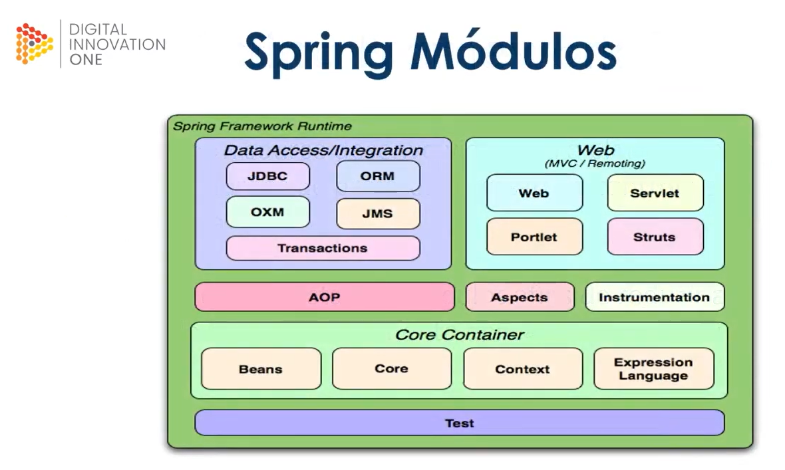
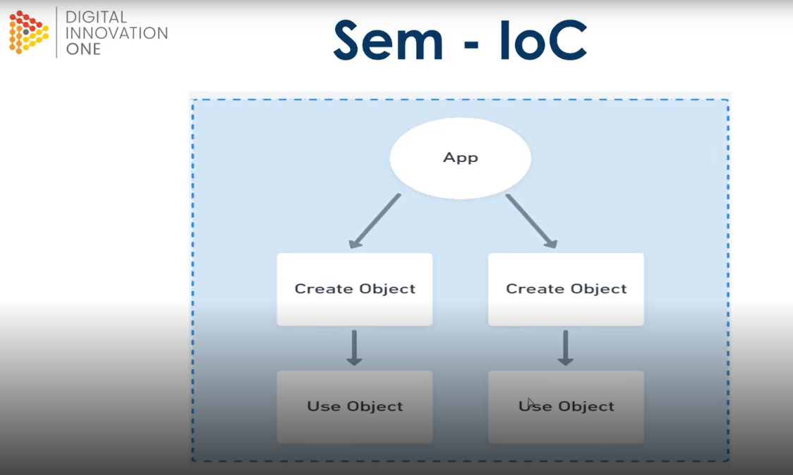
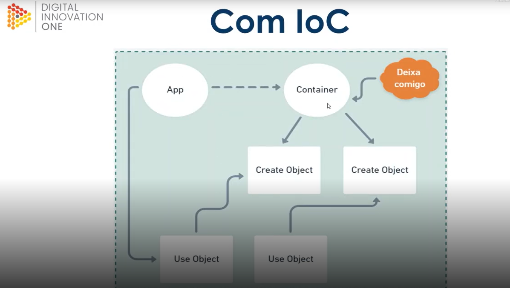
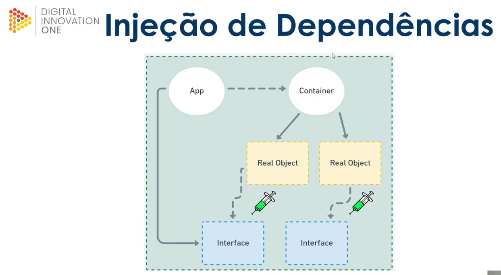
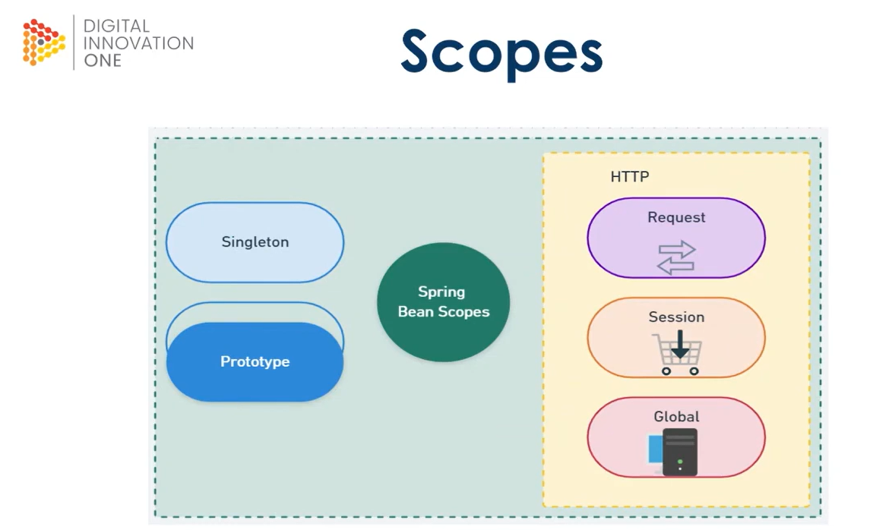

<h1 align="center">JAVA SPRING</h1>

<h3 align="center">Spring Framework</h3>

- Framework open source desenvolvido para a plataforma Java baseado nos padrões de projetos `inversão de controle(atribuir responsabilidades a um container)` e através da injeção de dependência adquirimos os recursos necessários para nossa aplicação.

- Sua estrutura é composta por módulos afins de reduzir a
  complexidade no desenvolvimento aplicações simples ou
  corporativa. Quer dizer que existe módulos específicos para cada uma das finalidades da nossa aplicação por exemplo queremos trabalhar com dados, segurança.

O Spring é baseado no módulo core é através dele que conseguimos inicializar um container Spring, através do seu contexto e criando os beans que são os objetos gerenciados pelo container Spring, nós vamos ter uma baixa dependência, um baixo acoplamento.

>  

Inversão de Controle:

- Inversion of Control ou loC, trata-se do redirecionamento do fluxo de execução de um código retirando parcialmente o controle sobre ele e delegando-o para um container. O principal propósito é minimizar o acoplamento do código.

- Quando a gente inicializa uma aplicação com spring por exemplo um container é inicializado para já obter todas as instancia, todas as referencias e preferencialmente configurações necessarias para nosaa aplicação para que através da inversão de controle a gente consiga não mais ter responsabilidades de gerenciar os nossos objetos mas deixamos para outro no caso o container fazer esse tipo de gestão, de instanciação, performance, alocação de recursos em nossa memória e para os objetos existentes ai na aplicação.

Antes precisava criar o objeto para depois utiliza-lo:

>  

Inversão de Controle:

>  

- Nós temos a aplicação, aplicação é inicializada consequentemente nosso container é configurado, carregado e ai todos os objetos que precisão existir previamente já estarão no container e consequentemente quando precisar usar um objeto a gente só requisita ao container as suas respectivas instancias, essa é a proposta da inversão de controle.

Injeção de dependência:

- Injeção de dependência é um padrão de desenvolvimento com a finalidade de manter baixo o nível de acoplamento entre módulos de um sistema.
- A partir de agora a gente deixa a necessidade muita das vezes até mesmo de ter a implementação, através da inversão de controle, que esta fortemente relacionada com a injeção de dependencia, eu tenho uma interface, um tipo correspondente, através do tipo que foi carregado pelo meu container, eu consigo injetar uma especificação para minhas interfaces, consequentemente minha interface, aplicação ela não tem ciencia de qual objeto, dependencia ela exija mas o conceito de injeção de dependencia é nos prover as nossas referencias, os recursos necessarios para aplicação. 

Aplicação ao ser inicializada ela carrega o container, o nosso container tem os objetos reais, as nossas implementações estão fortemente associadas a interface, então consequentemente a minha plicação não tem ciencia de qual instancia, ela tem um contrato uma caracteristica(interface) e os objetos reais que atendem a essa caracteristicas serão injetadas através do recurso de dependencias que é provida pelo container:

>  

Beans:

- Objeto que é instanciado (criado), montado e gerenciado por um
container através do princípio da inversão de controle.

Escopos:

- Temos 5 tipos de escopos categorizado para conceitos stand alone(adota em qualquer esfera de uma aplicação) e HTTP.

Singleton e Prototype é padrão do ecosistema spring.

- Singleton: é um escopo que vou ter um unico objeto sendo compartilhado por toda minha aplicação, quando for solicitada.
- Prototype: esse é criado uma nova instancia a cada requisição de um objeto, referencia ao container, então o container entende que não pode enviar a mesma referencia, objeto para camadas ou cenarios diferentes da minha aplicação.
- HTTP - Request: um bean será criado para cada requisição HTTP. Os objetos existirão enquanto a requisição estiver em execução.
- HTTP - Session: Um bean sera criado para a sessão de usuário (Ex.: mater um carrinho de compra). Precisamos acessar a mesma solicitação duas vezes para testar os escopos específicos da web.
- HTTP Global: Ou Application Scope cria um bean para o ciclo de vida do contexto da aplicação. Objetos compartilhados por toda a aplicação.

>  