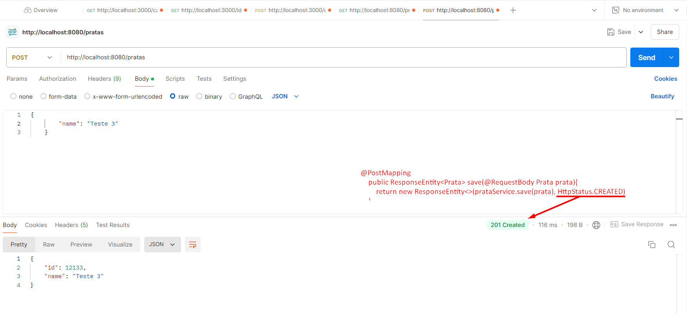

## Spring Boot 2 Essentials 09 - Método POST

`@PostMapping` - no contexto do seu controller o spring vai mapear automaticamente as requisições post;

Existe mmuitos lugares aonde faz a requisição post você recebe apenas o id como um retorno e em um protocolo 201, outros não recebe absolutamente nada só uma resposta 201 ou pode retornar o objeto inteiro, depende muito é mais questão de padronização;

Quando cria o método `save` precisa receber, ele vai chamar prataService;

```java
    @PostMapping
    public ResponseEntity<Prata> save(@RequestBody Prata prata){
        return new ResponseEntity<>(prataService.save(prata), HttpStatus.CREATED);
    }
```

```java
    public Prata save(Prata prata) {
        prata.setId(ThreadLocalRandom.current().nextLong(3, 100000));//setId vai ser gerado pelo banco de dados
        pratas.add(prata);
        return prata;
    }
```

> 
