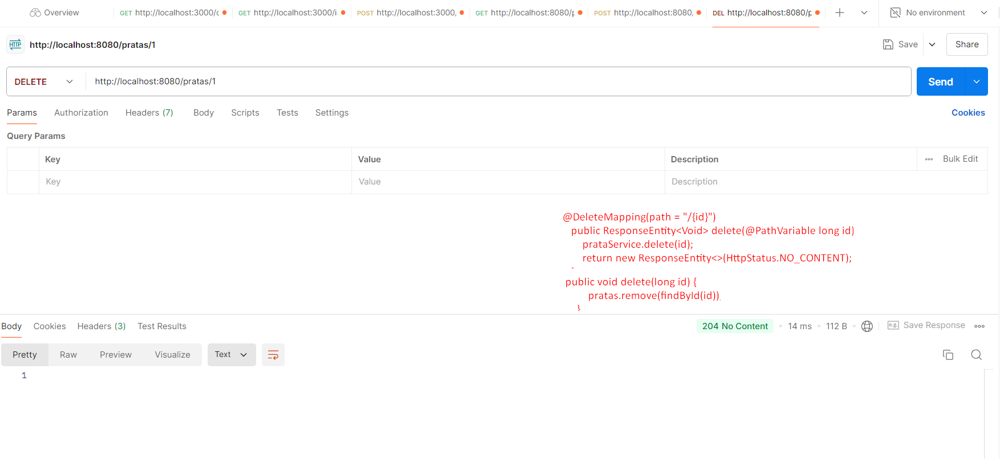
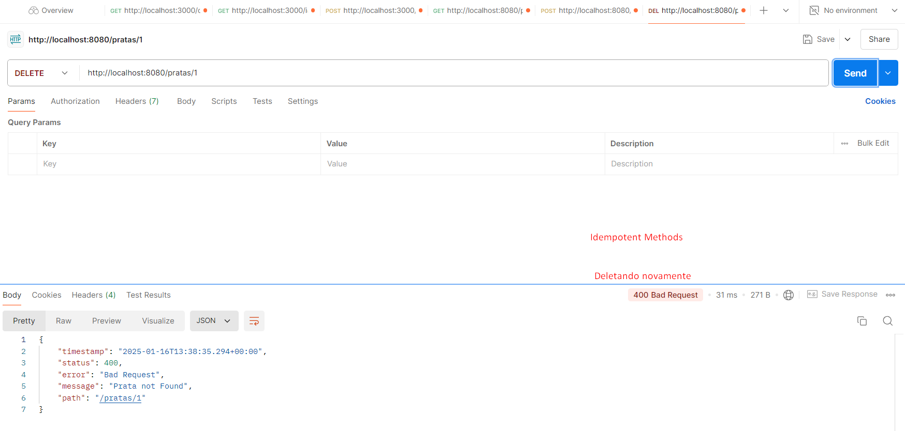

## Spring Boot 2 Essentials 10 - Método DELETE

`@DeleteMapping` - geralmente deleta passando o id e não retorna nada;

```java
 @DeleteMapping(path = "/{id}")
    public ResponseEntity<Void> delete(@PathVariable long id) {
        prataService.delete(id);
        return new ResponseEntity<>(HttpStatus.NO_CONTENT);
    }
```

cria um método no prataService:

```java
public void delete(long id) {
        pratas.remove(findById(id));
    }
```

- Se eu tentar remover uma prata, ele primeiramente vai buscar essas pratas, verificar se existe e se existir vai remover da lista, caso não exista vai lançar uma exceção;

`RFC7231` - Referência na implementação do protocolo http:
**https://datatracker.ietf.org/doc/html/rfc7231**

`4.2.1.  Safe Methods` - são métodos que não vão afetar absolutamente nada no seu servidor por exemplo o get e temos aqui os métodos `Idempotent Methods` - efetuar várias requisições pro seu servidor e essas requisições não alterarem o estado do servidor (PUT e DELETE);

```
   +---------+------+------------+---------------+
   | Method  | Safe | Idempotent | Reference     |
   +---------+------+------------+---------------+
   | CONNECT | no   | no         | Section 4.3.6 |
   | DELETE  | no   | yes        | Section 4.3.5 |
   | GET     | yes  | yes        | Section 4.3.1 |
   | HEAD    | yes  | yes        | Section 4.3.2 |
   | OPTIONS | yes  | yes        | Section 4.3.7 |
   | POST    | no   | no         | Section 4.3.3 |
   | PUT     | no   | yes        | Section 4.3.4 |
   | TRACE   | yes  | yes        | Section 4.3.8 |
   +---------+------+------------+---------------+
```

> 

> 
