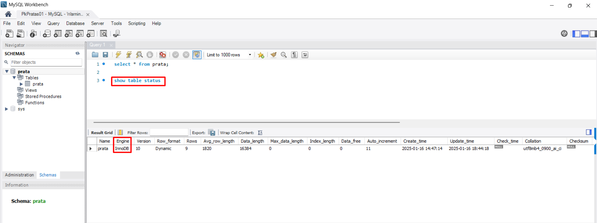

## Spring Boot 2 Essentials 19 - Transações

Primeiro precisa verificar se a tabela é do tipo `InnoDB`;

```sql
show table status
```

> 

```java
@Transactional // Indica que este método será executado dentro de uma transação.
public Prata save(PrataPostRequestBody prataPostRequestBody) {
    // O método converte o objeto recebido (PrataPostRequestBody) em uma entidade Prata
    // usando o mapeador PrataMapper, e em seguida, salva essa entidade no banco de dados.

    // `toPrata(prataPostRequestBody)` transforma os dados recebidos em uma entidade do tipo Prata.
    // `prataRepository.save(...)` persiste essa entidade no banco de dados.
    return prataRepository.save(PrataMapper.INSTANCE.toPrata(prataPostRequestBody));
}
```

**Controle de Transações Automático:**

- Quando um método com @Transactional é chamado, ele inicia uma transação no banco de dados.
- Se o método for executado com sucesso, a transação será confirmada (commit).
- Se ocorrer uma exceção não verificada (runtime exception), a transação será desfeita (rollback).

**Objetivo:**

- Garantir consistência e integridade dos dados.
- Facilitar o tratamento de falhas durante operações críticas, como salvar, atualizar ou deletar dados.
