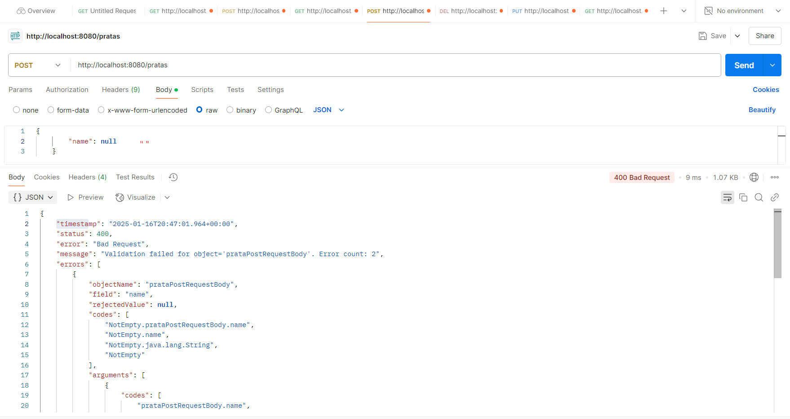

## Spring Boot 2 Essentials 20 - Validação de campos

Essa dependência vai trazer uma biblioteca que vai trazer umas bibliotecas que vai fazer a validação dos nossos campos;

```xml
<dependency>
    <groupId>org.springframework.boot</groupId>
    <artifactId>spring-boot-starter-validation</artifactId>
</dependency>
```

```java
// Pacote onde a classe está localizada. Segue a convenção de pacotes com base no domínio do projeto.
package br.com.pkpratas01.request;

// Importa anotações de validação para serem usadas na classe.
// @NotEmpty e @NotNull são usadas para validar os campos.
import jakarta.validation.constraints.NotEmpty;
import jakarta.validation.constraints.NotNull;

// Importa a anotação @Data do Lombok para gerar automaticamente os métodos getter, setter, equals, hashCode e toString.
import lombok.Data;

// A anotação @Data é usada para gerar automaticamente os métodos getter, setter, equals, hashCode e toString.
// Isso evita que você precise escrever manualmente esses métodos.
@Data
// Definição da classe. Representa uma estrutura de dados para enviar informações (Request Body) relacionadas a "Prata" (talvez um recurso do sistema).
public class PrataPostRequestBody {

    // Campo 'id' do tipo Long. Representa o identificador único do objeto.
    private Long id;

    // O campo 'name' representa o nome de algo relacionado a "Prata".
    // Anotações de validação são usadas aqui para garantir que o campo seja preenchido corretamente:

    // @NotEmpty: Garante que o campo não seja vazio ou somente espaços em branco.
    @NotEmpty(message = "The prata name cannot be empty")

    // @NotNull: Garante que o campo não seja nulo.
    // A mensagem personalizada será exibida se a validação falhar.
    @NotNull(message = "The prata name cannot be empty")
    private String name; // Nome do recurso que está sendo enviado na requisição.
}

```

No pacote Controller dentro de save:

`@Valid` - fala para o spring fazer essa validação automatica atraves dessa anotação;

```java
@PostMapping
    public ResponseEntity<Prata> save(@RequestBody @Valid PrataPostRequestBody prataPostRequestBody){
        return new ResponseEntity<>(prataService.save(prataPostRequestBody), HttpStatus.CREATED);
    }
```

**`Não deixa criar vazio ou nulo;`**

> 
