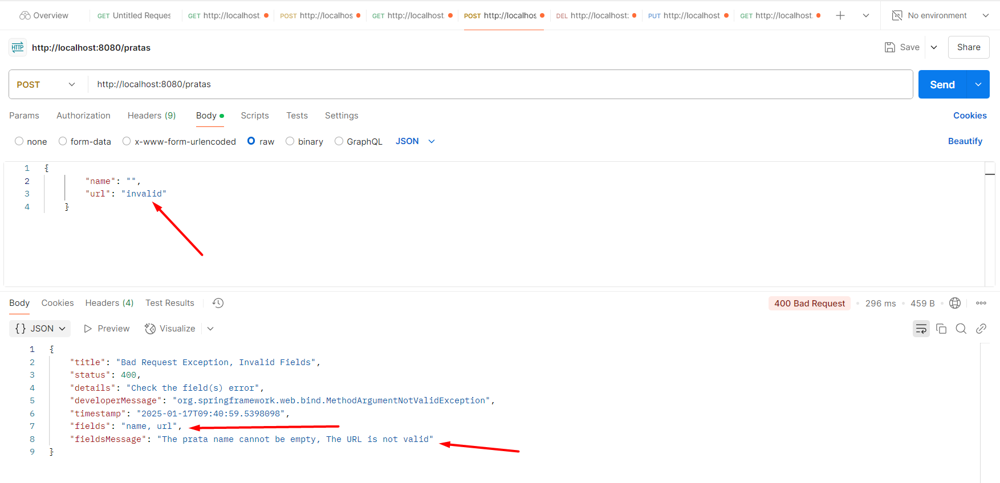

## Spring Boot 2 Essentials 21 - Handler para validação de campos

Erro quando tenata fazer um `post null ou vazio " "`:

```json
{
  "timestamp": "2025-01-17T12:02:08.511+00:00",
  "status": 400,
  "error": "Bad Request",
  "message": "Validation failed for object='prataPostRequestBody'. Error count: 2",
  "errors": [
    {
      "objectName": "prataPostRequestBody",
      "field": "name",
      "rejectedValue": null,
      "codes": [
        "NotEmpty.prataPostRequestBody.name",
        "NotEmpty.name",
        "NotEmpty.java.lang.String",
        "NotEmpty"
      ],
      "arguments": [
        {
          "codes": ["prataPostRequestBody.name", "name"],
          "arguments": null,
          "defaultMessage": "name",
          "code": "name"
        }
      ],
      "defaultMessage": "The prata name cannot be empty",
      "bindingFailure": false,
      "code": "NotEmpty"
    },
    {
      "objectName": "prataPostRequestBody",
      "field": "name",
      "rejectedValue": null,
      "codes": [
        "NotNull.prataPostRequestBody.name",
        "NotNull.name",
        "NotNull.java.lang.String",
        "NotNull"
      ],
      "arguments": [
        {
          "codes": ["prataPostRequestBody.name", "name"],
          "arguments": null,
          "defaultMessage": "name",
          "code": "name"
        }
      ],
      "defaultMessage": "The prata name cannot be empty",
      "bindingFailure": false,
      "code": "NotNull"
    }
  ],
  "path": "/pratas"
}
```

**Para melhorar o filtro validation error message, para que seja mais simplificado:**

Cria uma classe `ExceptionDetails` no pacote `exception`;

```java
package br.com.pkpratas01.exception;

import java.time.LocalDateTime;

import lombok.Data;
import lombok.experimental.SuperBuilder;

@Data
@SuperBuilder
public class ExceptionDetails {
    protected String title;
    protected int status;
    protected String details;
    protected String developerMessage;
    protected LocalDateTime timestamp;
}
```

```java
package br.com.pkpratas01.exception;

import lombok.Getter;
import lombok.experimental.SuperBuilder;

@Getter
@SuperBuilder
public class BadRequestExceptionDetails extends ExceptionDetails {

}
```

Agora precisa criar uma classe que vai trabalhar com os campos adicionais;

Cria uma classe `ValidationExceptionDetails` no pacote `exception`;

```java
package br.com.pkpratas01.exception;

import lombok.Getter;
import lombok.experimental.SuperBuilder;

@Getter
@SuperBuilder
public class ValidationExceptionDetails extends ExceptionDetails {
    private final String fields;
    private final String fieldsMessage;
}
```

Agora precisa trabalhar com `handler` - o handler é uma forma de interceptar, dizer para o controller para interceptar as exceções e adicionar o que você definiar dentro do método;

```java
package br.com.pkpratas01.handler;

// Importações necessárias para lidar com datas, listas, manipulação de coleções,
// HTTP, validação de campos e anotações do Spring.
import java.time.LocalDateTime;
import java.util.List;
import java.util.stream.Collectors;

import org.springframework.http.HttpStatus;
import org.springframework.http.ResponseEntity;
import org.springframework.validation.FieldError;
import org.springframework.web.bind.MethodArgumentNotValidException;
import org.springframework.web.bind.annotation.ControllerAdvice;
import org.springframework.web.bind.annotation.ExceptionHandler;

import br.com.pkpratas01.exception.BadRequestException;
import br.com.pkpratas01.exception.BadRequestExceptionDetails;
import br.com.pkpratas01.exception.ValidationExceptionDetails;
import lombok.extern.log4j.Log4j2;

// @ControllerAdvice permite que esta classe seja usada para tratar exceções
// em nível global para toda a aplicação.
@ControllerAdvice
// @Log4j2 é uma anotação do Lombok que facilita o uso do Log4j para logging.
@Log4j2
public class RestExceptionHandler {

    // Este método trata exceções do tipo BadRequestException.
    @ExceptionHandler(BadRequestException.class)
    public ResponseEntity<BadRequestExceptionDetails> handlerBadRequestException(BadRequestException bre) {
        // Criação de um objeto BadRequestExceptionDetails usando o builder.
        return new ResponseEntity<>(
                BadRequestExceptionDetails.builder()
                        .timestamp(LocalDateTime.now()) // Momento em que ocorreu a exceção.
                        .status(HttpStatus.BAD_REQUEST.value()) // Código de status HTTP 400 (Bad Request).
                        .title("Bad Request Exception, Check the Documentation") // Título descritivo do erro.
                        .details(bre.getMessage()) // Mensagem detalhada da exceção.
                        .developerMessage(bre.getClass().getName()) // Nome da classe da exceção para auxiliar os desenvolvedores.
                        .build(),
                HttpStatus.BAD_REQUEST); // Retorna a resposta com status HTTP 400.
    }

    // Este método trata exceções do tipo MethodArgumentNotValidException,
    // que ocorre quando os argumentos do método possuem erros de validação.
    @ExceptionHandler(MethodArgumentNotValidException.class)
    public ResponseEntity<ValidationExceptionDetails> handlerMethodArgumentNotValidException(
            MethodArgumentNotValidException exception) {
        // Obtém a lista de erros de campo da exceção.
        List<FieldError> fieldErrors = exception.getBindingResult().getFieldErrors();

        // Extrai os nomes dos campos com erros como uma única string separada por vírgulas.
        String fields = fieldErrors.stream().map(FieldError::getField).collect(Collectors.joining(", "));
        // Extrai as mensagens de erro dos campos como uma única string separada por vírgulas.
        String fieldsMessage = fieldErrors.stream().map(FieldError::getDefaultMessage).collect(Collectors.joining(", "));

        // Criação de um objeto ValidationExceptionDetails usando o builder.
        return new ResponseEntity<>(
                ValidationExceptionDetails.builder()
                        .timestamp(LocalDateTime.now()) // Momento em que ocorreu a exceção.
                        .status(HttpStatus.BAD_REQUEST.value()) // Código de status HTTP 400 (Bad Request).
                        .title("Bad Request Exception, Invalid Fields") // Título descritivo do erro.
                        .details("Check the field(s) error") // Mensagem geral sobre os erros nos campos.
                        .developerMessage(exception.getClass().getName()) // Nome da classe da exceção para auxiliar os desenvolvedores.
                        .fields(fields) // Lista de campos com erros.
                        .fieldsMessage(fieldsMessage) // Mensagens associadas aos erros nos campos.
                        .build(),
                HttpStatus.BAD_REQUEST); // Retorna a resposta com status HTTP 400.
    }
}
```

```java
package br.com.pkpratas01.request;

import org.hibernate.validator.constraints.URL;

import jakarta.validation.constraints.NotEmpty;
import lombok.Data;

@Data
public class PrataPostRequestBody {
    private Long id;
    @NotEmpty(message = "The prata name cannot be empty")
    private String name;
    @URL(message = "The URL is not valid")
    private String url;
}
```

> 
