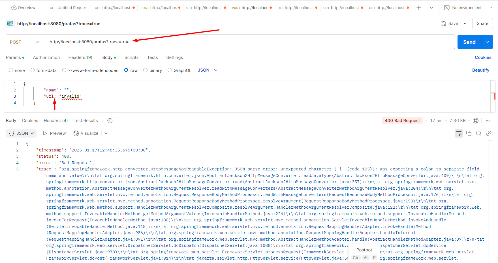

## Spring Boot 2 Essentials 22 - Sobrescrevendo handler do Spring

> 

```java
public class RestExceptionHandler extends ResponseEntityExceptionHandler {
}
```

`ResponseEntityExceptionHandler` - o spring já tem tratamento de diversas exceções;

**`PENDENTE`: NÃO CONSEGUI APLICAR NO MEU PROJETO**
