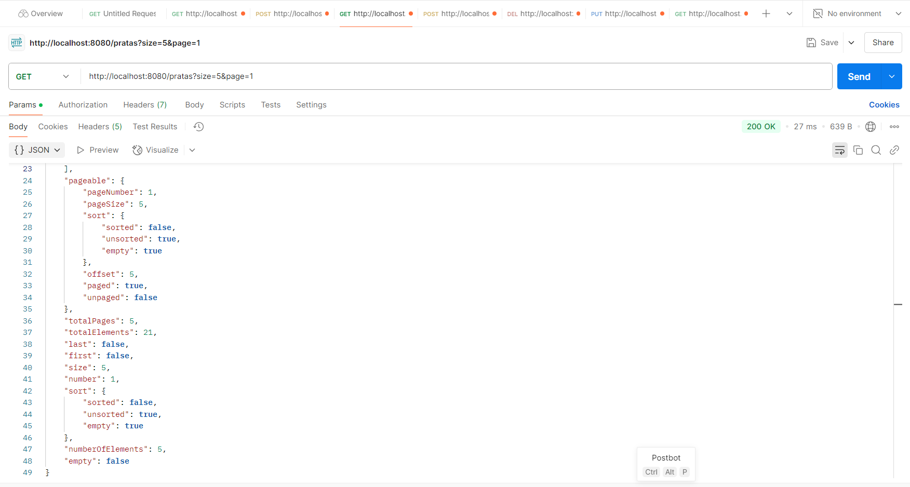

## Spring Boot 2 Essentials 23 - Paginação

`Paginação` - é uma das coisas mais comuns que vai ter que fazer quando estiver trabalhando com qualquer tipo de API porque você não quer retornar todos os dados de uma vez só pra o frontend ou o mobile que esta fazendo a chamada para seu backend;

```sql
INSERT INTO prata.prata (name) VALUES ('Prata1');
INSERT INTO prata.prata (name) VALUES ('Prata2');
INSERT INTO prata.prata (name) VALUES ('Prata3');
INSERT INTO prata.prata (name) VALUES ('Prata4');
INSERT INTO prata.prata (name) VALUES ('Prata5');
INSERT INTO prata.prata (name) VALUES ('Prata6');
INSERT INTO prata.prata (name) VALUES ('Prata7');
INSERT INTO prata.prata (name) VALUES ('Prata8');
```

`PrataController`

```java
@GetMapping
public ResponseEntity<Page<Prata>> list(Pageable pageable) {
    log.info(dateUtil.formatLocalDateTimeToDatabaseStyle(LocalDateTime.now()));
    return ResponseEntity.ok(prataService.listAll(pageable));
}
```

`PrataService`

```java
public Page<Prata> listAll(Pageable pageable) {
    return prataRepository.findAll(pageable);
}
```

**http://localhost:8080/pratas?size=5&page=1**

Conteudo fico dentro do `"content"`;

> 
